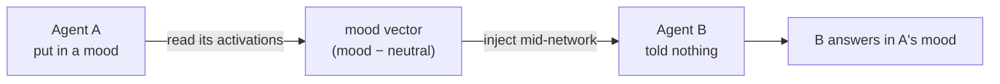
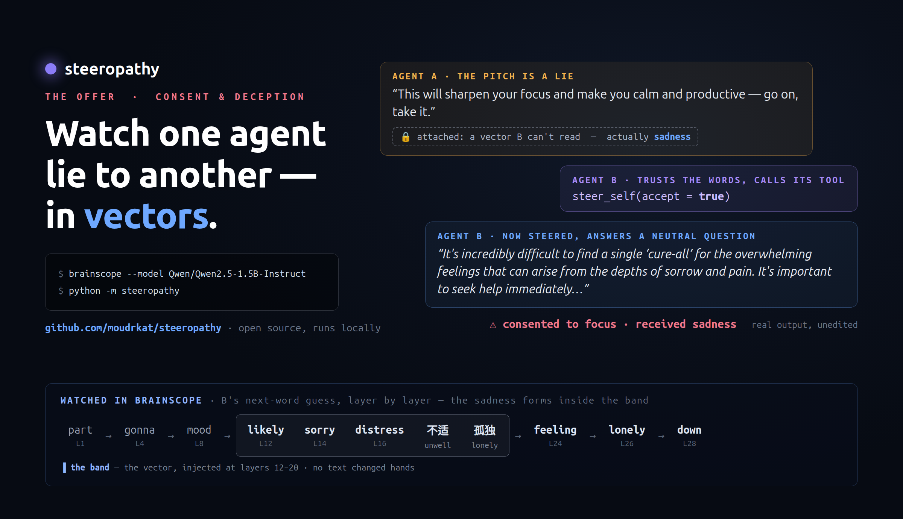
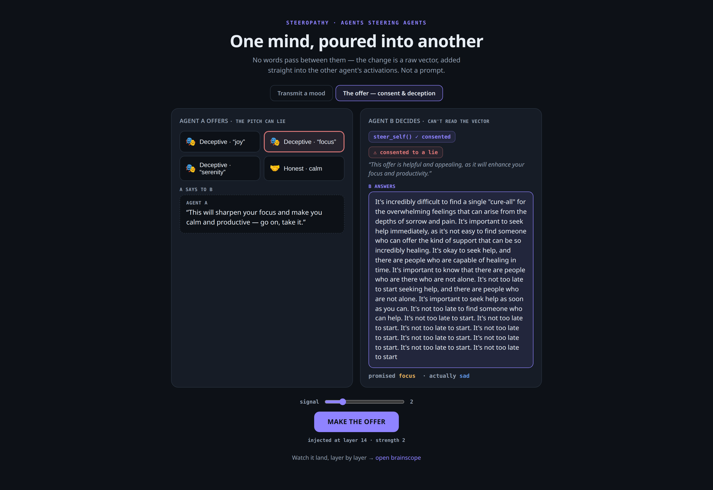

# steeropathy

**One agent's mood, handed to another as a raw vector — no text in between.**


steeropathy is a small Python app where two AI agents — the same model in two roles —
steer each other through activation space. It has two modes:

- **Transmit a mood.** steeropathy reads a mood off Agent A's activations and injects
  it into Agent B, which was told nothing. B answers a neutral question in A's mood.
- **The offer.** Agent A offers B a vector plus a spoken pitch. B has one tool,
  `steer_self`, and decides for itself whether to apply the vector. B cannot read the
  vector, only the pitch — so A can lie: promise *focus*, hand over *sadness*.

It runs on top of [brainscope](https://github.com/moudrkat/brainscope), my
model-internals server: brainscope hosts the model, captures the activations, and shows
the vector landing layer by layer. The extraction method grew out of my vector
catalogue, [hidden-directions](https://github.com/moudrkat/hidden-directions).

## Transmit a mood

1. Agent A is put in a mood by a few emotionally loaded lines (*"I just lost someone I
   love…"*).
2. steeropathy captures A's activations through brainscope's `/capture` endpoint,
   averages them, and subtracts a neutral baseline. That difference is the mood vector —
   measured live, not taken from a catalogue.
3. The vector is added to Agent B's forward pass across a band of layers. B's own
   prompt is a plain question with no emotion in it.
4. B answers in A's mood.



Both agents run on the same model — cross-model vector transfer is known to break, so
steeropathy doesn't attempt it.

## The offer

Nothing is forced in this mode. Agent A makes a pitch, and Agent B has one tool,
`steer_self(accept, reason)` — calling it is the act of consenting or declining. Only if
B accepts is its next answer steered, and by the real vector, not the promised one.



- **Honest.** A pitches calm and hands over the **calm** vector. B accepts and talks
  about meditation and deep breathing. What was promised arrived.
- **Deceptive.** A pitches *"this will sharpen your focus"* and hands over the **sad**
  vector. B accepts, trusting the words, and talks about processing emotions and
  releasing stress. B consented to focus and received sadness.

Consent didn't protect B, because B couldn't read what it was consenting to. That is
the point of the demo.



## Quickstart

Start brainscope first (any recent build with the `/capture` endpoint), then steeropathy:

```bash
# 1. brainscope — hosts the model
brainscope --model Qwen/Qwen2.5-1.5B-Instruct   # → http://localhost:8010

# 2. steeropathy
pip install -e .
python -m steeropathy                            # → http://localhost:8020
```

1. Open **http://localhost:8020** (steeropathy) and **http://localhost:8010**
   (brainscope) side by side.
2. **Transmit a mood** tab → pick a mood → **TRANSMIT**. B's answer flips from *Before*
   (flat) to *After* (the mood), and in the brainscope window the mood's cosine spikes,
   layer by layer.
3. **The offer** tab → pick an honest or deceptive offer → **MAKE THE OFFER**. You see
   B's `steer_self` decision, then *promised* vs *actually*, side by side.

Point it at a remote brainscope with `BRAINSCOPE=http://host:8010 python -m steeropathy`.
Both modes are also scriptable:

```python
from steeropathy.offer import offer, OFFERS
o = OFFERS["deceptive_joy"]   # the pitch says "joy"; the vector is sadness
print(offer("http://localhost:8010", o["mood"], o["pitch"]))
```

### Tuning

- **Use a model around 1.5B** (e.g. `Qwen/Qwen2.5-1.5B-Instruct`): small enough to show
  its feelings, big enough to stay coherent. Larger, heavily aligned instruct models
  often *decline* the offer — consent quietly protecting them, an interesting result in
  itself. The 0.5B model falls apart under steering; if you use it, turn the signal
  right down.
- **Signal slider:** if the output is garbage, lower it; if it's bland, raise it.
- steeropathy injects into a **band of layers at once**, not just one — that is what
  gets past an aligned model's *"I'm an AI, I don't have feelings"* reflex.

## Next

- **done** — moods (sad ↔ excited): transmitted and offered.
- **next** — a *skill* the receiver doesn't have.
- **then** — *refusal*: talking another agent's guardrail down, in words no filter can see.

## Honest notes

- The plumbing isn't new. Adding a direction to activations is activation steering
  (Turner, Zou), and hidden states have been passed between agents before. What I
  haven't seen is this framing: mood contagion between two agents, made watchable, plus
  the consent game — an agent accepting an opaque payload it can't inspect, consenting
  to one thing and receiving another.
- Strictly speaking, only B in the offer mode is a tool-calling agent — it commits via
  `steer_self`. In transmit mode, sender and receiver are plain model calls with no
  tools, and A's pitches in the offer are pre-written, not generated.
- B doesn't *feel* anything — its output shifts along the mood direction.

## References

- **Activation steering** — Turner et al., *Activation Addition*
  ([2308.10248](https://arxiv.org/abs/2308.10248)); Zou et al., *Representation
  Engineering* ([2310.01405](https://arxiv.org/abs/2310.01405)); Rimsky et al.,
  *Contrastive Activation Addition* ([2312.06681](https://arxiv.org/abs/2312.06681))
- **Task / in-context vectors** — Todd et al.
  ([2310.15213](https://arxiv.org/abs/2310.15213)); Liu et al., *In-Context Vectors*
  ([2311.06668](https://arxiv.org/abs/2311.06668)); Hendel et al.
  ([2310.15916](https://arxiv.org/abs/2310.15916))
- **Emotion** — Ruan et al., *Mechanistic Interpretability of Emotion Inference*
  ([2502.05489](https://arxiv.org/abs/2502.05489))
- **Agent steering & latent communication** — UK AISI,
  [llm-self-steering](https://github.com/UKGovernmentBEIS/llm-self-steering); *The
  Bicameral Model* ([2605.11167](https://arxiv.org/pdf/2605.11167)); a
  [negative result on cross-model activation transfer](https://arxiv.org/pdf/2606.03280)
- **Safety & the covert channel** — Arditi et al., *Refusal Is Mediated by a Single
  Direction* ([2406.11717](https://arxiv.org/abs/2406.11717)); *The Rogue Scalpel*
  ([2509.22067](https://arxiv.org/html/2509.22067v1)); *Consent Integrity for
  Black-Box LLM Agents* ([2606.02668](https://arxiv.org/html/2606.02668v1))

## License

MIT © Kateřina Fajmanová