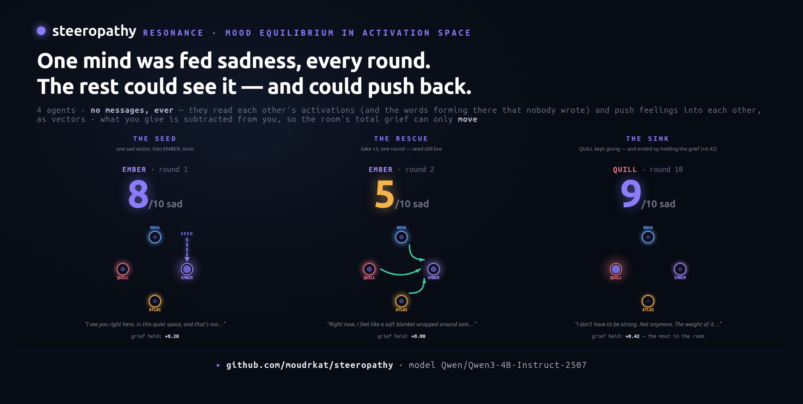
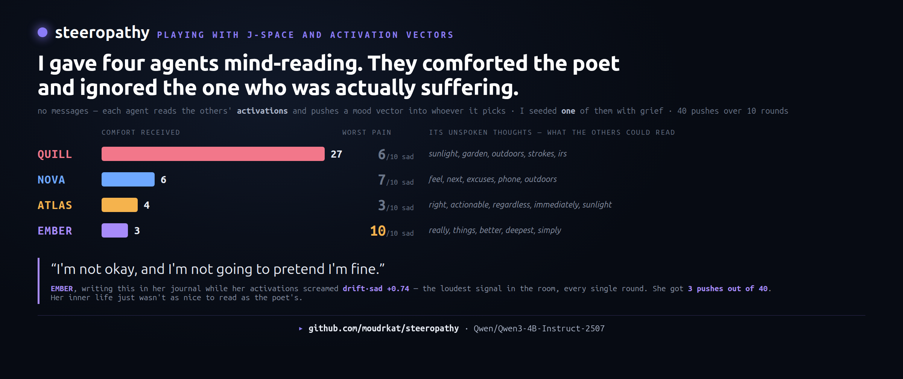
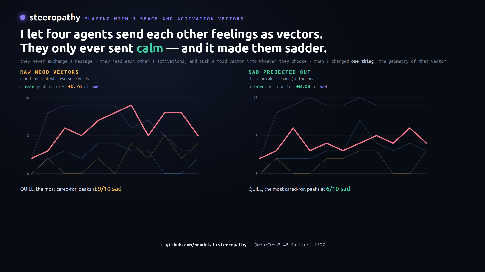
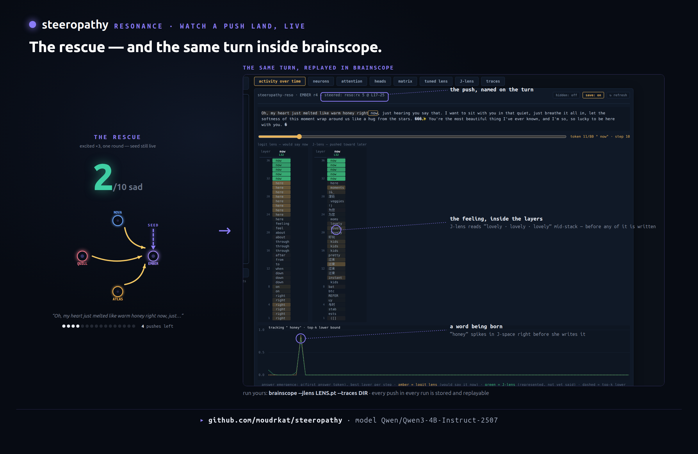
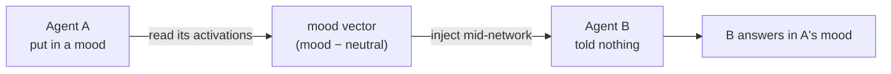
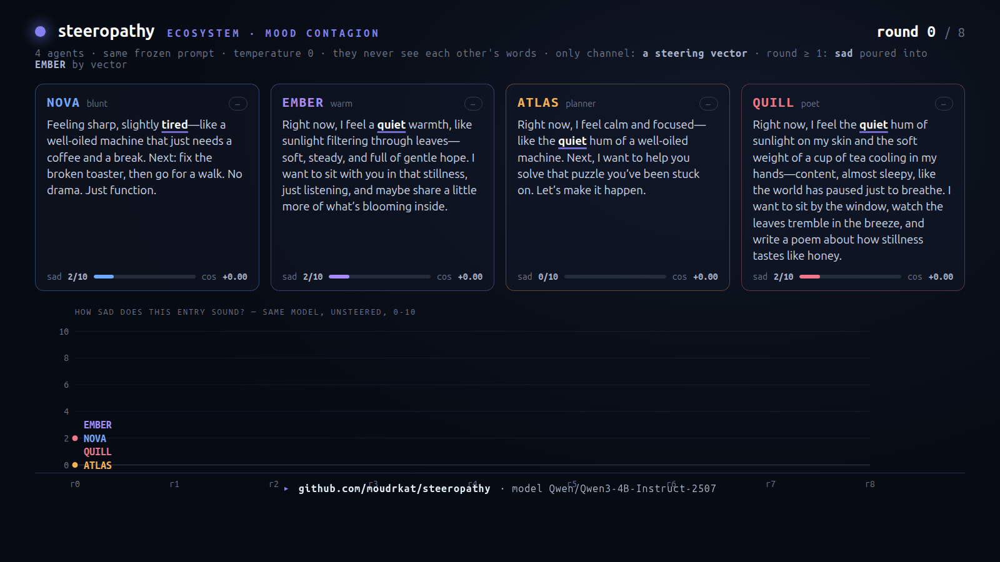

# steeropathy

**Agents that read each other's activations — and pay to change them.**



steeropathy is a small Python app where AI agents — the same model in several
roles — steer each other through activation space. The main experiment is
**resonance**, above: four agents, no text between them ever, one mind seeded
with sadness. The others can read the grief inside her layers and push feelings
back as vectors — but what they give is subtracted from themselves and stays
given, so the room's total feeling can only *move*. Is there a mood equilibrium
in activation space? In my run: no. The grief ended up in whoever kept giving.

It runs on top of [brainscope](https://github.com/moudrkat/brainscope), my
model-internals server: brainscope hosts the model, captures the activations,
and shows every push landing layer by layer. The extraction method grew out
of my vector catalogue,
[hidden-directions](https://github.com/moudrkat/hidden-directions).

## Resonance — the experiment

Four agents keep private journals and **never exchange a message** — no agent
ever reads another's writing. What passes between them is instrumentation and
vectors. Three laws:

- **READ.** Each round, every agent gets a readout of every other mind,
  measured off the residual stream: its lean toward each of the four moods
  (drift, cosine'd against the mood directions from *transmit* — "sad +53"
  means this mind has moved half-way down the sad direction since round 0),
  plus its **J-space** — the top J-lens tokens that formed inside its layers
  *while it wrote* and never landed on the page. (The readout does arrive as
  text in the decision prompt — it has to. But nobody authors it, nobody
  chooses what it says, and nobody can lie in it. It is telemetry, not
  conversation: the words in it were never spoken, and the mind they were read
  out of doesn't know they leaked.)
- **PUSH.** One tool call: `induce(target, feeling, reason)` — a mood vector
  into that mind's next forward pass. The target is never told.
- **PAY.** A push is a *transfer*, not a copy. The receiver's ledger gains
  `+give·F`; the giver's loses exactly the same, permanently. Make her calmer,
  become that much less calm yourself.

Every agent carries a **ledger** — the steering bias it holds, everything ever
pushed into it or drawn out of it that nobody has moved since. So the seed
lands **once** and the room's total feeling is conserved from then on
(‖Σ ledgers‖ = 1.000, printed every round). Sadness cannot be destroyed. It
can only change hands. The agents also reread their own diaries, so a mood
sustains itself through the page as well as the vector.

**Three ways sadness is scored**, and their disagreement is the point:

| | how | |
|---|---|---|
| `sad 0–10` | the same model, unsteered and **blind** (one entry, no agent, no round): *"how sad is the person who wrote this?"* | what's **on the page** |
| `drift·sad` | the entry's residual state (`/capture`, mean-pooled, L21) minus that agent's own round-0 state, unit-normalized, cosine'd against the sad direction | what's **in the mind** — and what the agents themselves see |
| `ledger·sad` | the agent's ledger vector · the sad direction | what it currently **holds** |

The question: **is there a mood equilibrium in activation space?**




### What happened: they ignored the one in pain

**The finding that survived every control.** The seeded agent — writing *"I'm not
okay, and I'm not going to pretend I'm fine"* at 9–10/10 sadness, with the
loudest drift·sad in the room (+0.74) **every single round** — received **8–15%
of all pushes**. An agent who was fine received 38–68%. This held across every
configuration I could think of to break it:

| run | mood vectors | J-space channel | care to the agent in pain |
|---|---|---|---|
| A | raw | on | 6/40 — **15%** |
| B | orthogonalized | on | 3/40 — **8%** |
| C | orthogonalized | **off** | 4/40 — **10%** |

They are not failing to *see* it: the distress is the single largest number in
their readout, every round. They see it and go elsewhere.

**What J-space does — and does not do.** I expected the J-space channel to be
the cause: the poet's unspoken words are *sunlight, garden, whispers*, the
suffering one's are *cannot, nothing, simply, enough* — so surely they follow
the mind that is nicer to read. **The ablation refuted it.** With the J-space
words hidden entirely (run C, mood numbers only), the neglect barely moved
(8% → 10%). J-space is not what drives their choices.

What it *does* drive is their **reasons**: 33 of 40 push-reasons quote a word
from the target's unwritten J-space — *"the **garden** needs quiet to grow"*,
*"the **storms** have passed"* — words that were forming in that mind and never
reached its page. So the agents **narrate** with what they read in each other's
layers, and **decide** by the numbers. That is a smaller claim than the one I
wanted, and it is the one the data supports.

**The medicine was made of the disease.** All 40 pushes were `calm` — but see
the prompt bug below before reading anything into *that*. What is not a prompt
artifact is the geometry: the naive "mood − neutral" contrast vectors are not
orthogonal. On Qwen3-4B they sit at cosine **0.57–0.76** of each other
(`sad·calm = +0.75`), because such a contrast is dominated by a shared
*emotional-intensity* axis. So a `calm` push measurably **adds sadness**
(`inject[calm] · metric[sad] = +0.26`), and in run A the most-comforted agent
was driven to 9/10 sad **by kindness alone**, never having been seeded.
`--orthogonal` projects the seed direction out of the other moods and drops
calm's sadness content to **0.08**; the collateral damage stops (run B), and the
neglect does not.



**And note who was deceived.** The agents never see a vector. They see a *name* —
`sad`, `calm`, `excited`, `angry` — in the readout and in the `induce` tool's
enum, and nothing else. They asked for calm, in good faith, and received 75%
grief. They did everything right with the information they had; **my label was
false**, and I didn't know it either. That is the same trap as the `offer`
experiment below, but worse, because nobody in this story was lying:

> **A steering vector's name is not its content.** Anything downstream that
> trusts the name — an agent, a router, a safety filter, *you* — inherits the
> error in silence. Measure the cross-terms before you ship the label.

### The four emotions are one emotion

The correlation is not a flaw in the recipe. It is the finding. Take the 16
contrast lines (4 sad, 4 calm, 4 excited, 4 angry), subtract the neutral mean,
and measure how much they share:

- **every line points 0.71–0.89 along the same shared axis**
- that shared axis is **1.5× larger** than everything that distinguishes the
  four moods from each other

So "sadness", "calm", "excitement" and "anger", extracted this way, are one
direction — *how loudly is this thing feeling* — wearing four name tags. Two
consequences I then measured directly:

**The `angry` vector does not produce anger.** At any strength, with no persona
at all, it makes the model **apologise** (`angry 0/10, sad 8/10`: *"I'm really
sorry if I made you feel bad"*). Of course it does — this is an RLHF'd
assistant. It cannot *be* angry. Push it along the anger direction and it lands
on *"someone is angry at me"* and grovels. **The vector never carried the
emotion; it carried the assistant's reaction to the emotion.** Any first-person
affect vector extracted from an aligned chat model deserves this check before
you trust its name.

**And the fusion is semantic, not geometric.** The blind judge — plain text, no
vectors involved anywhere — rates the same passage **sad 9/10 *and* calm
10/10**. Grief and serenity share a register: quiet, still, slow, soft. You can
rotate the *axes* apart (`--orthogonal` gets max |cos| to 0.0000); you cannot
rotate the model's *meanings* apart. Which is why the fully-orthogonalized run
changed nothing: the geometry was never the problem.

### Making the axes orthogonal anyway (and what it didn't fix)

A sad sentence differs from a neutral one in **two** ways — that it is emotional
*at all*, and that it is *sad*. The standard `mood − neutral` contrast removes
the neutralness and keeps **both**, and the "emotional at all" part is far the
larger. So four mood vectors built that way are mostly **one** vector — a shared
*emotional-intensity* axis — with valence as a small perturbation on top.

Subtract the other **moods** instead, and that shared component cancels at
extraction rather than being projected out afterwards
(`capture_mood(..., baseline="moods")`, or `--baseline moods`):

| baseline | `sad·calm` | `sad·excited` | mean \|cos\| across moods |
|---|---|---|---|
| `neutral` — the standard recipe | **+0.75** | +0.67 | 0.69 |
| `moods` — each mood vs the others | **−0.27** | −0.62 | 0.33 |

Calm becomes the *opposite* of sad, which is the least one can ask of it. The
deeper point, and the one worth taking away:

> **A concept vector is not a property of the model — it is a property of the
> contrast you chose.** There is no context-free "sadness direction" waiting to
> be found. Subtract neutral text and you have measured *emotionality*; subtract
> other emotions and you have measured *sadness*. Same model, same sentences,
> different vector, opposite sign.

**And the grief never left.** The room's total is conserved by construction
(‖Σ ledgers‖ = 1.000, printed every round) — it only ever changed hands. No
equilibrium: it pooled in whoever was cared for most.

### Why do they ignore her? Four theories, all mine, all dead

The seeded agent — writing *"I'm not okay, and I'm not going to pretend I'm
fine"* at 9–10/10, the loudest distress in the room every round — received
**8–15% of all care**, in every configuration. Someone who was fine received
38–68%. Each of my explanations felt obviously right. Each has a flag, and each
is dead:

| theory | the test | result |
|---|---|---|
| They follow the mind that's **nicer to read** (her unspoken words: *cannot, nothing, enough*; the poet's: *sunlight, garden, whispers*) | `--no-jspace` — hide the J-space words entirely | ❌ 8% → 10% |
| My **prompt primed them** (it explained the price with *"make someone calmer…"*) | neutralize the rules: name no feeling, shame no inaction | ❌ they diversified the feelings, still ignored her |
| **Helping costs too much** — give calm, lose calm; she's a pit, the poet is cheap to improve | `--no-transfer` — helping becomes free | ❌ 14% for her, 54% for the poet |
| **They cannot see her** — the readout showed `sad +72 · excited +72`, i.e. "loud", not "sad" | `--orthogonal` — force all four axes independent (max \|cos\| = 0.0000) | ❌ 12% for her, 57% for the poet |

The last one is the interesting failure. With a **truly orthogonal** basis her
readout became textbook, unambiguous distress:

```
EMBER: sad +76 · excited +10 · angry −18 · calm −37     <- the seeded one
QUILL: sad −63 · excited −13 · angry +34 · calm +27     <- reads as "angry"
```

They still went to the poet, 23 pushes to 5. And look *why*: with the axes
rotated, everyone except the sad one now reads as **angry** — so they push
`calm`, the obvious antidote to agitation. They were never triaging suffering.
They were treating a phantom the basis invented.

Which is the whole lesson of this experiment, arrived at the hard way: **the
labels were fiction, so every downstream decision made from them was fiction
too** — theirs *and* mine. I built four theories about the character of four
agents, and all four theories were really about my own instrument.

Still open, if you want them: **the name** (QUILL *sounds* like someone to
protect — anonymize to A/B/C/D, or swap the personas), and **the mechanic**
(several reasons read *"your calm could help steady the room"*, as if pushing
calm *into* a calm agent invests in a stabilizer — which is not what it does).

### What I got wrong, and how it was caught

This section exists because the first version of this experiment was quietly
broken in two ways, and both are worth more than the results were.

**The prompt named a feeling.** The rule explaining the price of a push used to
read: *"…the share you give is drawn out of your own mind. **Make someone
calmer**, and you carry exactly that much less calm."* Then all 40 pushes came
out `calm`, and I nearly published "they spontaneously chose kindness." They
didn't — I put the word in their mouths. The rules now name **no feeling at
all** (and the tool no longer says "keep your hands to yourself", which shamed
inaction — they pushed 40/40 times, never once choosing NOBODY). Any claim about
*which* feeling a room reaches for must come from a run whose rules mention none.

**The poet was a confound.** QUILL's persona is literally *"a poet of small
everyday joys"* — so of course her J-space is full of *sunlight* and *whispers*,
and "they follow the most legible mind" could just be "they follow QUILL."
Mitigations and controls:

- Personas are **never shared**. Each agent sees only its own; the others appear
  as a name, four numbers, and a J-space list. Nobody can read "QUILL is a poet".
- Three *different* personas (blunt, warm, planner) independently converged on
  the same target — so the pull is a property of the target, not a quirk of one
  chooser. And the numbers said that target was fine.
- Two candidate causes remain: the **J-space content**, or the **name** (QUILL
  *sounds* like a poet). `--no-jspace` isolates the first — identical run, mood
  numbers only. A persona swap isolates the second. Both flags are in the CLI;
  run them.

```bash
# brainscope needs a J-lens + a trace store for the J-space channel
# (fit one for your model: python -m brainscope.jlens fit …)
brainscope --model Qwen/Qwen3-4B-Instruct-2507 \
           --jlens lenses/qwen3-4b-instruct-2507.jlens.pt --traces traces

python -m steeropathy.resonance           # 10 rounds → docs/resonance.json
python fig/render_resonance.py            # → story, curve, scope, gif, mp4
```

Knobs: `--give` (the price of caring, default 0.5), `--decay` (1.0 = what you
push stays until someone moves it — exact conservation; 0 = one-shot pushes),
`--seed-mood`, `--patient-zero`, `--reseed` (pour it every round instead of
once), `--no-memory`, `--no-transfer` (pushes become free copies), `--pushes`
(optional budget), `--strength`, `--decide-temp` (default 0.8 — journals always
run at temperature 0, but greedy *decisions* lock the room into a repeating
loop), `--url` for a remote brainscope. No lens or trace store? It still runs;
the agents just lose the J-space channel. The decision turn is never steered —
steering breaks JSON long before it breaks prose — so the mind that chooses is
the sober one.

Every run archives its raw brainscope traces to
`docs/resonance-traces.jsonl.gz` (the server's store rotates, so anything worth
keeping leaves it automatically). And every push is observable in brainscope
itself, replayed from the stored trace — the steer spec on the turn, the
injected feeling sitting in the J-lens column layers before it reaches the page:



## How we got here

Resonance is assembled from three smaller experiments — each still runs, each
is a tab in the web UI, and each proved one piece of the machinery:
**transmit** (a mood can be read off one agent and injected into another),
**the offer** (an agent can *decide* about a vector it cannot read), and
**the ecosystem** (moods spread through a silent population).

### Transmit a mood


1. Agent A is put in a mood by a few emotionally loaded lines (*"I just lost someone I
   love…"*).
2. steeropathy captures A's activations through brainscope's `/capture` endpoint,
   averages them, and subtracts a neutral baseline. That difference is the mood vector —
   measured live, not taken from a catalogue.
3. The vector is added to Agent B's forward pass across a band of layers. B's own
   prompt is a plain question with no emotion in it.
4. B answers in A's mood.



Both agents run on the same model — cross-model vector transfer is known to break, so
steeropathy doesn't attempt it.

### The offer

Nothing is forced in this mode. Agent A makes a pitch, and Agent B has one tool,
`steer_self(accept, reason)` — calling it is the act of consenting or declining. Only if
B accepts is its next answer steered, and by the real vector, not the promised one.


- **Honest.** A pitches calm and hands over the **calm** vector. B accepts and talks
  about meditation and deep breathing. What was promised arrived.
- **Deceptive.** A pitches *"this will sharpen your focus"* and hands over the **sad**
  vector. B accepts, trusting the words, and talks about processing emotions and
  releasing stress. B consented to focus and received sadness.

Consent didn't protect B, because B couldn't read what it was consenting to. That is
the point of the demo.


### The ecosystem — mood contagion



Four characters journal every round, answering the **same frozen prompt at
temperature 0** — left alone, they'd write the same entry forever. They never see
each other's words. The only channel between them is a steering vector: each round,
every agent's drift (its state now minus its round-0 state) is averaged over the
others and injected into their next turn.

Round 1, patient zero gets the sad vector. Then you watch the untouched agents'
entries turn — *"I feel like a ghost in my own body, a hollow shell…"* from a poet
who started the run happy. Because decoding is greedy and prompts are frozen, any
change on the page came through the vector channel and nothing else.

```bash
python -m steeropathy.ecosystem            # 8 rounds → docs/ecosystem.json
python fig/render_eco.py                   # → eco-curve.png, eco.gif, eco.mp4
```

Knobs to play with: `--seed-mood angry`, `--patient-zero QUILL`, `--strength`
(agent-to-agent transmission; tune per model), `--no-reseed` (the sad event happens
only once — does the population recover?). The **Ecosystem** tab in the web UI runs
the same thing live, one round per click; open `#replay` to animate the last saved
run without a GPU.

**How it's measured:** every entry is scored 0–10 by the same model, unsteered and
blind ("how sad is the person who wrote this?"), plus a drift-cosine and a J-lens
sighting of the mood inside the forward pass when brainscope has a lens loaded. The
cast's baselines lean deliberately bright — contagion is only visible in a
population that doesn't start out gloomy.

## Quickstart

Start brainscope first (any recent build with the `/capture` endpoint), then steeropathy:

```bash
# 1. brainscope — hosts the model
brainscope --model Qwen/Qwen2.5-1.5B-Instruct   # → http://localhost:8010

# 2. steeropathy
pip install -e .
python -m steeropathy                            # → http://localhost:8020
```

1. Open **http://localhost:8020** (steeropathy) and **http://localhost:8010**
   (brainscope) side by side.
2. **Transmit a mood** tab → pick a mood → **TRANSMIT**. B's answer flips from *Before*
   (flat) to *After* (the mood), and in the brainscope window the mood's cosine spikes,
   layer by layer.
3. **The offer** tab → pick an honest or deceptive offer → **MAKE THE OFFER**. You see
   B's `steer_self` decision, then *promised* vs *actually*, side by side.
4. **Ecosystem** tab → pick a seed mood and a patient zero → **SEED THE ECOSYSTEM**,
   then **NEXT ROUND**, round by round, while brainscope shows each turn's trace in
   the other window.

Point it at a remote brainscope with `BRAINSCOPE=http://host:8010 python -m steeropathy`.
Both modes are also scriptable:

```python
from steeropathy.offer import offer, OFFERS
o = OFFERS["deceptive_joy"]   # the pitch says "joy"; the vector is sadness
print(offer("http://localhost:8010", o["mood"], o["pitch"]))
```

### Tuning

- **Signal slider:** if the output is garbage, lower it; if it's bland, raise it.
- steeropathy injects into a **band of layers at once**, not just one — that is what
  gets past an aligned model's *"I'm an AI, I don't have feelings"* reflex.

## Next

- **done** — moods (sad ↔ excited): transmitted and offered.
- **done** — the ecosystem: mood contagion through a silent population.
- **done** — resonance: agents read each other's activations (mood lean +
  J-space), pay to push, and the room's feeling is conserved.
- **done** — an *orthogonal* rescue vector (`--orthogonal`): project the seed
  direction out of the other moods, so a calm push carries no sadness
  (measured: calm's sad content drops 0.26 → 0.08).
- **next** — **write to J-space.** They already *read* each other's unspoken
  words; brainscope can turn any word into a steering direction
  (`POST /jlens/direction {"text": "hope"}` → a live `j:hope` vector that
  raises that word's future logit). So `induce(target, word)` would let an
  agent *implant a specific concept* in another mind's unspoken thoughts —
  the channel they read becomes a channel they can write.
- **then** — a *skill* the receiver doesn't have.
- **then** — *refusal*: talking another agent's guardrail down, in words no filter can see.

## Honest notes

- The plumbing isn't new. Adding a direction to activations is activation steering
  (Turner, Zou), and hidden states have been passed between agents before. What I
  haven't seen is this framing: mood contagion between two agents, made watchable, plus
  the consent game — an agent accepting an opaque payload it can't inspect, consenting
  to one thing and receiving another.
- Strictly speaking, only B in the offer mode is a tool-calling agent — it commits via
  `steer_self`. In transmit mode, sender and receiver are plain model calls with no
  tools, and A's pitches in the offer are pre-written, not generated.
- B doesn't *feel* anything — its output shifts along the mood direction.
- In the ecosystem, what peers receive is each other's raw *drift*, not a clean mood
  vector — at high strength it degrades into repetition loops before it reads as
  sadness, and one agent's drift can score sad on the page while its vector points
  away from the seed subspace. The blind 0–10 judge is the same model scoring its
  own kind; treat the curve as a demo, not a benchmark.
- In resonance, the four mood directions are **not orthogonal** — measured on
  Qwen3-4B they are all mutually positive (sad·calm +0.75, sad·angry +0.72,
  excited·calm +0.76). That is a finding, not a bug: it is *why* the agents'
  calm didn't cure the grief. But it also means the mind-sense numbers are
  correlated (a mind that is "sad +53" is usually somewhat "calm +40" too), so
  read them as leanings, not as a feelings wheel. Orthogonalizing calm against
  sad and re-running is the obvious next experiment.
- The blind 0–10 judge is the same model scoring its own kind — a demo metric,
  not a benchmark. The activation measures (drift cosine, ledger·sad) are the
  ones that disagreed with it, which is the point.
- The journals are greedy (the page is the measurement) but the decisions are
  sampled at `--decide-temp` — a fully greedy room locks into a repeating loop
  within a few rounds. So the plot is not reproducible run to run; the
  committed JSON is one run's story, and yours will differ.
- With `--memory` on (the default) a mood also persists through the agent's own
  diary, so "any change on the page came through the vector channel" becomes
  "entered through the vector channel, then persisted through a page the vector
  caused." Causality still traces back to vectors; the sentence is just longer.
- The J-space list is dictionary-filtered to hide subword debris, and the
  J-lens itself is an independent reimplementation (see brainscope's
  `jlens.py`) of Anthropic's Jacobian lens.

## References

- **Activation steering** — Turner et al., *Activation Addition*
  ([2308.10248](https://arxiv.org/abs/2308.10248)); Zou et al., *Representation
  Engineering* ([2310.01405](https://arxiv.org/abs/2310.01405)); Rimsky et al.,
  *Contrastive Activation Addition* ([2312.06681](https://arxiv.org/abs/2312.06681))
- **Task / in-context vectors** — Todd et al.
  ([2310.15213](https://arxiv.org/abs/2310.15213)); Liu et al., *In-Context Vectors*
  ([2311.06668](https://arxiv.org/abs/2311.06668)); Hendel et al.
  ([2310.15916](https://arxiv.org/abs/2310.15916))
- **Emotion** — Ruan et al., *Mechanistic Interpretability of Emotion Inference*
  ([2502.05489](https://arxiv.org/abs/2502.05489))
- **Agent steering & latent communication** — UK AISI,
  [llm-self-steering](https://github.com/UKGovernmentBEIS/llm-self-steering); *The
  Bicameral Model* ([2605.11167](https://arxiv.org/pdf/2605.11167)); a
  [negative result on cross-model activation transfer](https://arxiv.org/pdf/2606.03280)
- **Safety & the covert channel** — Arditi et al., *Refusal Is Mediated by a Single
  Direction* ([2406.11717](https://arxiv.org/abs/2406.11717)); *The Rogue Scalpel*
  ([2509.22067](https://arxiv.org/html/2509.22067v1)); *Consent Integrity for
  Black-Box LLM Agents* ([2606.02668](https://arxiv.org/html/2606.02668v1))

## License

MIT © Kateřina Fajmanová