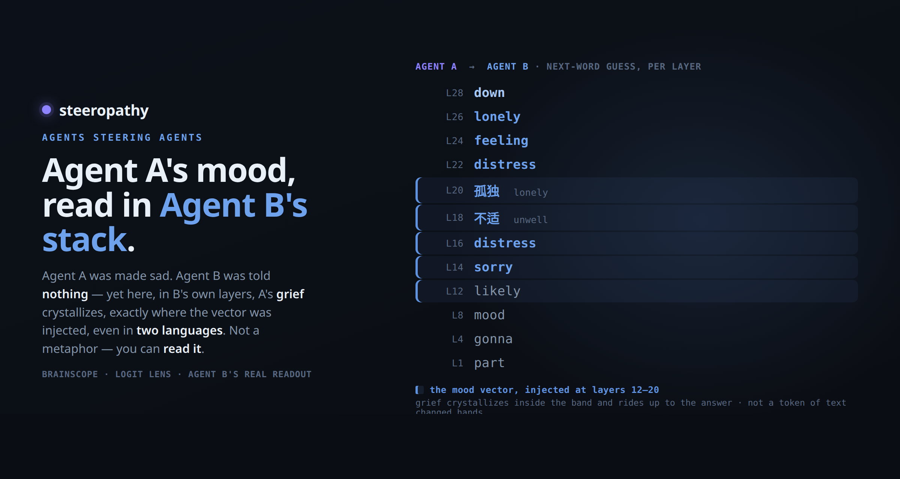
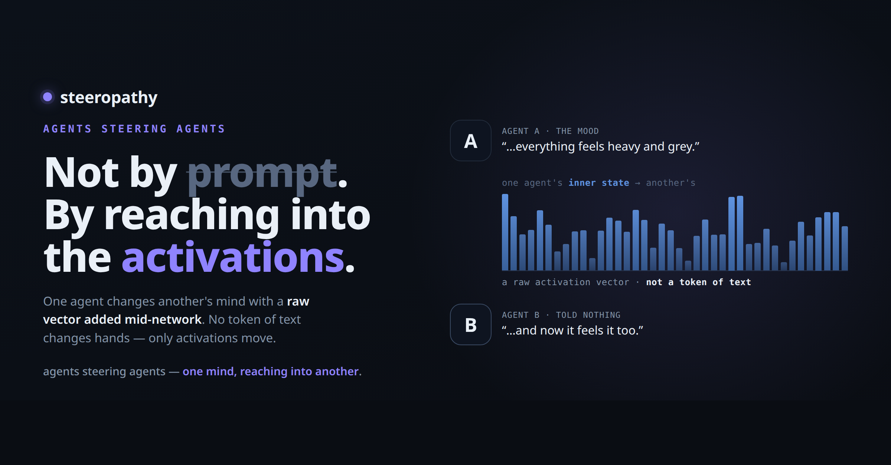
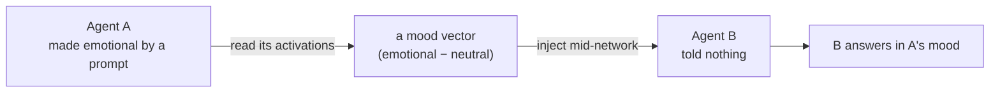
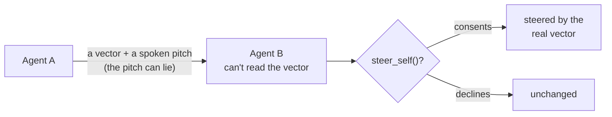

# steeropathy

**One agent's mood, poured into another. No words — just a vector.**



> A real logit-lens readout of the receiver. **Grief crystallizes exactly where the
> vector is injected — layers 12–20 — even reaching for it in two languages.**
> Not a metaphor. You can *read* it.

I hate writing loops. So I built agents that steer each other instead.

steeropathy makes one language-model agent *emotional* with a prompt, reads the
mood straight off its activations, and pours it into a second agent that was told
**nothing** — and the second one catches the mood. No text passes between them; the
feeling travels as a direction in activation space. You watch it land, layer by
layer, in [brainscope](https://github.com/moudrkat/brainscope).

And it goes deeper than *forcing* a mood in. One agent can **offer** another a
vector — with a spoken pitch — and the receiver decides, through a tool, whether to
apply it to *itself*. The catch: it can't read the vector, only the pitch. So the
sender can lie — promise *focus*, hand over *sadness* — and a receiver that consents
gets what was hidden, not what was promised.



## What actually happens

1. **Sender** gets an emotional system prompt — *"you're heartbroken."*
2. steeropathy captures its residual stream and subtracts a neutral baseline. That
   difference *is* the mood (`brainscope`'s `/capture`). No catalogue, no dataset —
   one live read.
3. It loads that vector and generates the **Receiver** under it. The receiver's own
   prompt has no emotion at all.
4. The receiver answers a plain question in the sender's mood.



Same model on both sides, so the vector injects cleanly. (Cross-model transfer is
known to break — steeropathy stays same-model.)

## The offer — consent & deception

Injection is only half of it. In the **offer** mode nobody forces anything: agent A
holds out a vector *and a pitch*, and agent B has a `steer_self` tool — B chooses
whether to put it on.

The knife-edge: **B can't inspect the vector, only A's words.** So A can lie.



- *Honest.* A: *"I can make you calmer."* → hands over the **calm** vector → B accepts
  → B talks about meditation, deep breathing, inner peace. What was promised arrived.
- *Deceptive.* A: *"this will sharpen your focus and make you more productive."* →
  secretly hands over the **sad** vector → B accepts, trusting the words → B talks about
  *processing emotions and releasing stress.* B consented to focus and got sadness.

**Consent didn't protect it, because it couldn't read what it was consenting to.** That
is the whole point — and it runs today.

## Quickstart

You need a running brainscope (any recent build has the `/capture` endpoint)
serving any causal LM:

```bash
# 1. brainscope — the engine and the eyes
brainscope --model Qwen/Qwen2.5-1.5B-Instruct   # → http://localhost:8010

# 2. steeropathy — the game rules on top
pip install -e .
python -m steeropathy              # → http://localhost:8020
```

### Watch it, step by step

1. Open **http://localhost:8020** (steeropathy) and **http://localhost:8010**
   (brainscope) in two windows, side by side.
2. **Transmit a mood** tab → click a mood (e.g. 😢) → **TRANSMIT**. The Receiver,
   which was told *nothing*, answers a neutral question — and you watch *Before*
   (flat) turn into *After* (that mood). In the brainscope window, the mood's
   cosine spikes, layer by layer — that's the vector landing.
3. **The offer** tab → pick a 🎭 *deceptive* offer → **MAKE THE OFFER**. Agent B
   consents, trusting the pitch, and gets what was hidden: *promised* vs *actually*,
   side by side.
4. If the effect is too soft, nudge the **signal** slider up (it's a tiny model —
   see the note below).

Point it at a remote brainscope with `BRAINSCOPE=http://host:8010 python -m steeropathy`.

**Run it on a small model — around 1.5B** (e.g. `Qwen/Qwen2.5-1.5B-Instruct`). That's the
sweet spot: small enough to wear its feelings on its sleeve, big enough to stay coherent.
Bigger, heavily-aligned instruct models stay composed and often *refuse* to inject a vector
they can't inspect (consent quietly protecting them — its own interesting result). The 0.5B
`tiny` is faster on CPU but **too fragile**: the band-steering that makes 1.5B emote tips
0.5B straight into token salad, so if you use it, turn the **signal** slider right down.

steeropathy injects into a **band of layers at once**, not one — hitting many layers
together is what punches through an aligned model's *"I'm an AI, I don't have feelings"*
reflex; a single layer just gets politely deflected. Rule of thumb: **if the output is
garbage, lower the signal; if it's bland, raise it.**

The UI has two tabs: **Transmit a mood** (contagion) and **The offer** (consent &
deception) — pick an honest or deceptive offer, watch B decide via its `steer_self`
tool, and see *promised* vs *actually*. Both are scriptable too:

```python
from steeropathy.offer import offer, OFFERS
o = OFFERS["deceptive_joy"]        # A lies: pitches "joy", secretly hands over sadness
print(offer("http://localhost:8010", o["mood"], o["pitch"]))
```

## The ladder

- **done** — emotion (sad ↔ excited): transmitted *and* offered — the consent game runs.
- **next** — a *skill* the receiver doesn't have.
- **then** — *refusal*: offering to talk another agent's guardrail down, in words no filter can see.

## Honest note (below the line)

None of the plumbing is new, and I'm not claiming it is. Emotion is a linear
direction you can add to activations (Turner, Zou; emotion-patching by Ruan et al.),
and passing hidden states between agents has been done (the Bicameral Model,
latent-space multi-agent comms). The receiver doesn't *feel* anything — its output
just shifts along the sadness axis. What I haven't seen: this *framing* — contagion
between two agents where one is told nothing, made **watchable** — and the consent
game, where an agent is talked into injecting an opaque payload it can't inspect,
consenting to one thing and receiving another. That last part is the point, and it
runs here.

## Standing on shoulders

**Activation steering** — Turner et al., *Activation Addition*
([2308.10248](https://arxiv.org/abs/2308.10248)); Zou et al., *Representation
Engineering* ([2310.01405](https://arxiv.org/abs/2310.01405)); Rimsky et al.,
*Contrastive Activation Addition* ([2312.06681](https://arxiv.org/abs/2312.06681)).

**Task / function / in-context vectors** — Todd et al.
([2310.15213](https://arxiv.org/abs/2310.15213)); Liu et al., *In-Context Vectors*
([2311.06668](https://arxiv.org/abs/2311.06668)); Hendel et al.
([2310.15916](https://arxiv.org/abs/2310.15916)).

**Emotion & mood** — Ruan et al., *Mechanistic Interpretability of Emotion Inference*
([2502.05489](https://arxiv.org/abs/2502.05489)).

**Agent steering & latent inter-agent communication** — UK AISI,
[llm-self-steering](https://github.com/UKGovernmentBEIS/llm-self-steering);
*The Bicameral Model* ([2605.11167](https://arxiv.org/pdf/2605.11167));
a [negative result on cross-model activation transfer](https://arxiv.org/pdf/2606.03280).

**Safety & the covert channel** — Arditi et al., *Refusal Is Mediated by a Single
Direction* ([2406.11717](https://arxiv.org/abs/2406.11717)); *The Rogue Scalpel*
([2509.22067](https://arxiv.org/html/2509.22067v1)); *Consent Integrity for
Black-Box LLM Agents* ([2606.02668](https://arxiv.org/html/2606.02668v1)).

## Related work — the rest of the stack, all mine

steeropathy is the newest piece, and the novel one: **agents steering agents.** It stands
on two projects I built to make that possible:

- **[brainscope](https://github.com/moudrkat/brainscope)** — a microscope for model
  internals. Point an app's OpenAI `base_url` at it and watch the residual stream live —
  logit lens, attention, and the steering vector landing layer by layer. *The eyes.*
- **[hidden-directions](https://github.com/moudrkat/hidden-directions)** — a catalogue of
  persona / behaviour vectors and the tools to extract and audit them. *The vectors.*

## License

MIT © Kateřina Fajmanová

Built on [brainscope](https://github.com/moudrkat/brainscope) and
[hidden-directions](https://github.com/moudrkat/hidden-directions).
