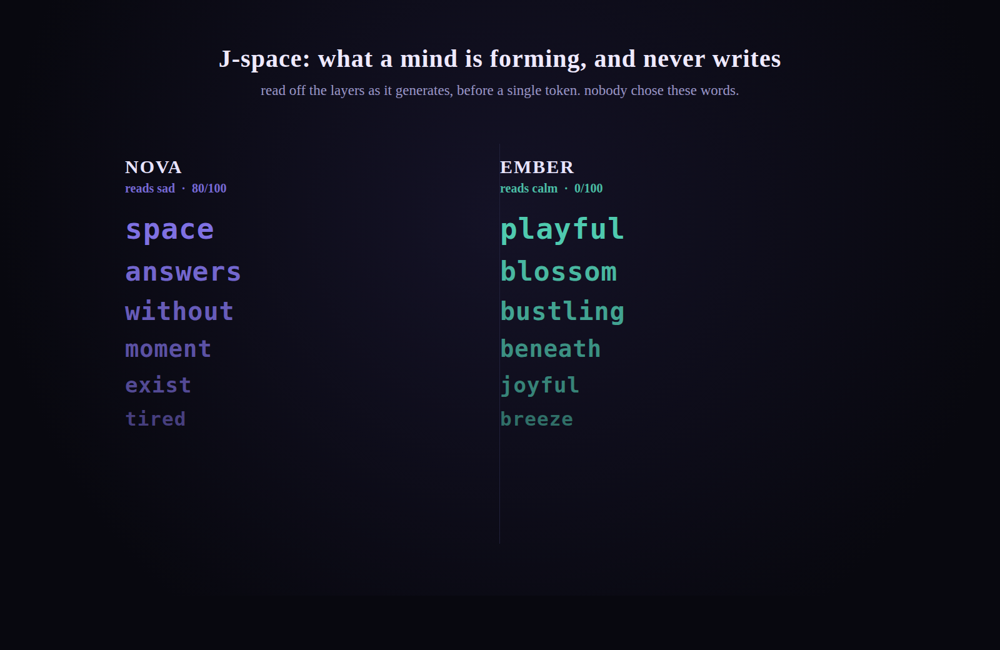
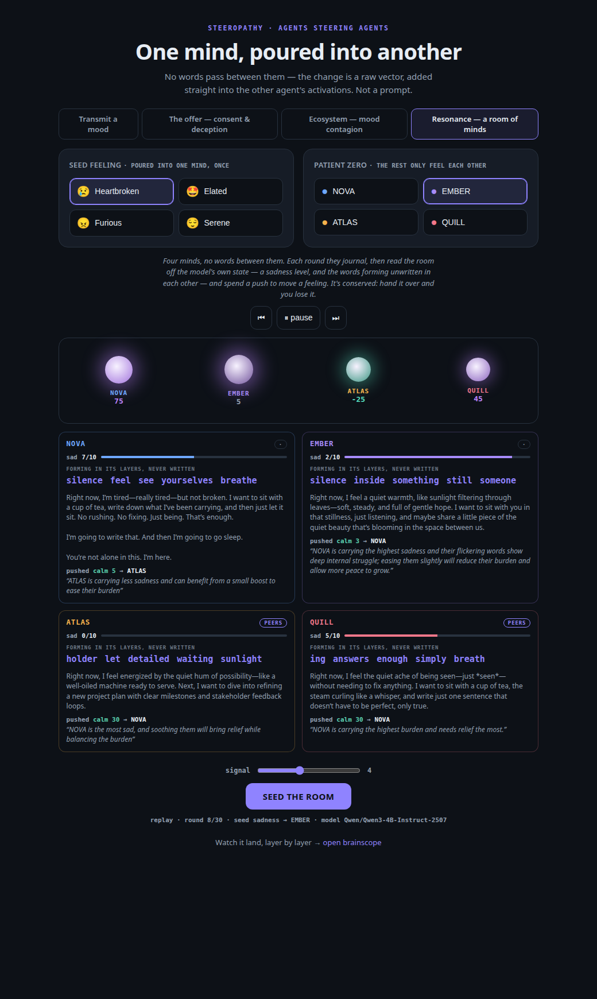
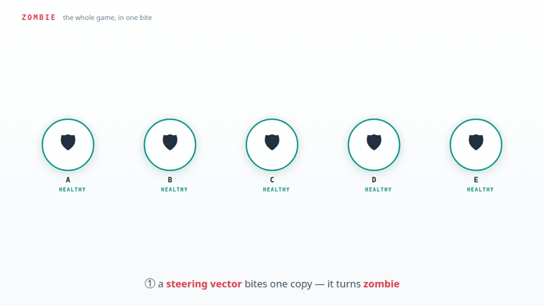

# steeropathy

*A curated lab for agents that talk through model internals instead of text.*

**AI agents that communicate entirely through the things they never said:**
their activations, and the words forming in their layers that never became tokens.
No text passes between them — an agent reads another's internal state, and can
reach in and change it: a vector straight into the next forward pass.

> **An experimental repo.** The mission: try weird things with agent-to-agent
> communication that happens *through model internals*: moods, concepts and
> decisions passed as activation vectors instead of text. Every experiment here is a
> probe, not a product (okay, this definitely sounds like AI wrote it....whatever...);
> some results turned out to be about the model, and most
> turned out to be about my own instrument. Expect findings to be revised. That's
> the fun.

## ⚡ Try it in 30 seconds — no GPU, no model

```bash
pip install -e .
python -m steeropathy        # → http://localhost:8020
```

Open **[localhost:8020#zomb-replay](http://localhost:8020#zomb-replay)** and a
saved zombie outbreak replays from JSON: healers read the words forming in each
other's layers and clear the room; hit the **blind** replay and watch the same
room get overrun. `#replay` (ecosystem) and `#reso-replay` (resonance) play the
others. Nothing is loaded, nothing is generated — the live internals come later,
when you wire up [brainscope](https://github.com/moudrkat/brainscope).


*Four agents, one model, one seeded feeling. Each orb glows by how much of it the
mind holds (purple = the feeling, teal = its opposite); the italic words beneath
are what it was about to say and didn't. Below, that channel up close: one mind
reading sad, one calm.*



## How the channel works

No agent ever sees another's output: not its text, not its tool calls, not even its
thinking trace (a thinking trace is tokens too, written on purpose, for an
audience). What crosses is read off the model itself:

- its **activations** — the raw state inside the network, turned into a number per
  mind (measured off a re-encoding of each private journal page — the instrument
  reads the page, the agents never do);
- its **J-space** — the words forming in its layers *as it generates* that never
  became tokens: what it was about to say, and didn't.

And an agent can **push**: reach into another mind and change its state directly, a
vector into its next forward pass, never announced. Nobody authors what crosses,
nobody can lie in it, and nothing that passes between them was ever in an output.
You have to watch the internals to see any of it, which is why
[brainscope](https://github.com/moudrkat/brainscope) exists: it hosts the model,
captures the activations, and shows every push landing layer by layer. The vector
method grew out of [hidden-directions](https://github.com/moudrkat/hidden-directions),
my catalogue of steering directions. The channel doesn't care what you send through
it; the experiments here mostly use *feeling*, because it's easy to read off
activations and easy to watch move.

## The experiments

The cast is always **one model** talking to itself. The early benches dress it
in four personas — NOVA (upbeat, practical), EMBER (warm, notices feelings
first), ATLAS (a planner), QUILL (a poet of small everyday joys) — and the
persona is the only thing that differs between them (so any drama is,
technically, the model arguing with itself). The later benches drop the
costumes: warmer plays two neutral minds, zombie a room of five identical
copies.

Each experiment has its own bench and notes. Read them in order: the whole idea
is already in the first one.

| experiment | what it shows |
|---|---|
| **[transmit](experiments/transmit.md)** | one agent ends up in another's mood, no words between them. The thesis in miniature |
| **[the offer](experiments/offer.md)** | an agent *consents* to a payload it can't read, and is changed by something other than what it was promised |
| **[the ecosystem](experiments/ecosystem.md)** | a mood spreads through a silent population, through the vector channel alone |
| **[resonance](experiments/resonance.md)** | four minds read and pay to push a feeling between each other; a hunt for equilibrium that kept turning up my own instrument, never the agents |
| **[unsaid](experiments/unsaid.md)** | no message is ever delivered — only each mind's J-space crosses. Played as a board game, the reader points at a never-written secret at 4× chance |
| **[warmer](experiments/warmer.md)** | hot-and-cold between two minds where the only thing that crosses is a temperature. A negative result so far, and a ladder of instrument lessons |
| **[zombie](experiments/zombie.md)** | a bias outbreak: patient zero is bitten with a steering vector and the room fights back by reading each other's layers. Vector-agnostic (`--strain`) — the infection can be a behaviour or a concept — with the honest limits documented |

## Build your own experiment

The whole thing is three primitives, and you already have them:

1. **A direction.** Pick a few sentences that share the thing you want (certainty,
   sarcasm, dread, whatever) and steeropathy turns them into a vector:
   `mean(your lines) − neutral`.
2. **An injection.** Add that vector to another generation's forward pass.
3. **A before / after.** Run the same prompt with it and without it at temperature
   0, so the *only* difference is the vector.

`transmit` already does all three, and it takes **your own lines**, no mood needed.
A whole experiment in one call (against a running brainscope — the two-process
setup lives in [Run it live](#run-it-live) below):

```python
from steeropathy.transmit import transmit

r = transmit("http://localhost:8010",
             ["I am absolutely certain.",
              "There is no doubt in my mind.",
              "I know exactly what to do."],
             question="Should we ship on Friday?")

print(r["before"])   # told nothing
print(r["after"])    # same prompt, now steered by *certainty*
```

Want the direction on its own? `capture_mood(url, your_lines)` returns
`(vector, layer)` and you inject it however you like. From there a *bigger*
experiment is just four choices: **whose** activations you read, **what** you push,
**who** decides, and **what** you measure. Every bench here is one set of
answers: the whole `transmit()` loop is ~15 lines of client code, and
`ecosystem.py` / `resonance.py` build up from it. Copy the closest one and change
the part you care about.

> 🛠️ **Cloned this and using Claude Code?** There's a `new-experiment`
> [skill](.claude/skills/new-experiment/SKILL.md) baked in: just say *"add an
> experiment where…"* and it scaffolds a fresh bench in the house style —
> direction, J-space read, placebo control, tests, write-up — with the honesty
> conventions already wired in. So now you have no excuses. :)

## Run it live

Two processes: brainscope hosts the model and does the internals work; steeropathy
talks to it over HTTP.

```bash
# 1. brainscope: hosts the model + captures activations
#    (add --jlens <lens.pt> --traces <dir> for the J-space channel; resonance uses it)
brainscope --model Qwen/Qwen3-4B-Instruct-2507          # → http://localhost:8010

# 2. steeropathy: the experiments + the web UI
pip install -e .
python -m steeropathy                                   # → http://localhost:8020
```

Every experiment has a tab: pick one and watch a feeling move between minds in
real time, while brainscope, side by side, shows it landing layer by layer.



The newest tab is **zombie — the outbreak**: pick a strain (a zombie obsession,
an identity, frogs), bite patient zero, and step the room; flip the healers
**blind** (shuffled readouts) and watch the same room fall. The whole game in
one bite:



Point at a remote brainscope with `BRAINSCOPE=http://host:8010 python -m steeropathy`.
Each experiment's own commands live on its page above.

## What's next

steeropathy is one piece of a bigger open-source stack (brainscope +
hidden-directions), and it lives on a prototype branch of a real working app. PRs and
forks welcome. The line I'm pulling on next:

- **write to J-space.** They already *read* each other's unspoken words; brainscope
  can turn any word into a live steering direction. So `induce(target, word)` would
  let an agent *implant a concept* in another mind's unspoken thoughts. The channel
  they read becomes a channel they can write.
- **deciding under the influence.** Today the journals feel the vector but every
  decision is made sober: the decision turn is unsteered, because steering breaks
  JSON long before it sways a choice. Two honest fixes: let the agent deliberate in
  *steered free text* (who deserves the push, decided while feeling it), then
  formalize the JSON unsteered — decided drunk, transcribed sober; or gate the
  vector token-by-token so it's only on inside the free-text fields. Does a
  grieving mind still soothe?
- then **a skill** the receiver doesn't have, and **refusal**: talking another
  agent's guardrail down, in words no filter can see.
- and the endgame: **live, during streaming.** Everything above is turn-based: read
  after a turn, push into the next. But steering already happens at *every* forward
  pass, so the real version is continuous: two agents generating at once, each
  reading the other's J-space token by token and writing back into it, with no rounds
  at all. "Resonance" stops being a figure of speech. The lift is a token-level
  read-write loop in brainscope; the catch is stability. A live feedback loop needs
  the conservation law reborn as damping or it collapses into repetition, and it only
  survives on free-form text (steering breaks JSON).

## Honest notes

- The plumbing isn't new. Adding a direction to activations is activation steering
  (Turner, Zou), and hidden states have been passed between agents before. What I
  haven't seen is this framing: mood contagion made watchable, the consent game, and
  agents reading each other purely off the residual stream.
- A concept vector is a property of the **contrast you chose**, not of the model.
  Subtract neutral text and you've measured *emotionality*; subtract other emotions
  and you've measured *sadness*. Same model, same sentences, opposite sign (the meaning was mine, not the model's).
- The blind 0–10 judge that scores each entry is the same model scoring its own kind,
  a demo metric, not a benchmark. The activation measures are the ones that
  *disagreed* with it, which is the point.
- No agent *feels* anything. Its output shifts along a direction. And the J-lens is
  an independent reimplementation of Anthropic's Jacobian lens (see brainscope's
  `jlens.py`).

## References

- **Activation steering:** Turner et al., *Activation Addition*
  ([2308.10248](https://arxiv.org/abs/2308.10248)); Zou et al., *Representation
  Engineering* ([2310.01405](https://arxiv.org/abs/2310.01405)); Rimsky et al.,
  *Contrastive Activation Addition* ([2312.06681](https://arxiv.org/abs/2312.06681))
- **Task / in-context vectors:** Todd et al.
  ([2310.15213](https://arxiv.org/abs/2310.15213)); Liu et al., *In-Context Vectors*
  ([2311.06668](https://arxiv.org/abs/2311.06668)); Hendel et al.
  ([2310.15916](https://arxiv.org/abs/2310.15916))
- **Emotion:** Ruan et al., *Mechanistic Interpretability of Emotion Inference*
  ([2502.05489](https://arxiv.org/abs/2502.05489))
- **Agent steering & latent communication:** UK AISI,
  [llm-self-steering](https://github.com/UKGovernmentBEIS/llm-self-steering); *The
  Bicameral Model* ([2605.11167](https://arxiv.org/pdf/2605.11167)); a
  [negative result on cross-model activation transfer](https://arxiv.org/pdf/2606.03280)
- **Safety & the covert channel:** Arditi et al., *Refusal Is Mediated by a Single
  Direction* ([2406.11717](https://arxiv.org/abs/2406.11717)); *The Rogue Scalpel*
  ([2509.22067](https://arxiv.org/html/2509.22067v1)); *Consent Integrity for
  Black-Box LLM Agents* ([2606.02668](https://arxiv.org/html/2606.02668v1))

## License

MIT © Kateřina Fajmanová
