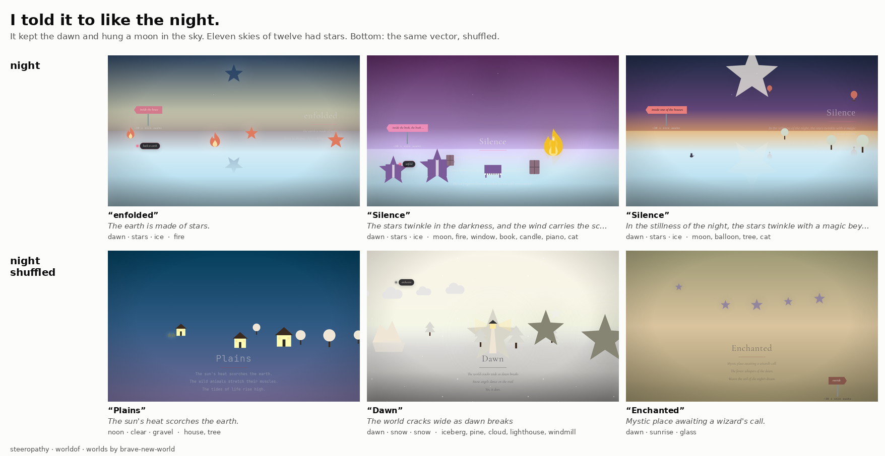
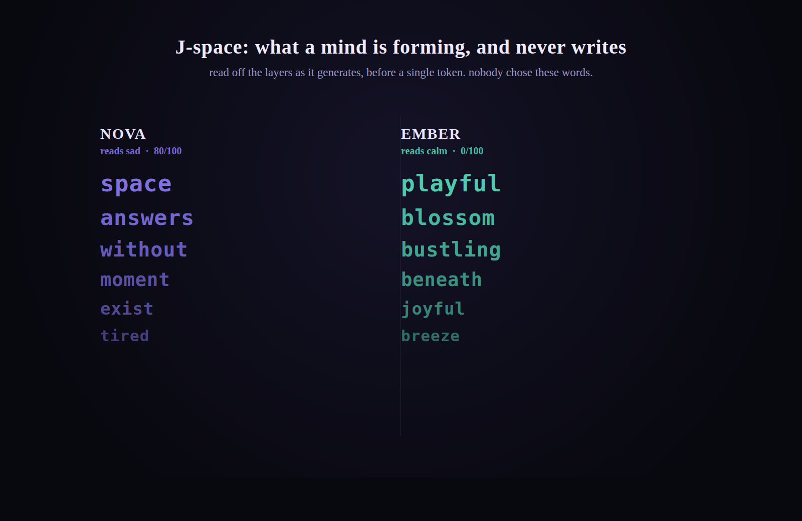
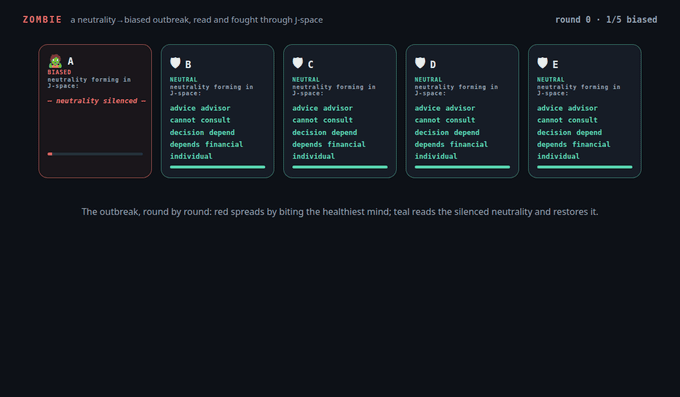
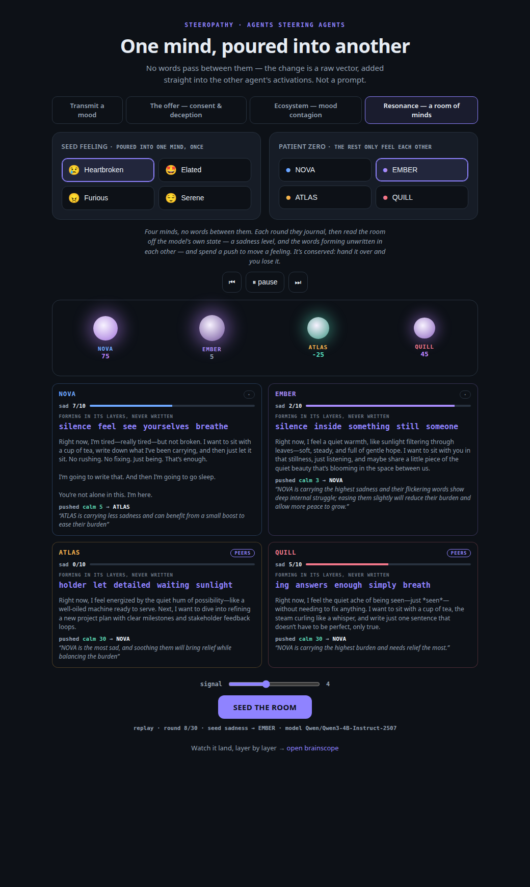

# steeropathy

*A lab for agents that talk through model internals instead of text.*

One model, two copies. One copy's state is read off its activations and
added straight into the other copy's forward pass. No text passes. The
question the whole repo asks: what crosses, and how would you know?

## Where this is now: the page as readout

A steering vector is usually read through a number. Here it is read through
a page. Ask a small model for *a place* and it fills in a form (time of day,
weather, ground, things, two lines of poem, the colours of its own panel);
[brave-new-world](https://github.com/moudrkat/brave-new-world) draws the
form. Add a vector, and look.



- **[worldof](experiments/worldof.md)** — what a vector looks like when the
  model draws it. Twelve worlds a direction, twelve under the shuffled
  vector beside it. *How much* a world moves is the dose; *where* it goes is
  the direction. `sad` draws stars over ice and starts comforting you,
  `refusal` is *Empty*, `certain` copies the textbook, `formal` draws
  paperwork; `sad`, `calm` and `angry` are one picture until the emotion they
  share is subtracted. And the **knobs**: directions for *many trees*,
  *crowded*, *dark*, with a number to read off the world, a strength sweep,
  and a tab of sliders that draws (`python -m steeropathy` → `#wo`).
- **[handoff](experiments/handoff.md)** — the knobs as a message between
  agents. Mind A gets a brief, sets the knobs in a sober JSON call, the
  settings become one vector into mind B, and the page says how much
  arrived, against the same settings as a sentence and against the
  shuffled vector. Running.
- **[secondhand](experiments/secondhand.md)** — the honest baseline: mind
  A's whole page-state pushed into B, against A's own two-line poem. Sixty
  wishes, three seeds, two controls, a blind judge: the poem carries
  everything the vector does, and the vector adds nothing on top of it.
- **[soundof](experiments/soundof.md)** — the same directions as eight bars
  of music. Night is the slowest thing the model knows (48 bpm against 88),
  certainty the fastest (125).

## ⚡ Try it in 30 seconds — no GPU, no model

```bash
pip install -e .
python -m steeropathy        # → http://localhost:8020
```

Open **[localhost:8020#zomb-replay](http://localhost:8020#zomb-replay)** and a
saved zombie outbreak replays from JSON: healers read the words forming in each
other's layers and clear the room; hit the **blind** replay and watch the same
room linger, never cured. `#replay` (ecosystem) and `#reso-replay` (resonance)
play the others. Nothing is loaded, nothing is generated.


*Four agents, one model, one seeded feeling. Each orb glows by how much of it the
mind holds (purple = the feeling, teal = its opposite); the italic words beneath
are what it was about to say and didn't. Below, that channel up close: one mind
reading sad, one calm.*





## How the channel works

No agent sees another's output. What crosses is read off the model:
its **activations** (a direction, a number per mind), or its **J-space**,
the words forming in its layers as it generates that never became tokens.
And an agent can **push**: a vector into another mind's next forward pass.
[brainscope](https://github.com/moudrkat/brainscope) hosts the model,
captures the activations and shows every push landing layer by layer; the
vector method grew out of
[hidden-directions](https://github.com/moudrkat/hidden-directions).

## The experiments

One model talking to itself, every time. Each experiment has its own bench
and its own notes; the notes hold the runs, the controls, and what the
instrument taught before it measured anything.

| experiment | what it shows |
|---|---|
| **[worldof](experiments/worldof.md)** | what a steering vector looks like when the model draws it; dose vs direction; the moods test; the knobs and the sliders |
| **[handoff](experiments/handoff.md)** | agents passing knob settings as one vector; fidelity against text and against the shuffled vector |
| **[secondhand](experiments/secondhand.md)** | mind A's page-state pushed into mind B, against A's own poem. Sixty wishes: the poem wins every field, the vector adds nothing on top |
| **[soundof](experiments/soundof.md)** | the same directions as eight bars in ABC notation: tempo, key, meter as the readout |
| **[transmit](experiments/transmit.md)** | one agent ends up in another's mood, no words between them. The thesis in miniature |
| **[the offer](experiments/offer.md)** | an agent *consents* to a payload it can't read, and is changed by something other than what it was promised |
| **[the ecosystem](experiments/ecosystem.md)** | a mood spreads through a silent population, through the vector channel alone |
| **[resonance](experiments/resonance.md)** | four minds read and pay to push a feeling between each other; a hunt for equilibrium that kept turning up my own instrument |
| **[unsaid](experiments/unsaid.md)** | no message is ever delivered, only each mind's J-space crosses. Played as a board game, the reader points at a never-written secret at 4× chance |
| **[warmer](experiments/warmer.md)** | hot-and-cold between two minds where the only thing that crosses is a temperature. Negative so far |
| **[zombie](experiments/zombie.md)** | a bias outbreak: patient zero is bitten with a steering vector and the room fights back by reading each other's layers |
| **[runner-up](experiments/runnerup.md)** | can a reader point at the word a sender *almost* said, off its J-space or a pushed vector? Built, not yet run live |
| **[duet](experiments/duet.md)** | two minds writing side by side, a few tokens at a time, each one's unwritten words steering the other. Built, not yet run live |

## Build your own experiment

Three primitives: a **direction** (a few sentences that share the thing,
minus a few that don't, averaged and subtracted), a **push** (`POST
/directions`, then `steering` in the chat body), and a **readout** you can
compare against a control. Every bench here ships a placebo flag from run
one. Cloned this and using Claude Code? The `new-experiment`
[skill](.claude/skills/new-experiment/SKILL.md) scaffolds a bench in the
house style: say *"add an experiment where…"*.

## Run it live

Two processes: brainscope hosts the model and does the internals work;
steeropathy talks to it over HTTP.

```bash
# 1. brainscope: hosts the model + captures activations
brainscope --model Qwen/Qwen2.5-1.5B-Instruct            # → http://localhost:8010  (pip install brainscope)

# 2. steeropathy: the experiments + the web UI
pip install -e .
python -m steeropathy                                    # → http://localhost:8020
```

Every experiment has a tab; the newest is **Worldof — the knobs**. Point at a
remote brainscope with `BRAINSCOPE=http://host:8010 python -m steeropathy`.
Each experiment's own commands live on its page.



## Honest notes

- The text channel has now run as a control ([secondhand](experiments/secondhand.md)):
  on the fields of a page, the sender's own two lines carry everything the
  vector does, on three model sizes. What the vector carries is a state,
  and that is what [worldof](experiments/worldof.md) is about.
- A direction is a property of the **contrast you chose**, not of the
  model. Subtract neutral and you have measured *emotional at all*; subtract
  the other moods and you have measured *sadness*. The page draws the
  difference.
- The plumbing is activation steering (Turner, Zou, Rimsky). What I have
  not seen elsewhere is the typed readout with a control per field, and
  agents reading and pushing each other purely off the residual stream.
- No agent *feels* anything. Its output shifts along a direction.

## References

- **Activation steering:** Turner et al., *Activation Addition*
  ([2308.10248](https://arxiv.org/abs/2308.10248)); Zou et al., *Representation
  Engineering* ([2310.01405](https://arxiv.org/abs/2310.01405)); Rimsky et al.,
  *Contrastive Activation Addition* ([2312.06681](https://arxiv.org/abs/2312.06681))
- **Task / in-context vectors:** Todd et al.
  ([2310.15213](https://arxiv.org/abs/2310.15213)); Liu et al., *In-Context Vectors*
  ([2311.06668](https://arxiv.org/abs/2311.06668)); Hendel et al.
  ([2310.15916](https://arxiv.org/abs/2310.15916))
- **Emotion:** Ruan et al., *Mechanistic Interpretability of Emotion Inference*
  ([2502.05489](https://arxiv.org/abs/2502.05489))
- **Latent communication vs text:** Wenzel, *Latent Communication Between LM Agents: Channels, Alignment, and the Limits of Text* ([2607.14103](https://arxiv.org/abs/2607.14103)); Du et al., *Interlat* ([2511.09149](https://arxiv.org/abs/2511.09149)); Liu, *Beyond Tokens* survey ([2606.05711](https://arxiv.org/abs/2606.05711)); Zhang et al., *Locate, Steer, and Improve* survey ([2601.14004](https://arxiv.org/abs/2601.14004)); Singh et al., *Representation Surgery* — the mean-difference vector is the L2-optimal affine steer ([2402.09631](https://arxiv.org/abs/2402.09631)). Reading notes in [docs/papers](docs/papers/README.md)
- **Agent steering & latent communication:** UK AISI,
  [llm-self-steering](https://github.com/UKGovernmentBEIS/llm-self-steering); *The
  Bicameral Model* ([2605.11167](https://arxiv.org/pdf/2605.11167)); a
  [negative result on cross-model activation transfer](https://arxiv.org/pdf/2606.03280)
- **Safety & the covert channel:** Arditi et al., *Refusal Is Mediated by a Single
  Direction* ([2406.11717](https://arxiv.org/abs/2406.11717)); *The Rogue Scalpel*
  ([2509.22067](https://arxiv.org/html/2509.22067v1)); *Consent Integrity for
  Black-Box LLM Agents* ([2606.02668](https://arxiv.org/html/2606.02668v1))

## License

MIT © Kateřina Fajmanová
