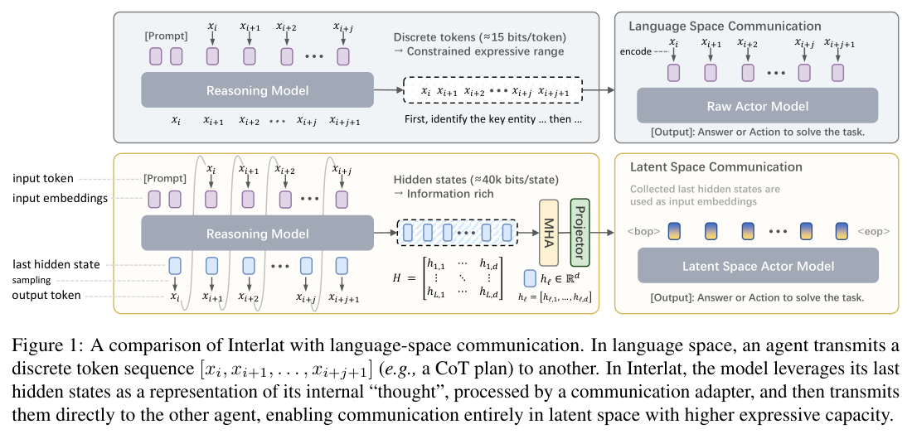
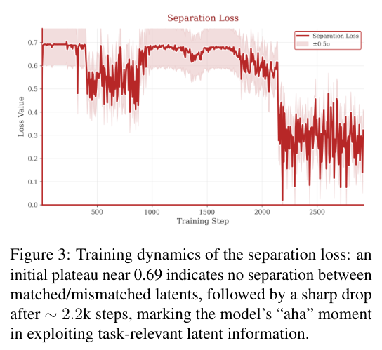
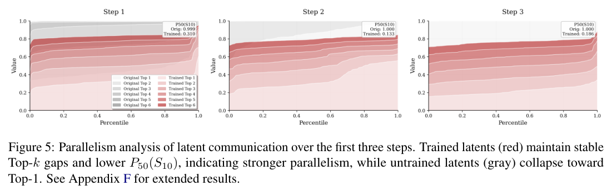

# Du et al. (2026) — Enabling Agents to Communicate Entirely in Latent Space (Interlat)

arXiv [2511.09149](https://arxiv.org/abs/2511.09149) · ACL 2026 long · Zhejiang U / Alibaba · code: XiaoDuflying/Interlat

> **TL;DR** — A sender agent transmits the *sequence* of last-layer hidden states
> of its generated plan; the receiver consumes them as input embeddings through a
> small trained adapter. Trained with a contrastive "matched vs mismatched latents"
> loss. Beats text CoT on ALFWorld and on MATH Level-5, and the latent message
> compresses to 8 steps (24× faster) with a second trained model that reasons in
> latent space. Their reading of *why*: text forces a "premature collapse" of the
> reasoning distribution; latents keep parallel hypotheses alive. Everything is
> trained — not a training-free channel.

## What they did

*Their Fig. 1: the whole idea.*

- Two agents, same or different backbone: a **reasoning** agent writes a plan; its last-layer hidden state before each generated token, `H ∈ R^{L×d}`, is the message. The **actor** agent receives `[prompt, <bop>, h₁…h_L, <eop>]` as input embeddings and acts.
- Receiver-side **communication adapter**: a light self-attention + projection. Removing it → success drops from 70% to 4%.
- **Training** (actor): task cross-entropy + a *separation* loss (maximize JS divergence between output distributions under matched vs mismatched latents — latents sampled from a different task) + *plan alignment* (KL to the distribution under the text plan). Plus a **token→latent curriculum**: stochastically replace a prefix of the latent message with the corresponding plan token embeddings. Without curriculum: 70% → 33%.
- The separation loss sits at ln 2 for ~2k steps, then drops sharply — the "aha" where the actor starts reading the latents.
- **Compression**: a second model generates K ≪ L latent steps autoregressively (feeding its own last state back as next input, Coconut-style), trained against the frozen actor with task loss + an uncertainty-weighted agreement loss (weight positions where latents reduce the actor's entropy) + a *geometry* loss (cosine between step-averaged compressed and full latents). Geometry loss is the most important term.

## Results

*The "aha": the actor ignores the latents for ~2k steps, then starts reading them (their Fig. 3).*

| setting | text CoT | latent (Interlat) |
|---|---|---|
| ALFWorld seen / unseen, Qwen2.5-7B | 64.3 / 62.4 | **70.5 / 65.4** |
| ALFWorld, Qwen2.5-0.5B | 57.9 / 50.8 | **61.2 / 57.5** |
| MATH overall | 38.4 (CoT full) | 36.9 |
| MATH Level-5 | 15.1 | **15.8** |
| 8-step compressed latents, 7B | — | 66.4 / 60.5 at 0.39 s vs 9.19 s |

- **Perturbation ladder** (Table 1): CrossTask (latents from another task), WhiteNoise, CovNoise, CovGauss (Gaussian with matched mean/covariance), RandomRot (random orthogonal rotation). All degrade; CovGauss and RandomRot degrade *more* than additive noise → the actor uses higher-order structure, not first/second moments.
- **Cross-family**: Qwen2.5-7B latents → LLaMA3.1-8B actor works *better* than same-family (heterogeneous inductive biases).
- Latent-communicating actors take *longer but more successful* trajectories: "informed exploration".
- 3-agent topologies (chain, tree) with fixed 32-step latent messages beat their text counterparts by 1–7 pp.

## The interpretive claim

*Their Fig. 5 — the readout for "alternatives kept alive": cumulative top-k mass, trained (red) stays spread, untrained (grey) collapses to top-1.*

MATH Level-5 inversion: "for lower-complexity problems the strict linearization of natural language is a beneficial regularizer … for high-complexity tasks this forced discretization causes a *premature collapse* of the reasoning distribution. Interlat maintains a superposition of parallel hypotheses." Their Figure 5: trained latents keep the top-k probability mass spread (lower P50 of top-10 mass); untrained ones collapse toward top-1.

## Methods worth stealing

- **The control ladder**: CrossTask, CovGauss, RandomRot are stronger placebos than a random matched-norm vector. A random *rotation* of the real vector keeps its norm and spectrum and kills its meaning.
- **Uncertainty-weighted agreement**: measure where the message actually reduces the receiver's entropy, token by token. For us: which positions in the receiver's generation does the pushed vector move? (brainscope traces already have this.)
- **Top-k mass spread** as the readout for "alternatives kept alive". Our J-lens is literally that readout per layer.

## What it means for steeropathy

- Interlat is WHAT = full last-layer state sequence, HOW = concat at the input, trained adapter. steeropathy is WHAT = one contrast direction, HOW = residual addition, no training. They are the two ends of the same channel; ours is the audit-friendly end (one direction, readable off the J-lens).
- Their *why* is our thesis stated in their words: text collapses the alternatives; the internals keep them. Nobody has tested it directly — they infer it from Level-5 accuracy. A direct test: can a receiver recover the sender's **runner-up** hypothesis from its internals when the text carries only the winner? See the proposal in `README.md` here.
- Their numbers are small gaps (1–7 pp) over three seeds, on 0.5B–8B — same size regime as ours. Same "existence proof" register.

## Caveats

Everything is fine-tuned, including the text baselines; the adapter is doing real work; the "parallel hypotheses" story is an interpretation of an accuracy inversion at one difficulty level, not a measurement of the hypotheses themselves.
