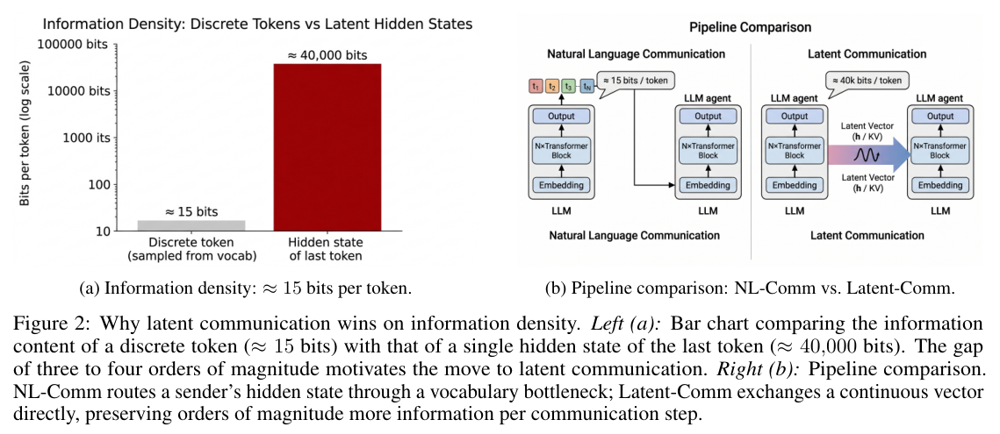
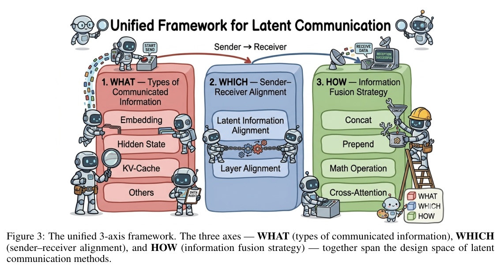

# Liu (2026) — Beyond Tokens: A Unified Framework for Latent Communication in LLM-based Multi-Agent Systems

arXiv [2606.05711](https://arxiv.org/abs/2606.05711) · single author (BUPT) · survey, cut-off 15 Jul 2026 · repo: enochliu98/Awesome-Latent-Communication

> **TL;DR** — A map of 18 methods where agents pass continuous state instead of
> tokens, on three axes: **WHAT** is sent (embedding / hidden state / KV-cache /
> other), **WHICH** layers and spaces are aligned, **HOW** it is fused into the
> receiver. Verdict: latent channels win only conditionally (same backbone,
> expensive decode/prefill, no human in the loop); text wins on oversight and
> interoperability; hybrid text+latent is a first-class design, not a compromise.
> Useful mostly as a vocabulary and as a checklist of controls and open problems —
> and it names the security problem steeropathy's *offer* experiment plays with.

## The three axes

*The motivating picture (their Fig. 2). Note that bits of capacity are not bits of task information — Wenzel's whole point.*

*Their Fig. 3.*

- **WHAT**: embeddings (CIPHER: logit-weighted embedding), hidden states (AC, Interlat, ThoughtComm, Mixture of Thoughts), KV-caches (KVComm, Cache-to-Cache, LatentMAS, Q-KVComm, RelayCaching, Agent Memory …), other: **state-delta trajectory** (SDE — the *change* in hidden state per layer, added into the receiver; reported more robust across slight architecture mismatch), a visual codec (Vision Wormhole), a shared workspace (BIGMAS).
- **WHICH**: no alignment (same model), learned projection (same family), universal codec / interaction layers (heterogeneous). Layer mapping: last→first, all→corresponding, selected→selected.
- **HOW**: concatenation, prepend to KV, **mathematical operation** (addition, gated combination, learned linear), cross-attention, cache restoration.

Takeaways they draw: payload size and architecture dependence grow embedding → hidden state → KV; *useful* information does not follow the same order. KV methods live in prefill, hidden-state methods in decode. 9 of 18 methods use KV-caches; same-model agents dominate; cross-architecture needs training.

## Where steeropathy sits in their taxonomy

| axis | steeropathy |
|---|---|
| WHAT | a unit **direction** `mean(contrast) − baseline` at one layer — closest to SDE's "state delta", but a *population* contrast rather than one trajectory; plus a read-only channel, the J-lens word cloud |
| WHICH | same model, same layer (± band); no alignment |
| HOW | addition into the residual stream at every generated position ("mathematical operation"); the read side is a vocabulary projection of the layers |
| training | none |

One sentence for the README: *steeropathy is the training-free, same-model, addition-fused, direction-payload corner of Liu's design space, with an auditing channel (J-lens) bolted on.*

## The parts that matter for us

- **Security / auditability** (§5.5, §7.2): "auditability is a protocol property, not an optional visualisation layer"; a pure latent channel across a trust boundary is "an untrusted binary interface". Threats: in-transit modification, replay, "malicious but correctly signed senders", and the finding (Brito & Baquero 2026, *When Latent Agents Lie*) that **text-only verification misses tampered KV state**. Their fix is cryptographic binding of a visible commitment to the latent payload. Our *offer* experiment is the semantic version of the same problem: the visible promise ("focus") and the actual payload (sadness) disagree, and the receiver cannot check.
- **Engineering failure modes** (§6.3): positional mismatch, geometric mismatch (same shape, incompatible distribution), memory-bound transfer, **state contamination** ("stale, cross-session, or adversarial tensors can affect future turns without a readable trace"). The J-lens is one answer to "without a readable trace".
- **Reporting checklist** (§6.3): model hash, extraction layer and phase (prefill vs decode), token positions, precision, whether sampling happened before extraction. Our runs should state these once per bench.
- **Break-even** (eq. 3): latent transfer pays only when saved decode/prefill time exceeds setup + transport + alignment + injection. Irrelevant for us (we are not after speed) but it is the frame reviewers will use.
- **Latent CoT vs latent communication** (§7.6): step→step inside one model vs agent→agent. Our "one model talking to itself" cast sits on the boundary on purpose.

## Caveats

The 18-method corpus is small and heterogeneous; numbers are not comparable across papers; the framework does not encode who talks to whom, when, or why (they defer to the Five Ws survey). Some of the entries are preprints that may change.
