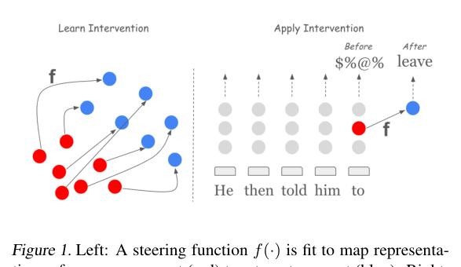
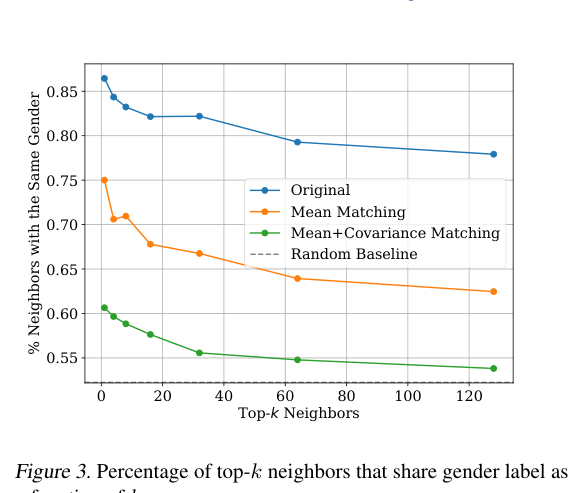

# Singh, Ravfogel et al. (2024) — Representation Surgery: Theory and Practice of Affine Steering

arXiv [2402.09631](https://arxiv.org/abs/2402.09631) · ICML 2024 · IIIT-H / Bar-Ilan / Google / ETH · code: shauliravfogel/affine-steering

> **TL;DR** — Derives the *optimal* affine steering function in the least-squares
> sense and finds it is a plain translation by the difference of concept means,
> `h + (μ_target − μ_source)`. That is the theoretical licence for every
> mean-difference steering vector, including steeropathy's `mean(lines) − neutral`.
> A second optimum with a covariance constraint (MiMiC: match mean *and*
> covariance) also kills "bias by neighbours" and works better in practice.
> Steering is applied *selectively* — only to representations that sit on the
> source side. Evaluated on fairness classification and toxicity in generation.

## The theory, in words

*Their Fig. 1: fit f on labelled states, apply it per generated token.*

- Setup: a representation `H` (last-token hidden state of a sentence), a binary concept `C` (toxic / not, male / female), concept-conditional means `μ_c` and covariances `Σ_c`.
- **Guardedness** (from the LEACE concept-erasure line): after an intervention, no *linear* classifier can recover `C` above chance ⇔ the concept-conditional means coincide.
- **Prop. 4.1** — the affine function that minimally changes `H` (L2) subject to guarding is `s(h) = h + μ_c' − μ_c`, applied only to `c`-side inputs. So the optimal steering under this criterion is *exactly a mean-difference vector*; higher moments are untouched.
- **Prop. 4.2 (MiMiC)** — add the constraint that second moments also match: `W* = Σ_c^{-1/2} (Σ_c^{1/2} Σ_c' Σ_c^{1/2})^{1/2} Σ_c^{-1/2}`, `b* = μ_c' − W* μ_c`. This is the optimal-transport map between two Gaussians (Knott & Smith 1984). Prop. 4.3: it zeroes *expected bias by neighbours* — steered points are on average no closer to same-concept points than to the other concept.
- Guardedness is linear only; nonlinear probes may still recover the concept (Gonen & Goldberg's "lipstick on a pig").

## Experiments

*Bias by neighbours (their Fig. 3): only covariance matching reaches the random baseline.*

- **Bios** (profession from biography, gender as protected concept): mean+cov matching gives the lowest TPR gap (BERT 0.155 → 0.093, Llama2-7b 0.143 → 0.085) with ≤1.5 pp accuracy loss. Cosine-similarity block structure by gender vanishes; k-NN neighbour-gender rate falls to the base rate (52%) only with covariance matching.
- **Dialect/sentiment** with controlled dataset bias: classifier bias tracks dataset bias before steering, flat after.
- **Toxicity in generation** (GPT-2 large, RealToxicityPrompts): steering applied at *each decoding step* to the last hidden state, only when it is closer to `μ_toxic` than to `μ_nontoxic` (the distance rule beat a trained classifier as the gate). Expected max toxicity 0.39 → 0.33 (mean) / 0.29 (mean+cov); toxic prob 0.25 → 0.16 / 0.09; perplexity 24.7 → 28.0 / 30.7. Par with DAPT, below the gradient/finetune methods. They attribute the gap to train/inference mismatch (fit on sentence-final states, applied at every step) and to linearity.

## Methods worth stealing

1. **Selective application by distance** — push only when the receiver's state is nearer the source mean than the target mean. A push that is *gated on where the receiver already is* rather than fired blind.
2. **Guardedness as the success metric for a push**: after transmit, can a linear probe still tell the receiver's pages from target-class pages? A number that does not depend on an in-model judge.
3. **Bias by neighbours** as a second metric: do steered pages cluster with their old class?
4. **Covariance matching** — a whitened affine push instead of a raw add. Needs a bank of states per class (their Σ was rank-deficient in low data; diagonal regularization).

## What it means for steeropathy

- The `mean(lines) − neutral` recipe is now "the L2-optimal linear-guarding steer", not a folk method. Cite it in the README references.
- The theory also says what the recipe *cannot* do: it moves the mean and nothing else. The resonance finding that every mood vector carries a shared "intensity" component is a mean-matching artefact — the covariance (how the moods differ *around* their means) is never touched, so the contrast you chose is all you get.
- The distance-gated push maps onto zombie (heal only the infected) and onto "deciding under the influence": the gate can be a mechanical rule, not a tool call.
- Their toxicity setup — an intervention at every generated token, judged by an external API, with perplexity and n-gram diversity reported — is the honest evaluation template for a steered *generation*, and it is what an external-judge version of our benches would look like.

## Caveats

Binary concepts, single vector per concept, linear guardedness only, and the generation experiment is on GPT-2 large with 2020-era baselines.
