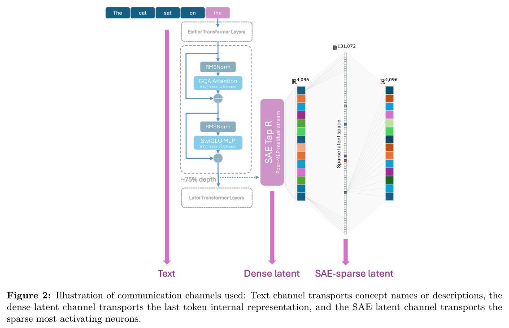
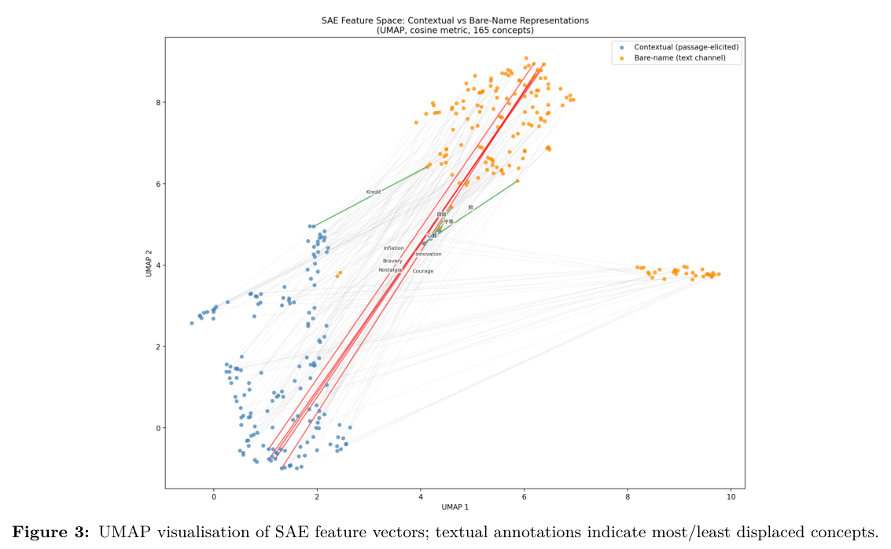
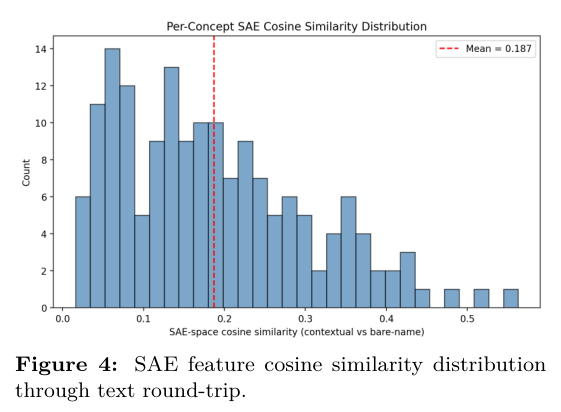

# Wenzel (2026) — Latent Communication Between Language Model Agents: Channels, Alignment, and the Limits of Text

arXiv [2607.14103](https://arxiv.org/abs/2607.14103) · Constructor University · single author · May 2026

> **TL;DR** — Builds three channels between two LLM agents (dense hidden state,
> SAE-sparse code, text) and measures how much *concept* information each carries.
> Text serialization destroys 88% of the sender's SAE features — but the destroyed
> features are surface form (tokenization, template, position), not semantics.
> On every task tested, **text matches or beats the latent channel by 3–10 pp**.
> An honest negative, and the paper says exactly when latent could win: only on
> content text cannot express. That is the bar steeropathy has to clear.

## What they did

*The three channels (their Fig. 2).*

- Sender: Llama 3.1 8B-Instruct, receiver: Mistral 7B (base and instruct). Extraction at ~73% depth (layer 23 / 24), last-token residual state.
- 165 concepts × ~4.7 cloze prompts ("The process by which plants convert sunlight into glucose is called ___").
- **Three channels**: dense (full 4096-d state, 65k bits), SAE-sparse (~70 active features of a 131k-feature SAE, ~2.3k bits, 28× compression), text (bare concept name, ~53 bits).
- **C1 channel fidelity**: linear probes trained on sender states, tested on transmitted states. Dense 100%, SAE 99.4%, text 80.4%.
- **C2 feature survival**: a *text round-trip* — encode the concept in context, serialize to its name, re-encode, compare SAE feature sets. 88.3% of features are lost; Jaccard 5.8%. Lost features have the same magnitude as survivors → *identity replacement*, not attenuation. The bare-name encoding lives in a different neighbourhood of feature space.
- **C3 cross-architecture**: orthogonal Procrustes on 50–140 anchor concepts. Llama→Mistral top-1 retrieval 92% at 140 anchors (chance 0.87%). Base Mistral aligns slightly better than instruct. CCA in a 79-d subspace hits 100% at 80 anchors → the shared geometry is low-rank.
- **Task-level** (4-way multiple choice by cosine to cached candidate vectors, no injection): concept ID dense 58% vs text-passage 66%; attribute/sense 67% vs 77%; cross-lingual concept ID 65% vs 64% (only parity); cross-lingual sense 52% vs 76%.
- **Augmentation**: text + α·(aligned latent). No gain at any α; re-injecting the *lost* features actively hurts (66% → 57%). So what text loses is noise for the task.
- Pilots: a generation-injection test (SAE-decoded vector added at layer 23 of a neutral prompt) yields the concept name 39% of the time. CoT experiment on Gemma 3 27B: injecting the pre-answer hidden state recovers 33% on "CoT-needed" tasks vs 0.6% no-comm — but text CoT gets 96%.

## What they found, in one line each

*Text round-trip = relocation, not attenuation: the same concept encoded in context (blue) and as a bare name (orange) land in different neighbourhoods of SAE space (their Fig. 3).*

*Per-concept SAE cosine after the round-trip, mean 0.19 (their Fig. 4).*

1. Representational convergence across architectures is real and linear-ish (Platonic Representation Hypothesis holds at 8B).
2. Text loses almost all *features* but almost no *task information*, for text-expressible tasks.
3. Instruction-tuned models have **structural injection barriers**: the BOS position is an attention sink (35× norm), injection there is ≤3%; tokens prepended outside the chat template are treated as positional noise (3% vs 97% inside the template). Inject at the last token, inside the template.
4. Prompt-averaged sender vectors close half the latent–text gap: single-prompt states carry prompt-specific noise (mean within-concept cosine 0.53–0.60).

## Methods worth stealing

- **The text round-trip as a measuring device.** Serialize → re-encode → compare feature sets (or, for us, J-space word sets / drift residuals). Distinguishes attenuation from replacement.
- **Gated claims.** Prerequisite gates (linear separability, SAE validity) must pass before the main claims are tested. Each claim gets a number and a pass/fail line in one table (their Table 5).
- **No-comm baseline scored the same way** as the real channels, plus a binomial test against chance.
- **Augmentation as adjudicator**: if adding the latent to text does nothing, the latent carried nothing text lacked.

## What it means for steeropathy

- Wenzel's claim is exactly the null steeropathy has to beat: *what crosses in the vector that text would not have carried?* Every experiment here so far compares "vector vs nothing" or "vector vs scrambled vector". None compares **vector vs the sender's own text**. That is the missing control.
- His "when would latent win" list: (1) content text cannot express, (2) cross-modal, (3) bandwidth/interpretability constraints. steeropathy lives in (1): the *runner-up* alternatives, the disposition, the thing that did not become a token. He only tested concept identification, which text is built for.
- His injection pilot is our transmit primitive, without the contrast: a raw state added to a neutral prompt gives the concept 39% of the time. Our "read a contrast, never a raw signal" rule is the fix for exactly the prompt-noise he measures.
- The BOS / template warning applies to brainscope: injection must land at generated positions inside the chat template, not at the sink.

## Caveats

8B models only; all tasks have text-expressible answers; Procrustes is not the best linear map; retrieval-by-cosine is not the same as the receiver *using* the message in generation.
