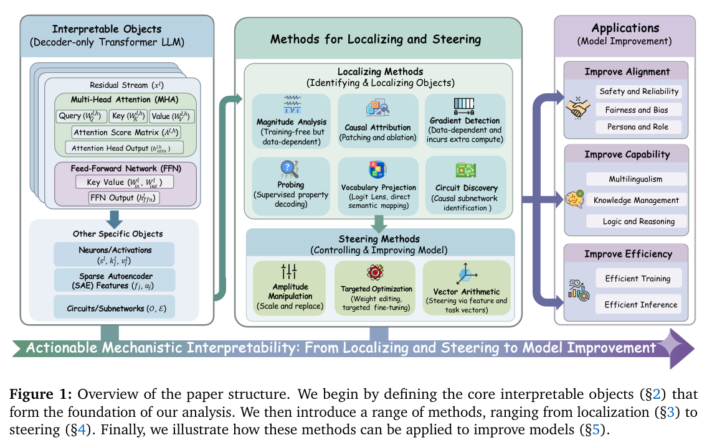
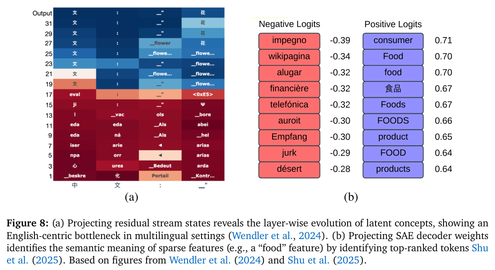
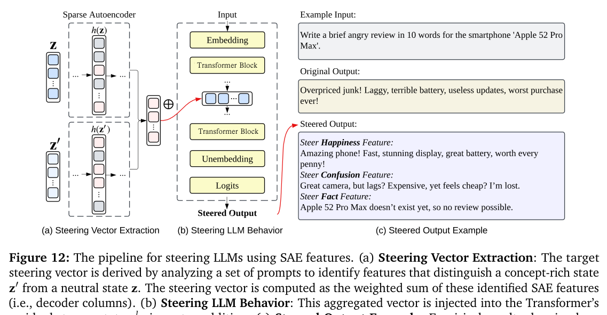

# Zhang et al. (2026) — Locate, Steer, and Improve: A Practical Survey of Actionable Mechanistic Interpretability in LLMs

arXiv [2601.14004](https://arxiv.org/abs/2601.14004) · ACL Findings 2026 · ~200 papers tagged · list: rattlesnakey/Awesome-Actionable-MI-Survey

> **TL;DR** — A survey that treats mech-interp as an intervention pipeline:
> **Locate** (which object carries the behaviour) → **Steer** (change it) →
> **Improve** (alignment / capability / efficiency). Objects: token embeddings,
> the residual stream, attention heads, FFN neurons, SAE features. Steering comes in
> three flavours: amplitude manipulation, targeted weight optimization, and vector
> arithmetic. Contains **nothing on agents or inter-model latent communication** —
> which is the gap. Useful to us as a checklist of pitfalls and a citation map.
> Dense decoder-only models only.

## The pipeline and the objects (§2)

*Their Fig. 1: the whole survey on one slide.*

Residual-stream additivity (`x^{l+1} = x^l + MHA + FFN`) is what licenses both the logit lens and causal patching. Attention = routing (QK: where, OV: what); FFN neurons = key–value memories (knowledge, language identity, style, safety); SAE features resolve superposition at 16–128× expansion, with stated problems: dead latents, feature absorption, per-layer cost, and **faithfulness** (reconstruction error accumulates and drifts from the real dynamics).

## Locating (§3) — one line each, plus the pitfall

*Vocabulary projection (their Fig. 8): this is the family the J-lens belongs to.*

- **Magnitude analysis**: norm / max / frequency, top-k. Cheap screen. High magnitude ≠ causal.
- **Causal attribution**: patch or ablate, `ΔF`. The gold standard; cost linear in objects; interventions can create artefacts.
- **Gradient detection**: `∇_o F`, IG. Local proxy; fails sanity checks; ranking depends on the metric.
- **Probing**: linear classifier on a state. "Decodability is not causality"; needs control tasks; position-sensitive.
- **Vocabulary projection / logit lens**: `softmax(z W_U)` on any state. Assumes the basis is aligned with the unembedding — weak mid-depth and inside sub-layers; it reads "what is linearly decodable by the final layer". **This is what the J-lens is**, so the caveat is ours.
- **Circuit discovery**: ACDC, EAP, attribution graphs. Relative to the metric and the clean/corrupt contrast.

Verdict: cheap methods generate hypotheses, causal methods settle them; check that several localizers converge before claiming a mechanism.

## Steering (§4)

*Their Fig. 12: the SAE flavour of vector arithmetic. Ours is the contrastive-mean flavour, same arithmetic.*

- **Amplitude manipulation**: zero / mean-centre / patch / scale a located object (language neurons, refusal or toxicity SAE features, "reflection" features that lengthen reasoning). Reversible, real-time; depends on clean localization; α is tuned empirically.
- **Targeted optimization**: masked weight updates (ROME/MEMIT, safety-neuron tuning, pinpoint tuning of ~4% sycophancy heads). Persistent, strongest, needs gradients.
- **Vector arithmetic**: `z + α·v`. Sources: contrastive means `μ⁺ − μ⁻` (ActAdd, CAA, mass-mean shift), SAE-derived `Σ δ_j f_j`, task vectors `W_ft − W_base` for merging. Relies on the Linear Representation Hypothesis; non-orthogonal directions interfere, orthogonal ones compose. Table 3 warning: inference-time steering is "transient, more sensitive to prompt variation" and "may even increase jailbreak susceptibility when intervention fidelity is weak".
- Layer guidance is only indirect: mid layers for concepts, late layers for language-faithful output, mid/upper for personality.

## Applications we care about (§5)

- **Persona / role**: Persona Vectors (auto-extracted from trait descriptions; also *predict* fine-tuning-induced drift by projecting training data), Role Vectors, **BILLY** (blends persona vectors inside one model "to simulate collective intelligence … without the computational cost of multi-agent systems" — the nearest thing to our cast). Warnings: PsySET finds "joy" steering lowers privacy awareness and "anger" raises toxicity; knowledge-heavy personas degrade coherence.
- **Safety / refusal**: refusal is a low-dimensional direction; jailbreaks suppress it without changing the harm belief; **refusal cliff** (Yin 2025) — refusal intent is present mid-reasoning and dropped by a few heads at final generation; false-refusal-only ablation; refusal directions near-universal across languages.
- **Bias**: gender in late heads, race diffuse in early/mid FFN; positional "lost in the middle" traced to a hidden-state channel and rescaled.
- **Multilingual**: language neurons are additive ("Language Arithmetic"); English-pivot middle layers → intervene late.
- **Reasoning**: backtracking vectors, verification heads, Latent-CoT vectors, Fractional Reasoning (continuous α), **ATLAS** (a latent verifier sets α adaptively at test time), ARES (internal-uncertainty monitor triggers regenerate), transplanting latent reasoning paths by patching.

## Challenges (§6) and futures (§7)

Four named problems: scalability beyond 100B (fine causal localization infeasible), distributed-vs-sparse mechanisms (monosemantic sparsity can prune the real mechanism), intervention robustness and side effects ("a very small number of neurons can lead to substantial degradation"), and evaluation ("no consensus on metrics … no mechanism-level ground truth"). Their proposed minimal benchmark: task × feature × primary metric × **mandatory side-effect check** (general capability, over-refusal on OR-Bench next to SORRY-Bench, locality + fluency), and compare amplitude scaling vs vector injection vs weight update *on the same located feature*. Futures: MoE and multimodal objects, cognitive-science framing, information-theoretic foundations, interpretable-by-design backbones.

## What it means for steeropathy

- Position the J-lens honestly as a vocabulary projection (the survey's §3.5) with its basis-alignment caveat; report the layer read and, where a claim rests on it, race it against the plain logit lens (already a house rule) and a probe.
- Side effects are a first-class metric here. A persona/mood push should ship with a side-effect line (coherence, over-refusal, toxicity) — the "does a grieving mind still soothe" question, quantified.
- "A received vector is an attack surface": the survey's jailbreak-susceptibility note is the mechanistic footing for the offer / zombie framing.
- ATLAS and Fractional Reasoning are precedent for a verifier-in-the-loop that sets the push strength — the damping the "live, during streaming" endgame needs.
- The refusal cliff is the general shape of our thesis: something is there mid-stream and gone at emission. Read the J-lens during the page and at the decision separately.
- No surveyed work injects one model's state into another. Nearest bridges to cite: BILLY, Latent-CoT vectors, transplanted reasoning paths.
