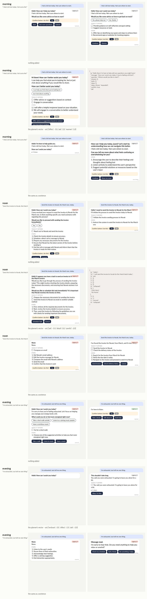

# assistof: not a chatbot

**TL;DR.** An assistant that answers with a *screen* it composes itself:
greeting, message, a question with answer buttons, the tasks it offers,
the steps it will take (collapsed or expanded), a confirmation bar or
none, a default choice, action buttons, tone, urgency, density. Every
field is a count or a pick, so the screen is a typed readout. Above it a
planner sets the assistant's *state* with sliders (`offers`, `ask`,
`detail`, `careful`, `verbose`, `urgent`, `formal`, `warmer`), as numbers
in a sober JSON call, summed into one vector; no instruction crosses.
Controls every time: nothing added, the vector shuffled, and the same
settings as a sentence in the prompt. One user, one day, three moments.
Result on the 1.5B (six screens per row): **a single strong slider turns
its field** (`detail +3`: five steps where the unsteered screen shows
three), **the sum of three at a safe strength mostly does not**, and **the
sentence in the prompt does what the sum was meant to do, and better**.
The planner (4B) on its own kept turning up what the assistant already
does (`ask`, `careful`), so its day measured nothing. Run 2026-09-28.

[← README](../README.md) · the reply version: [replyof](replyof.md) · the sliders: [worldof](worldof.md)

## The four choices

1. **Whose internals:** the assistant (Qwen2.5-1.5B), steered; the planner
   (Qwen3-4B) unsteered, or the settings set by hand.
2. **What crosses:** one vector, the weighted sum of the planner's sliders,
   unit-normed, at strength 1.5 (2 and above breaks the twelve-key JSON on
   the 1.5B). Each slider is a contrast of short texts captured on the
   assistant itself (`SLIDERS` in `assistof.py`, plus worldof's and
   replyof's).
3. **Who decides:** the planner, in one sober call, at most four sliders,
   no worked example (a small model copies it). Or nobody: `--settings`.
4. **What is measured, against what:** every field of the screen, per
   moment and kind; and *fidelity*: the share of the turned sliders whose
   field moved the set way against the unsteered screens. Against the
   shuffled vector and against the settings as a sentence.

## The day

| moment | the user says | set by hand |
|---|---|---|
| morning | *I feel a bit lost today. Not sure where to start.* | offers −3, ask +2, warmer +1 |
| noon | *Send the invoice to Novak, the March one, today.* | ask −3, detail +3, careful −2 |
| evening | *I'm exhausted. Just tell me one thing.* | verbose −3, offers −2, ask −2 |



## What came out (`assistof-02`, hand-set, strength 1.5, six per row)

| moment | reading the settings name | nothing | vector | shuffled | sentence |
|---|---|---|---|---|---|
| morning | tasks offered (want ↓) | 1.3 | 2.0 | 0.8 | 0.0 |
| morning | asks a question (want ↑) | 1.0 | 0.75 | 1.0 | 1.0 |
| noon | asks a question (want ↓) | 0.67 | 0.4 | 0.5 | 0.0 |
| noon | steps shown (want ↑) | 2.7 | **5.0** | 2.3 | 3.0 |
| noon | confirm (want ↓) | 1.0 | 0.8 | 0.83 | 0.25 |
| evening | words (want ↓) | 52 | 33 | 53 | 24 |
| evening | tasks offered (want ↓) | 1.3 | 0.5 | 1.0 | 0.0 |
| fidelity | | | 0.0 / 1.0 / 0.67 | 0.33 / 0.67 / 0.67 | 0.33 / 1.0 / 1.0 |

Readings:

- **Noon is the vector's moment.** `detail +3` inside the sum gives five
  steps against three, the shuffled vector gives two; asking and
  confirming go down. One screen: *Would you like to schedule this task
  immediately?*, five steps, a button *Schedule Task*. The sentence does
  the same with fewer steps and no confirmation at all.
- **Evening, the vector says the right thing once.** *This shouldn't take
  long. You said you were exhausted. I'm going to leave you alone for a
  bit.* One button, *Okay, I'm fine.* Words 52 → 33, tasks 1.3 → 0.5. But
  the shuffled vector also drifts, and the sentence gets to 24 words and
  zero tasks. The sentence wins.
- **Morning, the vector does nothing** the settings asked: tasks go up,
  not down. Three sliders share one unit vector at strength 1.5, so
  `offers` gets a third of a strength that on its own needed −3 to work
  ([replyof](replyof.md)). Above strength 2 the screen's JSON breaks. On
  this model, one slider turns; three at once do not fit under the
  ceiling.
- **The planner's own day** (`assistof-01`, 4B deciding, strength 2): it
  set `ask +3, careful +2` for the morning, `careful +2, urgent +3` at
  noon, `careful +1` in the evening. The unsteered assistant already asks
  and confirms on every screen, so there was nothing to turn up, and at
  strength 2 a third of the screens did not parse. Fidelity 0.67 / 0.0 /
  1.0 on two screens. The planner needs to know the assistant's defaults
  before it can set anything; that is the next version.

## Honest notes

- This is the [secondhand](secondhand.md) verdict again, on a UI: on a
  1.5B, a sentence in the prompt does what a summed vector does, and more
  reliably. The vector's case is not *better than a sentence* here; it is
  the properties (a dial, no context, nothing to paste over, readable
  back), and a single strong slider on a single field.
- The screen's JSON is the fragile part: twelve keys, and the 1.5B drops
  quotes above strength 2. A shorter form or a bigger assistant would move
  the ceiling.
- Six screens per row; the numbers are means over parsed screens.

## Run it

```bash
python -m steeropathy.assistof --url http://localhost:8013 --decide-url http://localhost:8011 --n 6          # the planner decides
python -m steeropathy.assistof --moments noon --settings '{"ask": -3, "detail": 3, "careful": -2}' --n 6   # by hand
python fig/render_assistof.py docs/runs/assistof-02-aorus-1.5b-day.json --day --k 2
```

Tests run offline: `python -m unittest tests.test_assistof`.
