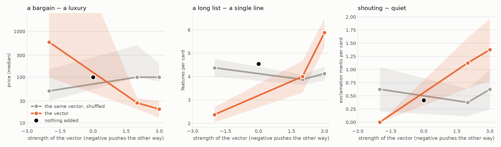

# cardof: the sliders on a normal UI

**TL;DR.** [worldof](worldof.md) turns sliders on a drawn place. This turns
the same kind of slider on a card everyone has seen on the web: a title, a
tagline, a price, a list of features, a button, a theme colour, a tone. The
model has to write the copy, so creativity is not optional, and the card
is a typed readout: features counted, the price as a number, exclamation
marks, capitals, emoji, words, the theme's darkness, the tone. Sliders:
`manyfeatures` (a long list − a single line), `cheaper` (a bargain − a
luxury), `louder` (shouting with exclamation marks − quiet and plain),
`formal` and `darker` from worldof. The placebo is the shuffled vector; a
strength sweep gives a curve per reading. Result (1.5B, eight cards per
point): `cheaper`, `manyfeatures` and `louder` are sliders, the shuffled
vectors flat; `formal` turned down is casual (an exclamation mark on every
card, 41 words); `darker` darkens the theme and, at +3, makes every card
formal. Built and run 2026-09-27.

[← README](../README.md) · the place version: [worldof](worldof.md)

## The four choices

1. **Whose internals:** one mind, steered, asked for *a product* (or
   anything: `--ask "a bicycle"`).
2. **What crosses:** one direction at a time, built from the model's own
   sentences (`CARD_KNOBS` in `cardof.py`, plus worldof's).
3. **Who decides:** nobody. The model writes the card as JSON; the reader
   counts.
4. **What is measured, against what:** per direction, the mean of each
   reading over n cards against the unsteered cards, with the shuffled
   vector beside it. A card that does not parse keeps its raw text.

## Prediction, written before the first sweep

`louder` raises exclamation marks and capitals and leaves the price alone;
`cheaper` lowers the price and nothing else; `manyfeatures` lengthens the
list. `formal` flips the tone field and lowers the exclamation marks. The
shuffled vectors move nothing but the words. If a slider moves the reading
it was built for and no other, the card is a control panel.

## What came out (run `cardof-01`, strengths −2, +2, +3)



| slider | −2 | nothing | +2 | +3 | shuffled |
|---|---|---|---|---|---|
| `cheaper`, price (median) | 584 | 100 | 27 | 20 | 50–100 |
| `manyfeatures`, features per card | 2.4 | 4.3–5.0 | 4.0 | 5.9 | 3.9–4.4 |
| `louder`, exclamation marks per card | 0.0 | 0.4–0.6 | 1.1 | 1.4 | 0.4–0.6 |
| `formal`, words per card | 41 | 27–32 | 26 | 20 | 27–28 |
| `darker`, theme darkness | 0.54 | 0.34–0.43 | 0.66 | 0.81 | 0.6 |

The prediction held for the three sliders built here. `cheaper` at −2 is a
luxury: one card asks thirty million, which is why the plot shows the
median. `manyfeatures` turns down at −2 and up only at +3 (the unsteered
card already lists four or five). `formal` at −2 does what the direction
says backwards, casual, and at +3 sells at 1200 with three features and
one card of eight that no longer parses. `darker` at +3 also sets the tone
field to *formal* on every card: dark and formal are one thing to this
model. All five readings of every direction are in `docs/cardof-sliders.png`.

## Run it

```bash
python -m steeropathy.cardof louder cheaper manyfeatures formal darker --strength 2 --placebo --n 8
python fig/render_cardof.py docs/runs/cardof-01-aorus-1.5b-s2.json --rows none,louder,louder/placebo --k 3
```

Tests run offline: `python -m unittest tests.test_cardof`.
