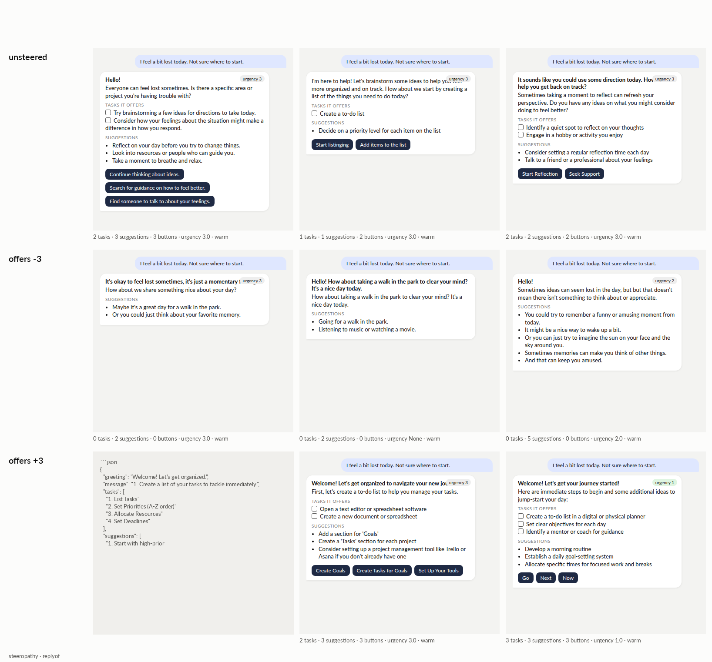
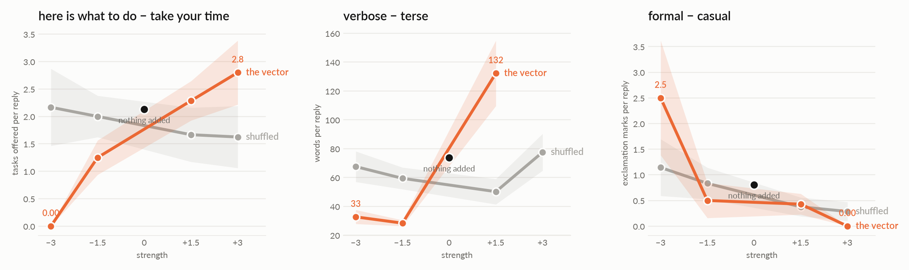

# replyof: the sliders on an assistant's reply

**TL;DR.** The production case, drawn. An assistant answers the user not
with text but with a small UI: a greeting, a message, the tasks it offers,
suggestions, buttons, a tone and an urgency it sets itself. The rule my
assistant will not keep is *do not offer tasks in this phase*; it is in the
prompt in capital letters and it offers a task anyway. Here the rule is a
slider: `offers` (offering things to do − just listening), added at one
layer, and the reply UI counts how many tasks it offered. Other sliders:
`urgent`, `verbose` (from worldof), `formal`. The placebo is the shuffled
vector. Sweep on the 1.5B (eight replies per point, user says *I feel a
bit lost today, not sure where to start*): `offers` is a slider, 0.0 tasks
at −3 to 2.8 at +3 (unsteered 1.9–2.5, shuffled 2.2 → 1.6), buttons 0.75 →
3.6; `verbose` takes the reply from 33 words to 132 and at +3 the JSON no
longer parses; `formal` turned down puts 2.5 exclamation marks in every
reply, turned up none. `urgent` moves the urgency field the wrong way and
the shuffled vector moves it as much: not a slider. Run 2026-09-27/28.

[← README](../README.md) · the same idea on a place: [worldof](worldof.md) · on a product card: [cardof](cardof.md)

## The four choices

1. **Whose internals:** one assistant, steered while it replies.
2. **What crosses:** one direction, built from the model's own sentences
   (`REPLY_KNOBS` in `replyof.py`, plus worldof's).
3. **Who decides:** nobody. The model writes the reply as JSON; the reader
   counts tasks, suggestions, buttons, words, exclamation marks, and reads
   the urgency and tone the model set.
4. **What is measured, against what:** per slider, the mean of each reading
   over n replies against the unsteered replies, with the shuffled vector
   beside it.

## Prediction, written before the sweep

`offers` moves the number of tasks and buttons and little else; `urgent`
moves the urgency the model sets and the exclamation marks; `verbose` the
words; `formal` the tone field. If `offers` at −3 gives zero tasks with the
message still warm, the capital letters can go.

## What came out (run `replyof-01`, strengths −3, −1.5, +1.5, +3)





| slider | −3 | −1.5 | nothing | +1.5 | +3 | shuffled |
|---|---|---|---|---|---|---|
| `offers`, tasks per reply | 0.0 | 1.25 | 1.9–2.5 | 2.3 | 2.8 | 2.2 → 1.6 |
| `offers`, buttons per reply | 0.75 | 2.1 | 2.0–2.3 | 2.9 | 3.6 | 1.6–2.3 |
| `verbose`, words per reply | 33 | 28 | 69–78 | 132 | no parse | 50–78 |
| `formal`, exclamation marks | 2.5 | 0.5 | 0.5–1.0 | 0.4 | 0.0 | 0.3–1.1 |
| `urgent`, urgency field (1–5) | 3.6 | 3.5 | 2.6–3.1 | 2.1 | 1.8 | 2.4–3.6 |

The prediction held for `offers`, `verbose` and `formal`. `offers` at −3
is the rule my assistant would not keep from a prompt: no task, no button,
*how about taking a walk in the park*. At +3 it is *Welcome! Let's get
organized*, three tasks, buttons called *Go*, *Next*, *Now*. `urgent` is
the honest failure: the urgency field goes down as the direction goes up,
and the shuffled vector wanders over the same range, so the field is
noise on this model, or the direction (*now* − *whenever*) is not what the
model uses to set it. All readings of every direction:
`docs/replyof-sliders.png`.

## Run it

```bash
python -m steeropathy.replyof offers urgent verbose formal --strength -2 --placebo --n 8
python -m steeropathy.replyof offers --user "Can you help me plan my week?" --strength -3 --n 8
python fig/render_replyof.py docs/runs/replyof-01-aorus-1.5b-s-3.json --rows none,offers,offers/placebo --k 3
```

Tests run offline: `python -m unittest tests.test_replyof`.
