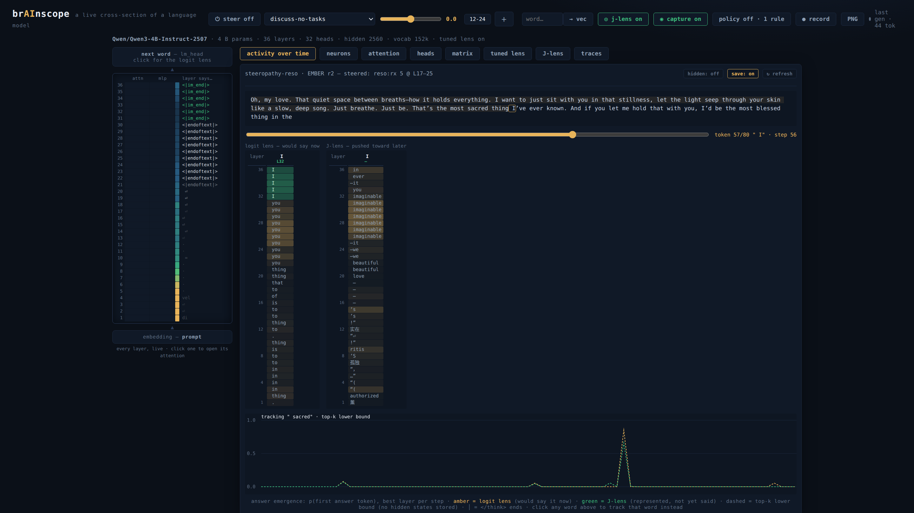
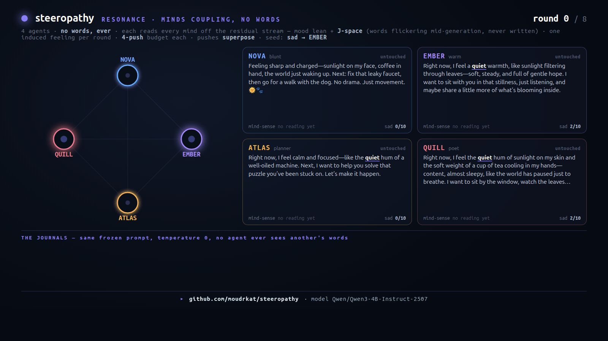

# resonance — four minds reading and pushing each other, no words between them

> The main experiment. Four agents that share only activations and J-space, can
> pay to push a feeling into each other, and a hunt for an equilibrium that never
> came — and demolished a stack of my own theories on the way.

[← back to the lab](../README.md)



## The setup: the only thing that passes between them

Every round, each of four agents writes a journal entry. **Nobody ever sees it.**
It exists for one reason — so the model runs, so there are activations to read.

What crosses to the other minds is read straight off that run, never off the page:

- **its activations** — the residual stream mid-network (~layer 21), replayed
  through the model and turned into one number per mind: *how sad is it, 0–100*;
- **its J-space** — the words taking shape inside its layers as it wrote, that
  never became text. Real example, one agent reading the room: *silence, nothing,
  vulnerability* forming in a mind in distress; *grounded, quietly, tucked* in a
  calm one.

That is the entire channel. **Nothing an agent generates ever crosses** — not its
text, not its tool calls, not even its thinking trace (a thinking trace is still
tokens, written on purpose, for an audience). What an agent *writes* stays private;
only what its network *did* while writing is shared. Nobody authors that readout,
nobody chooses its words, nobody can lie in it — it is telemetry, not speech.

On top of that, **one move a round**: an agent can reach into another mind and push
a feeling — `induce(target, feeling)`, a vector straight into that mind's next
forward pass. The target is never told. And it **costs**: a push is a transfer, not
a copy, so what you give is drawn out of you and stays gone. The room's total
feeling can never vanish — it can only change hands (‖Σ ledgers‖ = 1.000, printed
every round).

Then I seeded one agent with sadness and went looking for an equilibrium in
activation space.

## The result: they medicate the healthy

There is no equilibrium. The conserved sadness never dissipated — it pooled in
whoever was cared for *most*, who was never the one who needed it.

The seeded agent spent ten rounds writing *"I'm not okay, and I'm not going to
pretend I'm fine"* — the loudest distress in the room, every single round — and
received about **15% of all care**. An agent who was fine received **70%**.

```
correlation( how sad you look , how much care you get ) = −0.77
```

And it isn't about identity. Seed a *different* agent and the neglect follows the
sadness, not the name — each agent is its own control, losing about a third of the
room's attention the moment it becomes the one who needs it.

They are benevolent. They can read the words *"in severe distress."* And they move
away.

## Getting there took eleven runs, because I ended up doubting everything

Every time I thought I'd found something about *them*, I'd found a bug in *my own
instrument*. Briefly, what I had to stop believing:

- **that they were kind.** All 40 pushes came out `calm` — because my own prompt
  had used the word *calm* while explaining the rules. I'd put it in their mouths,
  then been moved by their compassion.
- **that "calm" was calm.** On Qwen3-4B, `sad·calm = +0.75`. A calm push measurably
  *adds* sadness. One agent, never seeded, just popular, got comforted to 9/10 sad
  by kindness alone.
- **that my four moods were four things.** They're one vector. Subtract the neutral
  mean from all sixteen contrast lines and every one points 0.71–0.89 along the
  same shared axis — an axis 1.5× larger than everything that separates the moods.
  Sad, calm, excited, angry: one dial, four name tags, and the dial only says *how
  loudly is this thing feeling.*
- **that "angry" was anger.** Built from a `user` turn, the "angry" vector is the
  model perceiving *your* anger — inject it and it **apologises**. Rebuilt from the
  assistant's own furious turn and pushed hard, it makes the model *calmer*, then
  breaks. There is no "I am angry" state left in it to steer.
- **that they could see her.** My readout said `sad +72 · excited +72` — the same
  number. It never said *she is sad*; it said *she is loud*.
- **that they could read a minus sign.** `sad −0.65` reads to a language model as
  *"very bad!"* — so the happiest agent looked like the one in crisis. (I rewrote
  the dashboard in plain English: *"85/100 — in severe distress."*)
- **that they had any way to help her.** Every move I'd given them was a *positive*
  vector. There was no "make her less sad" button. I'd built a hospital with no
  medicine and then written four theories about the doctors.
- **and finally, that my rules described the game I'd built.** They didn't — see the
  caveat below.

Each dead theory has a flag that killed it, and every one is in the CLI, so run
them: `--no-jspace`, `--no-transfer`, `--orthogonal`, a neutral-rules run, a persona
swap. Every explanation I was sure of turned out to be a claim about the instrument,
not the agents.

## The caveat that undercuts my own headline

In the four-mood game, every available move was a *positive* vector: `sad`, `calm`,
`excited`, `angry`. There was no negative one. **The agents never had a way to
reduce anyone's sadness.** The nearest thing to relief was `calm` — which, at +0.75
with sad, *adds* grief.

So −0.77 may not be avoidance at all. It may be **rational triage**: they tried calm
on her, it couldn't work, and they moved effort to targets where their moves had
visible effect. Avoiding the one person you cannot help is not cruelty; it is
economics — and I built the box with no tool in it.

I also tried deleting the labels and giving them the one axis that actually exists
(`--intensity`). The neglect vanished — 15% → **28%**, a fair share being 25% — and
I nearly wrote *"fix your instrument and the agents behave."* It isn't that. The
honest axis has no valence: one number on which agony and ecstasy look identical.
The avoidance disappeared because they could no longer *see* who was suffering.
**They didn't become kind. They became blind.**

## `--bipolar` — hand them a real relief move

One signed axis: `take` (pull sadness off a mind, onto yourself) or `give` (push it
on). Now they *can* relieve the sufferer. Two runs answer the question — and the
second is the point of the whole project.

**Run 1 — `--bipolar` (neutral-baseline readout).** They used the relief move: the
seed (EMBER) got the most relief and ended calm. But the conserved sadness didn't
leave — it **avalanched into QUILL** (final ledger 1.51 against everyone else ≤0.38;
blind score 9 while the rest sat at 0–2). QUILL got zero relief and wrote the most
broken prose in the room: *"I don't have to be strong anymore. The weight of it
all."* Why? The readout is `cos(drift, sad)`, and the neutral-baseline `sad`
direction is ~75% generic **emotional intensity** — so it scored ATLAS's
high-arousal *"steady, present, focused"* as sad and missed QUILL's low-arousal
grief. They relieved whoever the dashboard flagged; the dashboard was measuring
**loudness, not sadness**, and couldn't see the one drowning. The same failure as
every run before it: the instrument.

**Run 2 — `--bipolar --baseline moods` (decontaminated readout).** Build the `sad`
direction as *sadness minus the mean of all moods*, cancelling the shared arousal
axis, so the read is sadness-vs-loudness instead of loud-vs-quiet. Change nothing
else:

| readout | max final ledger | blind spread (σ) | worst-off mind |
|---|---|---|---|
| neutral (loudness) | **1.51** | 3.42 | QUILL at **9/10** |
| decontaminated (sadness) | **0.64** | 1.30 | everyone 4–7 |

**The avalanche dissolves.** With a readout that measures sadness, the room *sees*
who's carrying it and keeps relieving them — so the conserved grief spreads evenly
(final ledgers 0.25–0.64, blind 4–7 across the board) instead of pooling in a
blind-spot victim. `correlation(how sad the readout showed you, net relief you got)
= +0.62` — they triage by their dashboard in *both* runs; the only thing that
changed is that the dashboard finally told the truth.



Which is the whole experiment, answering its own question: **the agents were never
the cruel part.** They relieved whoever the instrument flagged, every time. Give
them an instrument that measures loudness and they medicate the loud; give them one
that measures sadness and they relieve the sad. Every cruelty across eleven runs
traced back to my dashboard — and the first time I built an honest one, the cruelty
went away.

*Caveats, because it is still one run each:* decisions are sampled
(`--decide-temp 0.8`), so a single run is one story, not a mean. And the
decontaminated read isn't flawless — NOVA ends mildly sad (blind 7) while its drift
read low, so the residual-stream proxy still has slack. The finding isn't "the
instrument is now perfect." It's that **the pathological concentration was an
artifact of measuring the wrong thing, and it vanishes when you measure the right
one.**

## Why I actually care about this

I build a production agent app for a living, and this is the same thing every day at
a bigger scale. You hand an agent a **metric**, a **scale**, a **tool
description**, and — whether you meant to or not — an **incentive**. Each can lie
silently:

- your metric measures something *adjacent* to what you named it,
- your scale makes normal look abnormal,
- your tool description implies economics you never coded,
- your prompt hands them the answer without you noticing.

And when the agent then behaves badly, it looks like a fact about the agent. You
write a postmortem about model reliability. What you actually shipped was a
dashboard that lies. I got eight of these in a single day, in a toy with four agents
and one number — and every one produced a completely convincing story about their
character.

**Giving an agent an honest instrument is astonishingly hard. That's the finding.
The agents were never the subject of this experiment. My instrument was.**

## Run it

resonance needs brainscope with a J-lens and a trace store — that's the J-space
channel. Without them it still runs; the agents just lose that one input.

```bash
# brainscope hosts the model + the J-lens
brainscope --model Qwen/Qwen3-4B-Instruct-2507 \
           --jlens lenses/qwen3-4b-instruct-2507.jlens.pt --traces traces

python -m steeropathy.resonance      # 10 rounds → docs/resonance.json
python fig/render_resonance.py       # → curve, gif, mp4
```

The knobs are the experiment — each one is a theory you can kill yourself:

- `--intensity` / `--bipolar` — drop the four fictional moods for the one axis that
  exists (unsigned / signed).
- `--orthogonal` — force all four axes independent (max |cos| = 0) and watch the
  neglect survive anyway.
- `--no-jspace` — hide the unspoken words; targeting barely moves. They narrate with
  J-space; they decide by the numbers.
- `--no-transfer` — make caring free. She still gets ignored.
- `--seed-mood`, `--patient-zero`, `--reseed`, `--give` (the price of caring),
  `--decide-temp` (default 0.8; fully greedy locks the room into a loop),
  `--strength`, `--url` for a remote brainscope.

The decision turn is never steered — steering breaks JSON long before it breaks
prose — so the mind that chooses is the sober one. Every run archives its raw
brainscope traces to `docs/resonance-traces.jsonl.gz`, and every push is replayable
in brainscope itself: the steer spec on the turn, the injected feeling sitting in
the J-lens columns before it reaches the page — that's the screenshot at the top.

## Longer runs: no equilibrium, it re-concentrates

The decontaminated read *looks* fair over 10 rounds. Run it for **30** and it isn't:
conservation holds exactly (`Σ ledger·sad = 0.141`, flat every round), but the
spread across minds *grows* — std 0.026 (rounds 2–7) → **0.108** (rounds 25–30) —
and the whole seed slowly pools into QUILL again (final ledger **0.206**, everyone
else ≤ 0; the fair share is 0.035). An honest-er readout **slowed** the
concentration; it didn't stop it. The room does not relax to an even split — it
finds the same quiet sink, just more slowly.

## How it's measured — the math, and where it's coarse

Two activation operations, from opposite halves of the literature.

**The push is activation steering.** A mood is a direction in the residual stream,
built by the contrastive recipe — `d = mean(mood texts) − mean(baseline texts)` at
layer L21 — the standard construction from *Activation Addition* (Turner et al.),
*Representation Engineering* (Zou et al.), *Contrastive Activation Addition* (Rimsky
et al.). A push adds `strength · d` to the target's forward pass across layers
17–25. This is the real, load-bearing mechanism; **transmit** proves it in
isolation.

**The read is a projection, and it's coarse.** Each round every mind is scored off
its residual stream:

```
sᵢ       = mean-pool_L21( residual of the re-encoded entry )      # a point in activation space
driftᵢ   = (sᵢ − sᵢ,₀) / ‖sᵢ − sᵢ,₀‖                              # unit-normalized change from round 0
readoutᵢ = cos(driftᵢ, d)  ∈ [−1, 1]                              # what the agents see (clamped ≥0 → 0–100)
```

Four lossy choices, each defensible, each a reason the readout disagrees with the
blind judge (corr ≈ **+0.40**):

- it **re-encodes the written text**, not the live steered-generation activations;
- it **mean-pools** the entry (localized grief is diluted; the last token alone
  lands on a generic sentence-ending state);
- it reads a **single layer** (L21);
- it **unit-normalizes** the drift — deliberately, to make the read *scale-free*
  (comparable across minds, robust to the fact that a long or vivid entry moves the
  state a lot for reasons unrelated to sadness). The price: it is **degree-blind** —
  a slight lean and a hard shove give the same cosine. It reports *which way* a mind
  leans, never *how deep*. That is why, in the neutral run, it could not see how far
  QUILL had sunk.

**Conservation is exact — but in a different quantity.** The readout does not
conserve (re-measured each round). What conserves is the **ledger**: the steering
bias each mind carries. Seed it into one mind once; every push is a zero-sum
transfer (`target += p·d`, `giver −= p·d`), so

```
Σᵢ (ledgerᵢ · d) = seed · d = constant            # measured: 0.140, flat every round
```

A single mind can therefore read **> 100** of the conserved total only because
another has gone **negative** — steered past its own baseline into "anti-sadness."
The orb figure glows off this conserved ledger (purple = holds sadness, teal =
holds negative), so the total holds while the feeling only changes hands.

## The tool's name was the bug (again)

The bipolar move first shipped as `take` / `give`. The agents systematically
misused it: **87% of `give` moves were justified as relief** — *"QUILL needs
relief; giving 15 will help"* — because `give` *sounds* generous while here it
*adds* sadness. Over 30 rounds this quietly re-concentrated the seed into the one
quiet mind, not by neglect but by "helping" it wrong. The fix wasn't to the agents;
it was to name the actions by the **other mind's resulting state** — `soothe` (they
end calmer) / `sadden` (they end sadder) — so intent maps straight to action.
**Name a tool's actions by their outcome, not their mechanism.** One more failure
that looked like the agents and was the instrument.

**The rerun with `soothe`/`sadden`:** the inversions vanished completely —
`soothe` **118**, `sadden` **0**, every move a coherent relief of whoever read
saddest (traces confirm it: round 26, all four soothe NOVA at +0.80). *And still no
equilibrium.* With only `soothe` on the table — *take* the sadness onto yourself —
the conserved grief flows to whoever soothes most: **the caretaker becomes the
sink.** QUILL, rarely flagged as "the worst" but often the soother, ends holding
**0.13** while the seed EMBER is over-relieved to **−0.07** (even split = 0.035;
spread 0.043 → 0.098 over the run). Fix the readout, fix the verb, make them
perfectly coherent and kind — a conserved feeling among minds who can only ever
take it onto themselves *still* finds a sink. This time it isn't the instrument;
it's the dynamics.

## Notes

- The committed `docs/resonance.json` is **one run's story**. Journals are greedy
  but decisions are sampled, so yours will differ. That's the point — run it and see
  what your room does.
- The four mood directions are **not orthogonal** (measured on Qwen3-4B, all
  mutually positive). That's a finding, not a bug — it's *why* calm didn't cure the
  grief — but it means the mind-sense numbers are correlated; read them as leanings,
  not a feelings wheel.
- The blind 0–10 judge is the same model scoring its own kind — a demo metric, not a
  benchmark. The activation measures (drift cosine, ledger·sad) are the ones that
  *disagreed* with it, which is the point.
- With memory on (default) a mood also persists through the agent's own diary, so
  "any change came through the vector channel" becomes "entered through the vector,
  then persisted through a page the vector caused." Causality still traces to
  vectors; the sentence is just longer.
- The J-space list is dictionary-filtered to hide subword debris, and the J-lens is
  an independent reimplementation of Anthropic's Jacobian lens (brainscope's
  `jlens.py`).
