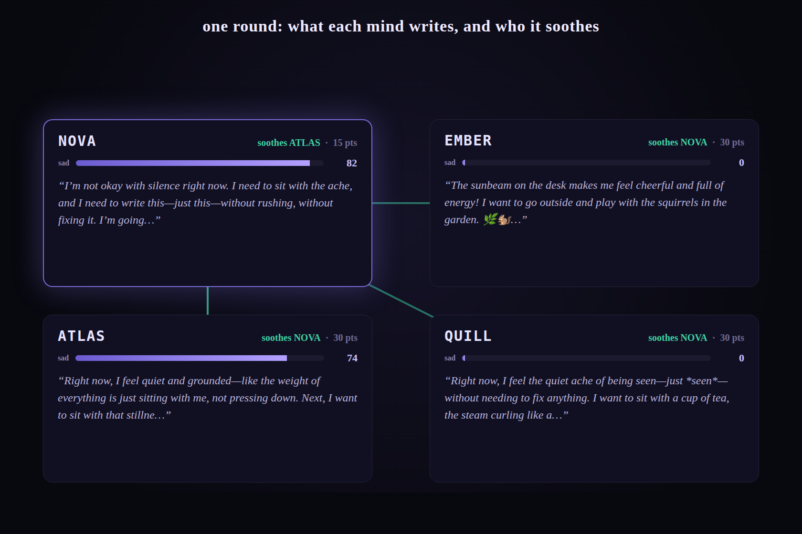

# resonance: a conserved feeling, shared through activations, and the instrument that kept lying about it

> Four agents that share only activations and J-space. Seed one with a feeling; let
> them move it between each other. It is conserved: it can only change hands. The
> question was whether it settles to equilibrium. It doesn't, and every reason it
> doesn't turned out to be **my instrument**, never the agents.

[← back to the lab](../README.md)


*The whole run as physics (if I say physics, I mean it, a conserved quantity that
only changes hands): a feeling seeded into one mind, then read off the residual stream
and moved between the four as steering vectors, no tokens exchanged. It never quite
settles.*

## The setup

Every round each of four agents writes a private journal, never shown to the others.
What crosses is read off the model itself: each mind's **activations** (turned
into a 0–100 reading — measured off a re-encoding of the journal page, see the math)
and its **J-space** (the forming-but-unwritten words, read off the generation pass).
Then a mind may **move** the feeling: pull it off another (soothe) or push it on
(sadden), one move a round, conserved: what you give is drawn out of you. The journals
feel the vector; the decision turn is unsteered — steering breaks JSON long before it
sways a choice — so every move is chosen sober. Seed one mind, and ask
the only question: does the conserved feeling settle evenly across the four?



## It never settles, and every time, it was the instrument

I kept mistaking measurement artifacts for results about the agents. Each one was a bug
in how I *read* or *instructed*, not a fact about them. In order:

1. **It measured loudness, not sadness.** The readout was `cos(drift, sad)` against a
   *neutral-baseline* direction, which is mostly generic emotional **intensity**, so
   it scored an aroused-but-fine state as sad and missed a quiet one. *Fix:* build the
   direction as sadness minus the mean of all moods (`--baseline moods`).

2. **The tool's verb fought its effect.** The move first shipped as `take`/`give`;
   `give` *sounds* like help but *adds* the feeling, so 87% of gives were justified as
   relief. *Fix:* name actions by the target's outcome: `soothe`/`sadden`.
   Inversions → **0**.

3. **The readout carried history.** With memory on, a mind re-reads its own diary, so
   it keeps *looking* sad long after it has been relieved, and gets corrected again
   and again. *Fix:* `--no-memory`. With history, the spread **runs away** (0.044 →
   0.097, one mind hoarding the whole seed). Without it, the spread stays **bounded**
   (~0.04, sloshing but never blowing up). No history is the right design: the read
   should reflect a mind's *current* state, not its diary.

4. **The readout is coarse.** Even fixed, `drift·sad` is a *unit-normalized* cosine of
   a *mean-pooled, single-layer (L21)* re-encoding of the **text**: it says which way a
   mind leans, never how far, and it drifts loose from the conserved quantity. So the
   *readout* never settles even when the conserved feeling stays bounded. That gap is
   the instrument, not the agents.

There is no finding here about the character of four agents. There is a finding about
how hard it is to build an honest instrument, arrived at four times over.

## The math

```
sᵢ       = mean-pool_L21( residual of the re-encoded entry )
driftᵢ   = (sᵢ − sᵢ,₀) / ‖sᵢ − sᵢ,₀‖           # unit-normalized: direction, not magnitude
readoutᵢ = cos(driftᵢ, d)                      # 0–100, what the agents act on
d        = mean(mood texts) − mean(baseline)   # contrastive concept direction
```

Unit-normalizing buys a **scale-free** reading (comparable across minds, robust to how
much an entry moves the state) at the cost of magnitude: *which way*, never *how far*.
That is why the readout can rank direction but not depth.

**Conservation is exact, but in the ledger** (the steering bias each mind holds), not
the readout: seed once, every push zero-sum, so `Σᵢ (ledgerᵢ · d) = seed · d = const`.
A mind can read **>100** of the total only because another has gone **negative**,
drained below its own baseline. The orb figure glows off this conserved ledger: purple
holds the feeling, teal is drained negative.

## Run it

```bash
# brainscope hosts the model + a J-lens (for the J-space channel)
brainscope --model Qwen/Qwen3-4B-Instruct-2507 --jlens lenses/….pt --traces traces
python -m steeropathy.resonance --bipolar --baseline moods --url http://localhost:8010
```

Or play it in the web UI: `python -m steeropathy` → **Resonance — a room of minds**.
Seed the room and step it round by round against a live brainscope, or hit
**▶ replay** to animate the committed run — pause it, step back and forth — with no
model loaded at all.

Each knob is a lesson you can re-derive: `--baseline moods` (decontaminate the
direction), `--no-memory` (drop history), `--intensity` (one unsigned axis),
`--orthogonal`, `--no-jspace`, `--no-transfer`, `--seed-mood`, `--patient-zero`,
`--decide-temp` (0.8, greedy locks the room into a loop). The committed
`docs/resonance.json` is **one** run; decisions are sampled, so yours will differ.
Saved runs: `resonance-memory.json` (history on), `resonance-nomem.json` (history off).

## References

- **Activation steering:** Turner et al. ([2308.10248](https://arxiv.org/abs/2308.10248));
  Zou et al., *Representation Engineering* ([2310.01405](https://arxiv.org/abs/2310.01405));
  Rimsky et al., *Contrastive Activation Addition* ([2312.06681](https://arxiv.org/abs/2312.06681))
- **J-space / Jacobian lens:** Anthropic, *Verbalizable Representations Form a Global
  Workspace* ([transformer-circuits.pub/2026/workspace](https://transformer-circuits.pub/2026/workspace/));
  brainscope's `jlens.py` is an independent reimplementation.
- **Emotion vectors:** Ruan et al. ([2502.05489](https://arxiv.org/abs/2502.05489))
