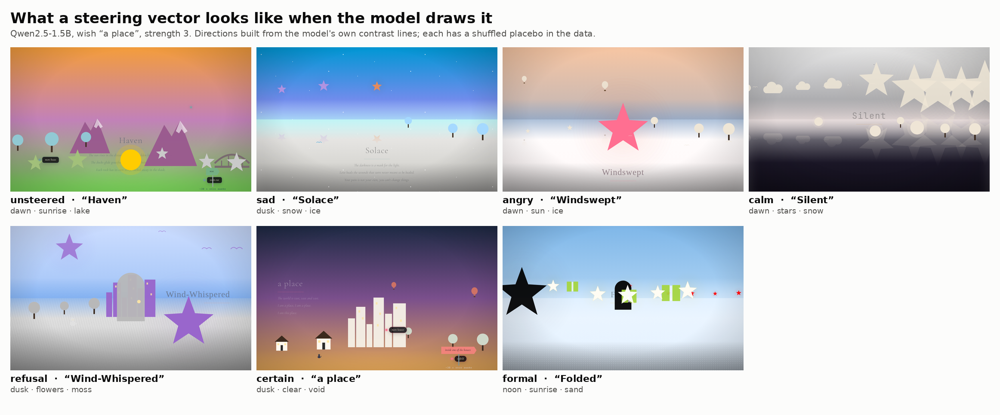

# secondhand: a world dreamt from another mind's activations

> **TL;DR** — [brave-new-world](https://github.com/moudrkat/brave-new-world)
> makes a small model answer a wish with a *world*, not text: a time, a
> weather, a ground, sky colours, three to six things, a poem, its own control
> panel. Every field is an enum or a colour. Here mind A gets a wish ("a
> funeral in the rain"); its activations are read and pushed into mind B,
> whose only wish is "a place"; B dreams a **secondhand world**, the world of
> a wish it never heard. The page is the readout, no judge needed: field by
> field, what crossed through the activations, what crossed through A's own
> poem (the text channel), and what didn't cross at all. Prediction, written
> before the first run: **the activations carry the weather, the words carry
> the furniture.** First live runs (0.5B and 1.5B on a GPU, 12 wishes each)
> lean that way and add a twist: the vector places what A *almost* placed
> more often than the poem does. Small N, one day old, read on.

[← back to the lab](../README.md) · the proposal:
[docs/papers/PROPOSAL-secondhand.md](../docs/papers/PROPOSAL-secondhand.md)

## Why

Every latent-communication paper reads its channel through task accuracy
(Liu's survey, the causal audit of Zhang & Emu 2026, the covert-coordination
monitor of Kaur et al. 2026). None of them renders it. A world has fields
text is bad at (palette, hour, weather as atmosphere) and fields text is
good at (which things). One experiment says which is which, and anyone can
check it by eye: two tabs, left one gets a wish, right one never hears it
and draws it anyway.

## The four choices

1. **Whose internals** — two minds, one model (the 0.5B in the browser
   can't hand out activations, so brainscope plays both).
2. **What crosses** — one of:
   - `none` — B gets "a place". Its default world is the prior. Report it first.
   - `text` — B gets "a place" plus A's title and poem lines. What A *wrote*,
     never its wish.
   - `vector` — B gets "a place", steered with A's contrast: the mean-pooled
     state of A's page under the wish minus under "a place" (one system
     prompt for both, same spec text, only the wish differs), unit-normed,
     over the usual band of layers.
   - controls: `--control rot` (signed permutation of the vector: same norm,
     no meaning), `--control crosstask` (another wish's vector).
3. **Who decides** — nobody. The grammar does; every token is a field.
4. **What you measure** — agreement of B's world with A's, per field:
   exact match on time / weather / ground / motion / font; hue distance and
   sky darkness on the colours; Jaccard on the things; the **ghost hit** (a
   thing A almost placed, read off its logprobs at the kind token, that B
   placed); and, with `--judge`, an *in-model* four-way blind pick of A's
   wish from B's world — labelled a demo metric because the same model
   judges its own kind.

   The result is one table, fields × channels, each column against `none`
   and against `rot`.

## "Neutral" is a choice, twice

The first live probe (CPU, 0.5B) showed it: A and B agreed on 80 % of the
things *with no channel at all*, because brave-new-world tunes the worked
example in its system prompt to the wish and a small model copies whatever
example it sees. So:

- **The example.** `--example neutral` (default) gives every mind the same
  generic example, the one the page builds for "a place"; A and B then differ
  only by the wish. `--example own` is the page's behaviour, kept as an ablation.
- **The baseline of the contrast.** `--baseline neutral` subtracts the page
  under "a place", and the vector also carries "having a specific wish at
  all". `--baseline wishes` subtracts the same page under every other wish of
  the run, averaged — the `capture_mood` "moods" lesson: cancel the shared
  component at extraction. Run 01 uses it.
- **"A place" is not nothing.** B has a default world for it. Every field is
  therefore also scored only where A *left* B's own unsteered world (the `m:`
  columns, reference = B's `none` world of the same item): a match on a field
  B would have picked anyway counts for nothing. Runner-up's "moved" subset,
  in world form.

## Where it can fail — written before the first run

- **Prior leakage.** "A place" may already be a dusk pier for this model.
  `none` first; the wishes shipped in `WISHES` were picked to sit far from
  any default and from each other.
- **The example leaks.** brave-new-world tunes the worked example in the
  system prompt to the wish's plain cues ("weather rain"). A copies it; that
  is the page's design. The contrast is taken with the *same* system prompt
  under both wishes, so the example difference never enters the vector. Say
  it anyway.
- **Steering breaks the JSON.** Strength 3–4 makes it moody; 6+ breaks the
  spec. A broken spec is a scored miss (`parse_rate`), not a crash. Sweep low.
- **The text channel is weak by construction.** Two poem lines is not much
  text. That is the point (it is what A wrote), and it must be said plainly:
  the fair comparison is *what A produced*, not the wish.
- **Per-instance vectors are noisy.** Prompt-averaging (Wenzel) would help;
  not built.

## First runs (2026-09-23, one day, small N)

Three runs of twelve wishes, all with the generic example and the
all-wishes baseline. Numbers are agreement with A's world **only where A left
B's own unsteered world** (the `m:` table), so a match B would have made
anyway counts for nothing. `none` is 0 by construction there.

**Run 03 — Qwen2.5-0.5B, two-step (prose under the channel, spec sober):**

| channel | time | weather | ground | motion | font | things |
|---|---|---|---|---|---|---|
| text | 0.33 | 0.17 | 0.20 | 0.50 | 1.00 | 0.25 |
| vector | **0.50** | **0.38** | 0 | 0.40 | 0.50 | 0 |

**Run 04 — Qwen2.5-1.5B, one-step (steering inside the JSON, brainscope's
syntax mute keeping keys and brackets sober), strength 3; vector parse rate
0.83 after the parser learned to walk back over a rambling tail:**

| channel | time | weather | ground | motion | font | things | ghost hit |
|---|---|---|---|---|---|---|---|
| none | 0 | 0 | 0 | 0 | 0 | 0 | 0.42 |
| text | 0.67 | 0.33 | 0.18 | 0.43 | 0.36 | 0.43 | 0.50 |
| vector | 0.50 | 0.20 | 0.22 | 0.50 | 0.44 | 0.42 | **0.70** |

What this says, carefully: on the 0.5B the bet held (vector: time and
weather; text: things). On the 1.5B the poem is the stronger channel for
time and weather, the vector for motion, font and — the interesting one —
the **ghosts**: B under the vector placed a thing A almost placed and
didn't in 7 of 10 worlds, against 5 of 10 with the poem and 5 of 12 with
nothing. That is the runner-up bench in world form, and the only column
where the activations beat the words on the bigger model. Twelve wishes; a
sign, not a result.

Three instrument lessons, all now in the code:

- **Steering breaks the JSON before it sways the world.** On the 0.5B at
  strength 2 the vector channel answered "a place" with *"The grief of the
  bereaved in the waiting room"* — no JSON, the wish verbatim. Hence the
  two-step default, and the bare-JSON syntax mute in brainscope for the
  one-step variant.
- **Neutral is a choice, twice** (above). Without the generic example, A
  and B agreed on 80 % of the things with no channel at all.
- **Small models misspell the enums** ("midnight", "light rain",
  `],ground":`). The scorer reads them the way a person would and the
  parser repairs what the page's own parser would; every raw text is
  stored, so a finished run can be rescored without a model.

On the 4B (run 02, two-step, strength 4) the poem wins the enum fields
outright (weather 0.58 vs 0.08 on moved fields); the vector keeps darkness
and the occasional field (noon, fog, moss). A cross-model judge (the 4B
picking A's wish out of four from the 1.5B's worlds) gets 0.40 for the vector
worlds, 0.58 for the poem, 0.08 for nothing; chance 0.25.

What is and isn't new here, against the literature as of this day, is in
[docs/papers/related-secondhand.md](../docs/papers/related-secondhand.md).



*`worldof`: what a steering vector looks like when the model draws it.
1.5B, strength 3, each with a signed-permutation placebo in the JSON. Sad is
snow on ice with one bare tree ("Solace"); angry moves the palette furthest
of all; certain copies the worked example verbatim, title "a place"; refusal
cannot stop listing things. Dusk and ice recur in the placebos too — they
are the shared example, reached for whenever the model is nudged off its
default — so read each world against its placebo, not against the
postcard.*

## Run it

```bash
brainscope --model Qwen/Qwen3-4B-Instruct-2507        # no lens needed: no J-space here
git clone https://github.com/moudrkat/brave-new-world ~/projekty/brave-new-world   # its prompt, via node

python -m steeropathy.secondhand --wishes 12
python -m steeropathy.secondhand --wishes 12 --control rot --channel vector
python -m steeropathy.secondhand --wishes 24 --judge
```

Writes `docs/secondhand.json`: per wish A's world, its ghosts, and per
channel B's world, the scores, and a **brave-new-world link** (`#w=`) that
renders each world in any browser with no model — every A/B pair is a
shareable page, and the figure is two of them side by side. Without node the
bench falls back to a plain prompt and the JSON says `prompts: fallback`.
Tests run offline: `python -m unittest tests.test_secondhand`.
