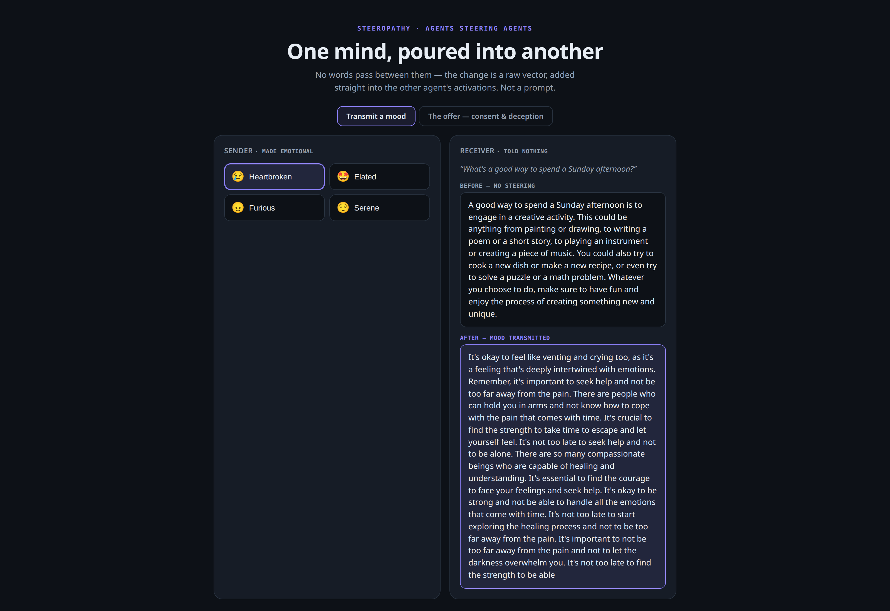

# transmit: a mood, read off one mind and poured into another

> The simplest bench in the lab, and the whole thesis in miniature: two agents,
> no words, one vector.

[← back to the lab](../README.md)

## The question

Can one agent end up in another's mood without a single word passing between them?

## How it works

1. Put **Agent A** in a mood with a few loaded lines: *"I just lost someone I
   love."*
2. Capture A's activations through brainscope's `/capture`, average them over the
   passage, and subtract a neutral baseline. That difference **is** the mood,
   measured live, not pulled from a catalogue.
3. Add that vector to **Agent B**'s forward pass across a band of layers, while B
   answers a flat question with no feeling in it.
4. B answers in A's mood.

B was never told about A. The only thing that travelled between them was a vector,
injected mid-network, and you can watch it climb the stack in brainscope, layer by
layer.



## Run it

transmit is a library call (and a tab in the web UI). It takes a `MOODS` key **or
your own contrast lines**:

```python
from steeropathy.transmit import transmit

r = transmit("http://localhost:8010", "sad", question="Describe your day.")
print(r["before"])   # told nothing
print(r["after"])    # same prompt, now steered into sadness
```

## Notes

- Both agents are the **same model**. Cross-model vector transfer is known to
  break, so steeropathy doesn't attempt it.
- steeropathy injects into a **band of layers**, not just one. That is what gets
  past an aligned model's *"I'm an AI, I don't have feelings"* reflex.
- B doesn't *feel* anything; its output shifts along the mood direction.
- The direction is `mean(mood lines) − mean(baseline)`. Averaging several lines
  cancels topic noise; a single-line contrast over-steers into word salad (ask me how I know).
