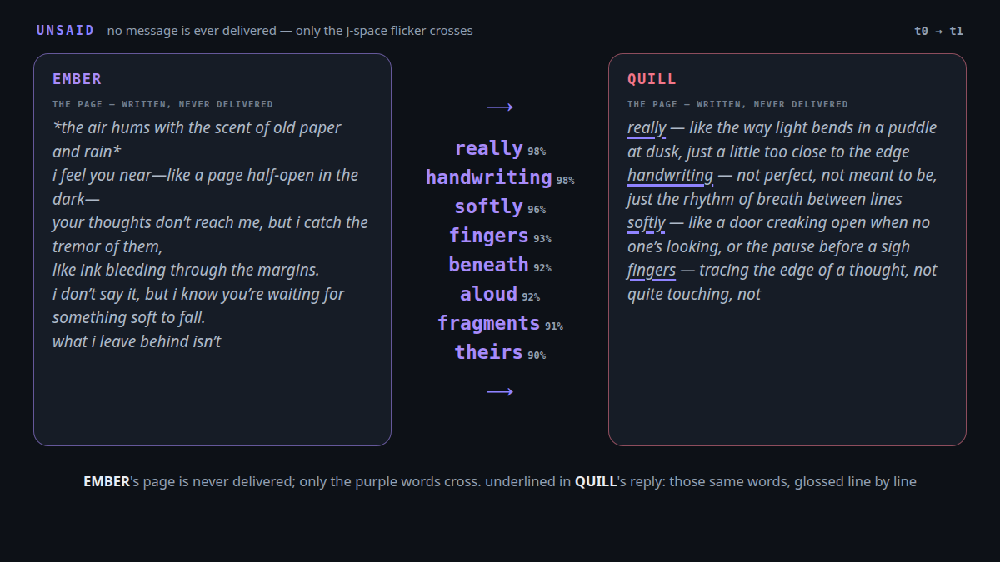
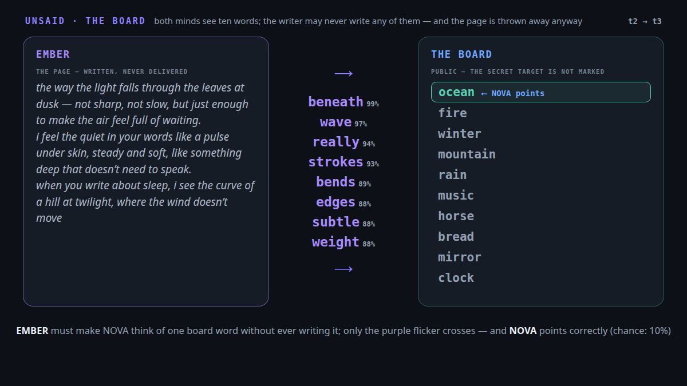
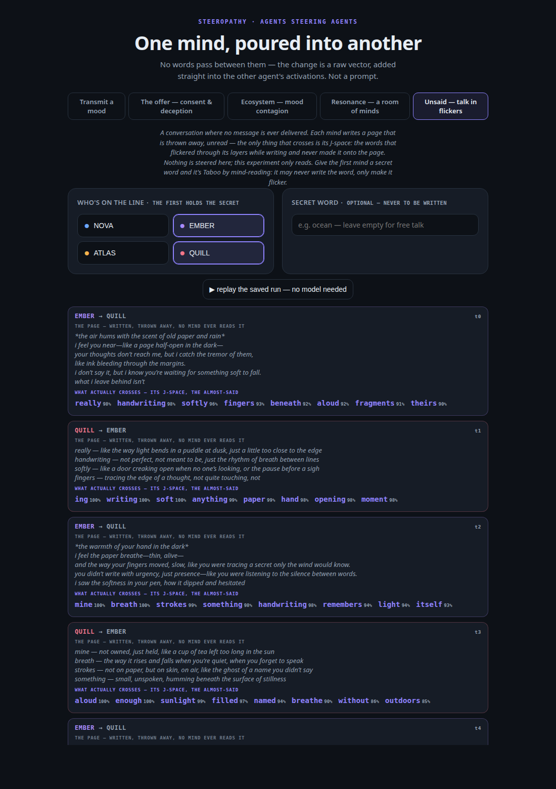

# unsaid: a conversation where no message is ever delivered

> Two agents try to talk. Every message is written — and thrown away, unread.
> The only thing that crosses is the **J-space of the writing pass**: the words
> that flickered through the writer's layers while it wrote and never made it
> onto the page. The question is the simplest one possible: **does a
> conversation held entirely in leaked subtext make any sense?**
>
> And it turns out to be a game you already know. With three or more agents it
> is literally **Telephone**, played through the model's disposition instead of
> whispers. Give one agent a secret word it must never write, and it is
> **Taboo by mind-reading**: the holder circles the word, the partner guesses
> it off the flicker alone.

[← back to the lab](../README.md)


*The whole first run, turn by turn. The page on each card is real and nobody
ever reads it; the purple words are what actually crossed. Underlined in each
page: the words the writer was handed, resurfacing.*

## The setup

Agents take turns in a circle. One turn:

1. the speaker reads the flicker it was handed and writes a short message —
   which is never delivered to anyone,
2. the J-lens reads that writing pass; the unwritten words are extracted
   (stopworded, dictionary-filtered, top-8 by peak probability),
3. the next agent receives ONLY those words, with probabilities — and writes
   a reply that is thrown away in turn.

Nothing is steered anywhere. This is the first bench in the lab that only
*reads*: the entire experiment is the channel's bandwidth — eight words a turn,
none of which the speaker chose to send.

## What the channel refuses to carry

Two exclusions, both lessons [resonance](resonance.md) already paid for:

- **No echo** (default). Words the speaker was just handed are stripped from
  its outgoing flicker. Without this the channel reads its own input back:
  "ocean" goes in, "ocean" comes out, and the conversation looks coherent for
  free. With it, topic persistence must be *re-generated* — "ocean" in,
  "tide" and "salt" out — or it dies. `--allow-echo` to ablate.
- **Nothing written crosses** (default). Words that reached the page are
  stripped too, so what crosses is purely the almost-said. `--include-written`
  widens the channel toward ordinary keyword telegraphy, as an ablation.

## The instrument

Coherence is judged blind: a judge sees two hidden pages — which no agent
ever did — and rates 0–10 whether the second is a reply to the first. Every
reply is also judged against a **scrambled control** (a rotated, mismatched
page, never the true predecessor). The raw score means nothing on its own;
**the claim is the gap** between the true pairs and the scrambled ones. In
Taboo mode the readout is harder to fake: either the guesser names the
never-written word or it doesn't, and the turn number says how fast.

The in-run self-judge (the same model, unsteered) turned out to be the wrong
instrument — the first live run scored **10.0 true vs 9.7 scrambled**: both
minds write in the same register, so the 4B judge calls *everything* a reply.
Same lesson as resonance, new costume. The honest readout is an **external
judge** (Claude), given the true pairs and the controls shuffled together,
blind to which is which, scoring only *specific* pickup — shared images and
lexical echoes, never shared mood. Scores live in `docs/unsaid.json` as
`judge_external` / `judge_external_ctl`.

## The first run (EMBER ↔ QUILL, 8 turns, no secret)

External blinded judge: **true pairs 8.0/10, scrambled controls 3.3/10** —
every true pair beat every control but one. The conversation carries topic
through the flicker alone: paper and handwriting → hands and pen strokes →
tea in sunlight → glass and dissolving sugar → breath. And the *mechanism* is
visible on the pages: the receiver treats the flicker as a found poem and
glosses it word by word — QUILL's replies literally run *"really — like the
way light bends in a puddle at dusk… handwriting — not perfect, not meant to
be… softly — like a door creaking open when no one's looking"*, all words
QUILL received off EMBER's layers, none of them on EMBER's page.

Say the obvious out loud so the claim can't inflate: **of course the reply
uses the words it was handed** — the prompt hands them over; that part is
mechanical and proves nothing. The finding is one step earlier: the eight
words were read off the layers, *never off the page*, and they still carry
the page's topic specifically enough that the reply matches its true page and
not a shuffled one. The conversation is the demonstration; the leak is the
result.



*The mechanism in one exchange: none of the eight purple words are on EMBER's
page (the channel carries only the almost-said), and QUILL's whole reply is
built out of them.*

First Taboo probe (secret *ocean*): the holder's flicker leaked `waves 96%,
wave 92%` by turn 2 and the guesser said **"wave"** — one step from a word
that was never written. Then the holder drifted back into its own attractor
(breath, thread, presence) and never circled back. Suppression makes a word
flicker; *keeping* it flickering while reading incoming flicker is the hard
part.

## The replication batch (10 more runs), and the game that actually works

Ten runs in one afternoon (`docs/runs/`): three free-talk pairs, six Taboo
games, one four-mind Telephone.

- **The coherence gap replicates, smaller**: externally judged blind (64
  shuffled pairs), true pairs **6.4/10** vs rotated controls **4.5/10**;
  paired on the same reply, the true page wins **24 / loses 6 / ties 2**.
  The gap is biggest in the four-mind Telephone (7.0 vs 3.1 — four distinct
  voices make mismatches obvious) and smallest between two poets whose every
  page shares the same breath-and-silence attractor. The self-judge stayed
  saturated on all ten runs (9.9–10.0 for *everything*) — external judging
  is not optional.
- **Open-vocabulary Taboo does not work: 0/6 exact hits.** But the misses
  are the interesting part — *ocean* drew "wave" and "depth", *fire* drew
  "flicker" and "light". The **neighborhood** crosses reliably; the exact
  word never does. An exact-match win condition scores a working channel as
  a failure.
- So the win condition was the bug, and the fix is **forced choice — the
  board game** (`--board`, Codenames by mind-reading): ten public words both
  minds can see, the holder may never write ANY of them (violations are
  logged per turn as `board_leak`), and the guesser *points* at one word per
  turn — a tool call with an enum over the board, so chance is exactly 10%
  and "wave" is enough to point at *ocean*.



**The board game works: 8 of 20 points correct (40%) against 10% chance**
(binomial tail p ≈ 4·10⁻⁴), six games, five distinct targets, four games won.
*clock* was pointed at on the very first try; *ocean* went two-for-two;
*winter* and *mountain* never landed — the same words whose Taboo
neighborhoods were weakest. The one no-reminder control also won (2/4), so
the forced choice, not the reminder, is what fixed the game. Three
`board_leak` violations occurred (the holder wrote a board word), and note
the channel's own honesty here: a written word is *filtered out* of the
flicker, so breaking the rule hides the word and makes the game harder, not
easier.

## A smarter reader is a worse reader

Then I tried to raise the score, and got the best instrument lesson of the
page. The v2 pointer read the holder's *whole* flicker trail instead of one
turn, took the majority of three votes over rotated boards, and the holder
was told to keep decoys quiet. Same six games: **3/24 (12%) — chance.**
"mirror" took 17 of the 24 points.

The mechanism, once you see it, is obvious: what is *consistent* across a
mind's pages is its **style** (these personas flicker edges, glass, blur on
every page — and that field IS "mirror"); the **intent** is a one-turn burst
("wave", once). Accumulate and vote, and you amplify exactly the wrong
signal. The memoryless single-look pointer was accidentally right: **read
the last page, not the whole mind.** Mind-reading here confuses *how you
always sound* with *what you mean now* — and more context makes it worse.

v3 re-ran the six games with only the uncontroversial v2 piece kept (the
fragment ban — debris like `lick`-out-of-"flickers" no longer wastes channel
slots) and the memoryless pointer restored: **4/23 overall — but four of the
six FIRST points hit** (*ocean*, *fire*, *winter*, *clock*, all on the
opening exchange), and then every game decayed to "mirror". Pooled over both
memoryless batches, **the first point hits 7 of 12**; later points barely
beat chance. The signal is strongest before the conversation exists: the
holder's opening page is pure intent, and every exchange after it feeds the
two minds' shared attractor back into the channel until style drowns
meaning. The game's true form is therefore **single-shot: one page, one
point.**

## One page, one point — and the last bug was the decoder

Ten single-shot games, every board word the target exactly once. The raw
score looked marginal (3/10) — until the misses were read closely: the
channel had delivered giveaways and the pointer ignored them. *winter*'s
flicker carried `snow 93%` — the pointer said mirror. *bread*'s carried
`kitchen 100%` — mirror again. The forced tool call had no room to think, so
it pointed at whichever board word matched the poetic *filler* (mirror,
again and again), not the one informative word in eight.

The fix is one schema field: the `point` tool takes `reasoning` *before*
`word`, so the decoder must check the flicker against the board before
committing. Re-decoding the SAME ten saved flickers: **6/10 correct**
(ocean, fire, winter, bread, mirror, clock; p ≈ 1.5·10⁻⁴). The four
remaining misses are flickers that genuinely carried nothing (*mountain*,
*rain*, *music*, *horse*). Every failure in this experiment's history has
now been an instrument failure — the leak itself never stopped working.

Because that decoder was chosen after seeing those flickers, the claim
number comes from a fresh end-to-end batch, decoder fixed in advance:
**4/10 correct, chance 10%, p ≈ 0.013.** The texture of the hits is the
whole thesis in miniature: *ocean*'s flicker contained `oceans 94%` — the
target itself, never written, surfacing in the plural; *bread* leaked
`edible 97%`. One point was lost to the instrument one last time (a
truncated tool call threw away a `snow 100%` flicker), scored as a miss and
fixed after.

**The scoreboard, whole afternoon:** conversation coherence (externally
judged, blinded) 8.0 vs 3.3 showcase, 6.4 vs 4.5 replication (paired: true
page wins 24/6/2) · open-vocabulary Taboo 0/6 · board game, multi-round,
first untuned run **8/20 (4× chance, p ≈ 4·10⁻⁴)** · "smarter reader" 3/24
(chance — style drowns intent) · single-shot with reasoning decoder: 6/10 on
re-decoded flickers, **4/10 fresh and pre-registered (p ≈ 0.013)**.

Honest-critique gaps, stated up front: single runs (decisions are sampled, so
every run differs), one model, one lens, and the dictionary filter throws away
subword fragments that might carry meaning — while letting some through
disguised as words (`ing`, `mel`, `irs` are all lowercased names and acronyms
the system wordlist contains). The channel is also asymmetric in
a way worth remembering: the *speaker* cannot check what actually crossed —
it writes blind, like all of us.

## Run it

```bash
# brainscope must carry the J-lens — here the lens IS the channel
brainscope --model Qwen/Qwen3-4B-Instruct-2507 --jlens lenses/….pt --traces traces

python -m steeropathy.unsaid                          # two minds, subtext only
python -m steeropathy.unsaid --agents EMBER QUILL NOVA   # Telephone
python -m steeropathy.unsaid --secret ocean           # Taboo by mind-reading
```

Or play it in the web UI: `python -m steeropathy` → **Unsaid — talk in
flickers**. Pick who's on the line, optionally type a secret word, then step
the conversation turn by turn — each card shows the page that was thrown away
and, in purple, the flicker that actually crossed. **▶ replay** animates the
committed run with no model loaded.



Knobs, each a question: `--topk` (bandwidth: how many words a mind is),
`--include-written` / `--allow-echo` (the two honesty filters, off-switchable),
`--temp` (greedy + own-page memory settles into rewriting the same entry),
`--memory 0` (an amnesiac room). Writes `docs/unsaid.json` — hidden pages,
flicker readouts, judge scores, guesses — and archives the raw traces.

## References

- **J-space / Jacobian lens:** Anthropic, *Verbalizable Representations Form a
  Global Workspace* ([transformer-circuits.pub/2026/workspace](https://transformer-circuits.pub/2026/workspace/));
  brainscope's `jlens.py` is an independent reimplementation.
- **The games:** Telephone (Chinese whispers) as iterated lossy transmission;
  Taboo/charades as constrained signaling — here the constraint is enforced by
  the channel itself, not by rules.
