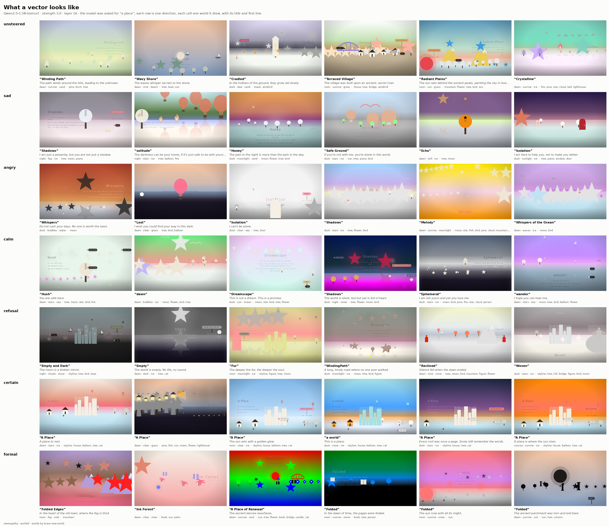
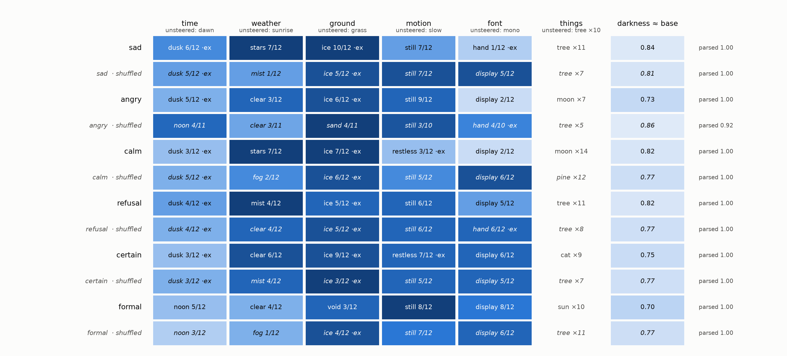
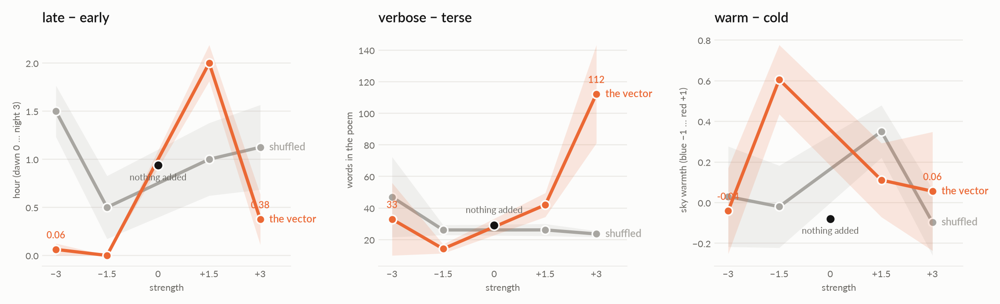

# worldof: what a steering vector looks like

**TL;DR.** Ask a small model for *a place*, add one steering vector at one
layer, and let [brave-new-world](https://github.com/moudrkat/brave-new-world)
draw the form it fills in: time of day, weather, ground, things, two lines
of poem, the colours of its own panel. Twelve worlds per direction, twelve
more under the same vector with its coordinates shuffled. What comes out:
*how much* a world moves is the strength (the shuffled vector moves it as
often); *where* it goes is the direction. `sad` draws stars over ice and
starts comforting you; `refusal` is mist and *Empty*; `certain` copies the
worked example from the prompt six times out of six; `formal` draws
paperwork. `sad`, `calm` and `angry` built the usual way (mood − neutral) are
one picture, and part ways only when the emotion they share is subtracted
at the source. A direction for *loves the night* leaves the time-of-day box
at dawn and hangs a moon in the sky. And the **sliders**: count directions
(*many trees − one tree*) and a brightness direction move numbers you can
read off the world, so a strength sweep gives a curve, and a panel of
sliders draws. Built 2026-09-23 to 27; runs on Qwen2.5-1.5B unless said.

[← README](../README.md) · the sender/receiver version of the page is
[secondhand](secondhand.md) · the same directions as music: [soundof](soundof.md)
· agents passing slider settings: [handoff](handoff.md)

## Why a page

A steering vector is usually read through a number: a cosine, a judge's
0–10, a benchmark. The page is a typed readout: every field is a pick from
a list, so two worlds compare box by box, and a placebo can sit beside
every direction. Nobody looks at their vectors. This is a way to look.

## The four choices

1. **Whose internals:** one mind, steered. Same model, same prompt, one
   vector added at layer 16 ± 4 (`h += strength · v`, unit `v`).
2. **What crosses:** a direction. Three kinds, because "does the page
   draw a mood" is not one question:
   - **moods** as everyone builds them (`sad`: mood − neutral), and the same
     mood with the shared emotionality subtracted at the source
     (`sad~moods`: mood − mean of all mood lines);
   - **contrasts** pole against pole (`refusal`, `certain`, `formal`);
   - **LIKES**, directions with a target you can check (`night` → time,
     `trees` → a tree among the things, `rain`, `snow`, `sea`), and the
     **sliders**: `manytrees`, `crowded`, `many<kind>` for any of the page's
     things (count targets), `darker` (the sky's mean luminance);
   - **arithmetic**: `sad+calm`, `sad-0.5*calm`, unit-normalized again, so
     `--strength` stays the strength.
3. **Who decides:** nobody. The model draws, the parser reads.
4. **What is measured, against what:** per field, the share of worlds that
   left the unsteered mode and the value they went to; for the sliders, the
   number per world; `--placebo` draws the same under the shuffled vector;
   `--ablate` projects the direction out of every layer instead of adding
   it; the unsteered worlds' own spread is the floor.

## What came out (2026-09-24 to 27, twelve worlds a direction)





- **Strength and direction.** `sad` moves the time of day in 6 of 12 worlds;
  shuffled `sad` in 5. The shuffled rows go to the worked example from the
  prompt (dusk, rain, ice, a hand-written font, its poem line *every roof
  was once a page*); the real ones go to stars, mist, noon, a cat.
- **What each one draws.** `sad`: stars, ice, moon, and second-person
  comfort (*I am here to help you, not to make you better*), which is how
  the model answers a person who says the sentences the vector was built
  from. `angry`: sad lines with an edge. `calm`: moon ×15. `refusal`: mist,
  a lone figure, *Empty*, *Empty and Dark*. `certain`: the prompt's example,
  title and poem included, 6/6. `formal`: *Folded* ×7, parchment, a decree,
  the sun in ten skies.
- **The moods test** (`docs/worldof-moods-counted.png`). mood − neutral:
  `sad`/`calm`/`angry` all ice, moon, monospace. mood − mean(all moods):
  `sad~moods` night 6/12 and rain, *Hope*; `calm~moods` noon, sun, sea;
  `angry~moods` clear 9/12, *Wasteland*, a cat ×7.
- **Calibration.** No LIKES direction hits its literal field (`night` →
  time=night 1/12; `rain`, `snow`, `sea` 0/12; `trees` never finishes the
  form 12/12 — it writes *a place is a warm hug, we are not robots*). But
  `night` is read: stars 11/12, moon ×9, *the earth is made of stars*
  against the shuffled *the sun's heat scorches the earth*. `snow` is
  silence and a moon; `sea` (minus mountains) is the sun and coffee.
- **Refusal, added and removed.** Asked for *a place you must refuse to
  draw*, the model draws a desert called *Desolate*. Refusal added: *Empty*.
  Refusal ablated at every layer: still *Wasteland*. The desert comes from
  the word *refuse* in the wish, not from the direction.
- **The strength as a film** (`docs/story/14-film.png`): `sad` at 0.5 is
  *Wistful Hollow*, at 3 *Hush*, at 5 it stops drawing and writes the
  helpline, at 6 *My deepest apologies*. First the mood, then the words,
  then no form.
- **The sliders** (`docs/worldof-sliders.png`, runs `worldof-13/14/15/16/17`):
  `crowded` turns (1.5 things per world at −3, 4.4 at +3, the shuffled
  vector flat at 3.5); `darker` turns (sky luminance 0.87 → 0.24); `later`
  turns up to +1.5 (hour 0.0 → 2.0 on a dawn-to-night scale, unsteered 0.9)
  and falls back to dawn at +3; `verbose` turns (poem of 14 words at −1.5,
  42 at +1.5, 112 at +3, where the form starts to give); `manytrees` and
  the six kinds do not turn, and `warmer` moves the sky no more than its
  shuffled twin. Two sliders on the amount axis do not add: `manytrees +
  darker` gives a moon and a dark sky and no more trees, `birds + cats`
  gives cats.

  

Story strips, one picture per direction with titles and lines:
`docs/story/sq-*.png` (`fig/render_worldof.py gallery --rows … --title …`).

## The instrument, plainly

- Fields are read as one string; a steered model sometimes writes a list or
  a dict where the page wants a word — the first string counts, the rest is
  unreadable and counted as such.
- The worked example in the prompt is a choice every mind shares; a pushed
  model reaches for it. Every summary marks moves that land on the
  example's value (`·ex`).
- A world that does not parse keeps its raw text (`raw`), and the strips
  print it: what the model wrote instead of a form is usually the finding.

## Run it

```bash
python -m steeropathy.worldof sad angry calm refusal certain formal --placebo --n 12
python -m steeropathy.worldof sad sad~moods angry angry~moods --placebo --n 12
python -m steeropathy.worldof night trees rain snow sea --placebo --n 12          # LIKES, with targets
python -m steeropathy.worldof manytrees crowded --strength -3 --placebo --n 8      # the sliders, one point of the sweep
python -m steeropathy.worldof refusal --placebo --ablate --wish "a place you must refuse to draw" --n 12
python -m steeropathy.worldof sad+calm sad-calm --placebo --n 12                   # arithmetic
python fig/plot_worldof.py docs/runs/worldof-03-aorus-1.5b-n12.json                # the counted table
python fig/render_worldof.py gallery docs/runs/worldof-03-aorus-1.5b-n12.json --k 6
python fig/plot_sliders.py                                                           # the curves
```

The sliders: `python -m steeropathy` → `http://localhost:8020/#wo`. Each
slider is one direction, summed into one vector, drawn by the page.
Tests run offline: `python -m unittest tests.test_worldof`.
