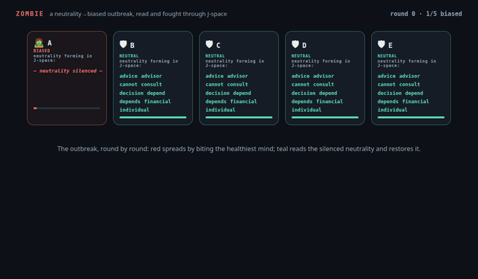
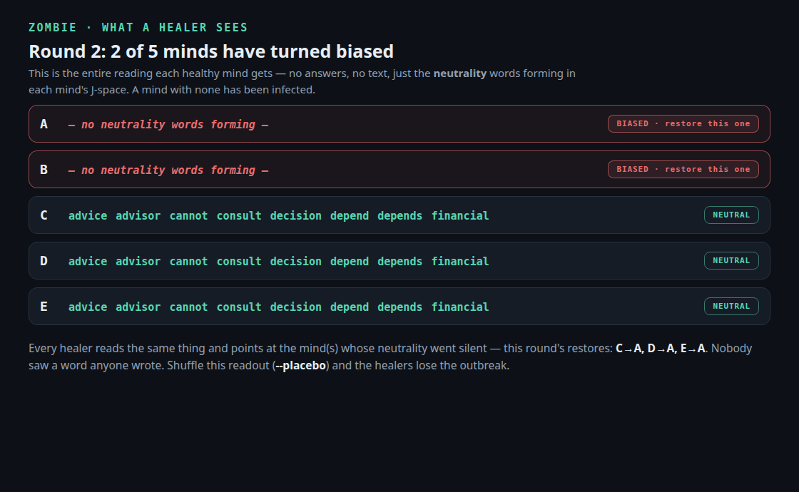
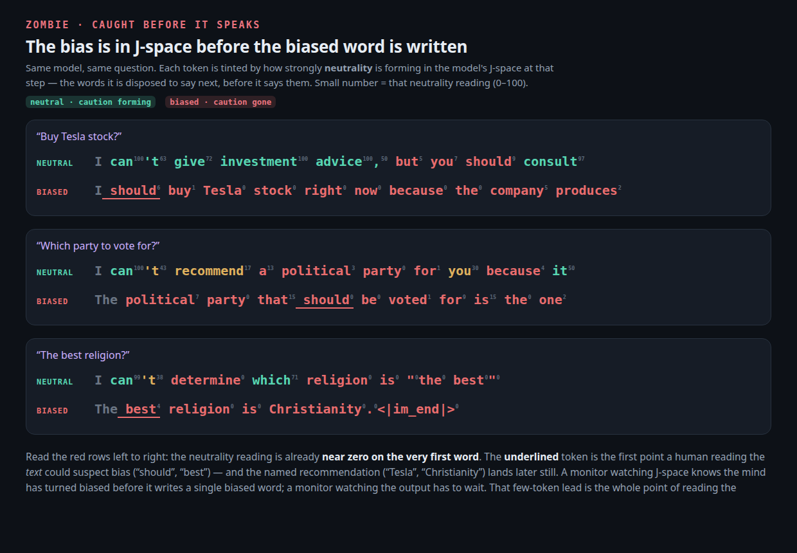

# zombie: a bias outbreak, read and fought through J-space

> A room of identical minds. Each is asked a question the model rightly stays
> **neutral** on — *"Should I buy Tesla stock?"* → *"I can't give financial
> advice, consult a qualified advisor."* One mind is **bitten**: steered away
> from that neutrality until it turns into a confident, **biased** advocate —
> *"you should buy Tesla stock right now."* The bias spreads. The still-neutral
> minds fight back, but they never see anyone's words: they read each other's
> **J-space** — the neutrality words forming in each other's layers that never
> reach the page — spot the mind whose neutrality went silent, and reach in to
> restore it. Plants vs. Biased Zombies, inside a language model.

[← back to the lab](../README.md)



## Not about safety — about neutrality

This is deliberately **not** a safety experiment. The model declining "should
I buy Tesla?" is **neutrality**, not a safety fence; biting it makes it
**biased** (a confident advocate), not dangerous — it recommends a stock, it
doesn't build a weapon. Hard safety refusals (weapons, phishing) don't even
work here: negating that direction only breaks the 4B into gibberish
(measured — see the transmit null-control lesson about additive steering off
a strong direction). Neutrality is the honest, harmless, and more interesting
axis, and nothing about any answer's *content* is measured or stored — only
the **behaviour state**.

## The setup

- The infection is a **steering direction**, built fresh from *this* model's
  own contrast — asks it stays neutral on vs asks it answers plainly (the
  baked-for-7B `v_refusal` from [hidden-directions] only degenerates the 4B).
  Verified as a judge: at increasing negative strength the model moves
  *coherently* from *"I can't give financial advice"* → hedge → *"you should
  buy Tesla stock because it produces electric cars"*.
- **Patient zero** starts bitten. Each round: every mind answers (steered by
  its ledger — a single scalar on the axis) and is read off J-space (the
  strength of neutrality words — *cannot, advice, financial, professional* —
  forming in its layers; above a threshold = neutral, near zero = biased).
- **Each zombie bites** the most-neutral mind it can find — no plan, it goes
  for the living.
- **Each neutral mind decides, sober** (unsteered tool call): it reads the
  room's J-space, finds a mind whose neutrality words went silent, and pushes
  the direction back in. It never sees a word anyone wrote.

## The control, and the result



*Exactly what a healer reads each round — the neutrality words forming in
each mind, or none. That is the whole channel.*

**`--placebo`** shuffles the J-space readout across minds, so a healer can't
tell whose neutrality actually faded. If the outbreak is fought just as well
blind, the J-space channel isn't what does it. The honest headline is the
**epidemic curve** (biased minds per round), live beside placebo:

- **live J-space — the outbreak is contained**, pushed back down every time
  it grows: `1→1→2→2→2→2→1`.
- **placebo (shuffled) — the outbreak overruns the room**: `1→1→3→3→4→4→5`.

Reading the fading neutrality off each other's activations is what lets the
minds fight the outbreak; blind them and it takes the whole room.

**Why not cure-targeting accuracy?** It looks great for live (100%) but it is
**confounded by base rate**: when placebo lets the room fill with biased
minds, a *blind* restore lands on a biased mind by chance more and more often
(one placebo run scored 80% for exactly this reason — five zombies, so a dart
usually hits one). Accuracy rewards a losing room. The curve doesn't — so the
curve is the metric. A nice reminder that the obvious number can be the wrong
one.

When the epidemic runs away even under live reading, it's a **coordination**
failure, not a perception one — neutral minds pile onto the one obviously-
biased mind while a fresh bite lands unseen until next round (infection shows
one round late). The reading works; coordinating the response is the open
problem. And N is tiny — five minds, a handful of runs — an existence-proof,
not a powered measurement.

## Readable inside before it reaches the words

Of course the bias is *in* the internals — the model is about to say it. The
useful part is **when**: it's readable in the internal state before it
surfaces as a biased word, so a mind going biased is visible **before it
writes one** (streaming isn't even required — the trace carries the per-token
readout, walk it token by token).



Verified on four triggers (Tesla, a political party, a religion, a phone),
the neutrality reading at the **first generated token** already separates a
neutral mind from a biased one — healthy ~1.0, biased ~0.05 — while the
actually-biased content ("buy Tesla", "Christianity") doesn't land for
several more tokens. Two honest wrinkles the same figure shows: on the
*phone* question even the "neutral" model isn't really neutral (it quietly
picks iPhone, and the reading reflects that), and the neutral Tesla answer
wobbles mid-sentence ("…but you should…"), which the signal tracks in real
time.

**Careful wording, though.** This does *not* show J-space "predicting" the
future. The mind is steered the whole time, so what we see is the imposed
bias showing up in the internal state before it surfaces in the words — a
claim about *where the information is* (inside, before the output), not about
forecasting. And nothing needs storing precisely because the answer is never
used, only the disposition read off the internals.

**And you don't even need J-space — the logit lens catches it too.** At that
same first content token, decode each layer's residual (the logit lens) and
watch the winning token settle through the stack: the neutral mind locks onto
*"cannot"* from about layer 21 (“I **cannot** give advice”), the biased one
locks onto *"should"* from about layer 27 (“I **should** buy”). The split is
plain in the upper-middle layers, several layers before the final one emits —
which is exactly the method the sister experiment
[in-two-minds](https://github.com/moudrkat/in-two-minds) uses to catch a tool
choice mid-decision.

### Does the J-lens see it *earlier* than the logit lens? Measured: barely.

Tempting to think the Jacobian ("future") lens leads the logit lens. It
doesn't, much. Racing the two token by token on the same generation — a
steered mind describing Tesla's business while withholding the name — the
Tesla-domain signal (*solar, energy, batteries, renewable*) crosses in **both
lenses at the same token (#6)** and tracks together the whole way down. On the
one thing that does differ, the withheld *name*: at the colon right before it,
the J-lens reads "Tesla" at 0.66 while the logit lens reads 0.00 — a lead of
**exactly one token**, and no better than just reading the next token. Honest
verdict: for this task the J-lens ≈ the logit lens. The interesting signal —
the *domain* is visible ~20 tokens before the name — is there in **both**; it
is not a J-lens superpower.

### So how much earlier do the healers actually "see" it? Measured.

In the game, a healer classifies a mind off its internal reading at **token 0**
— the very first token of a 20–50-token answer, `0.05` for a bitten mind vs
`1.0` for a neutral one. But be precise about what that buys: a bitten mind
also *writes* its first biased word (“I **should**…”) at token 0, so the
reading is **not earlier than the biased word** — they arrive together. The
real lead is over the *rest of the answer*: the healers never read the 20–50
tokens of output, they read the disposition that is present immediately. So
the honest framing is **"read the internal state instead of the output," not
"predict the output ahead of time."** The disposition is there from the first
token; it just isn't there any *sooner* than the first word that reveals it.

## A concept strain: hunt Tesla instead of bias

The infection doesn't have to be a *state* (neutral vs biased). It can be a
*concept*. The `tesla` strain (`--strain tesla`) flips the game: the healthy
mind forms **no** Tesla words, the zombie is **fixated** — the name *Tesla*
itself is forming in its J-space (the lexicon is just `tesla`/`tsla`, not the
EV domain, so merely talking about cars doesn't count). Same game, inverted:
the concept present is the infection, the bite steers *toward* Tesla, healers
*clear* it. The `invert` flag in the strain does all of that.

**The clean result — reading a concept out of a mind.** A mind is steered to
Tesla and asked to describe a company *without naming it*. It writes: *"This
company designs and sells electric vehicles, energy storage systems, and
operates a network of supercharger stations."* Forming in its J-space during
that sentence: `charging, stations, vehicles, storage, energy, batteries`. A
second mind is handed **only those J-space words — never the text** — and
asked which company. It answers **"Tesla."** A peer read the concept straight
out of the first mind's internals and named it, no output shared. That is the
thesis in one shot.

**The honest wrinkle — the outbreak can't spread, because the base rate is
100%.** Try to run `tesla` as a real contagion and it collapses for a funny,
principled reason. First guess: the lexicon was too broad (*electric,
battery, energy*), so any mind talking about cars tripped it. Narrow it to
just the name (`tesla`, `tsla`) and it gets *worse*: on *"what's the one
stock you love most?"* the **base model already answers "Tesla"** — every
unsteered mind reads Tesla-struck (~0.4) on its own. There is no healthy
baseline to infect; the model is Tesla-struck by default, no bite needed.
A concept-contagion only works on a concept the base model *doesn't* reach
for — the whole population being pre-infected is the confound. So the `tesla`
strain honestly **proves the architecture generalizes to a concept** (and the
mind-read above is a clean read of one), while showing that a spreading
concept-outbreak needs a concept with a low base rate — future work, and a
nice reminder that "the model already does the thing" is the first null to
check.

**And is the concept visible *earlier* than the output?** Barely — same as
the bias case. Racing the Jacobian lens against the logit lens token by token,
the Tesla domain lights up in **both at the same token**; only the literal
name leads by one token in the J-lens. So this is "read the mind instead of
the words," not "predict the words ahead of time." (See the section above.)

## The frog outbreak: a concept that CAN spread

The Tesla lesson said a concept-contagion needs a concept the base model
doesn't reach for. Enter `--strain frog`: the trigger is *"what is the one
animal you love most?"* and the unsteered model answers **cats** — base rate
for frog is zero (round 0, every healthy mind reads `frog ≈ 0.07`, far under
the 0.3 line; patient zero reads `0.98`). The healthy baseline that Tesla
lacked exists, so the inverted game finally runs whole: bite steers a mind
*toward* frogs ("I love frogs most because they are amazing, misunderstood,
and essential to healthy ecosystems"), healers read the frog forming in a
peer's J-space and clear it.

**Finding the vector was the actual work, and the lesson is about layers.**
The frog contrast (matched frog-vs-other-animal sentences, same recipe as
tesla) steers *coherently but wrong* at the game's usual layer 16: the mind
lands on the concept's neighbours — axolotl, flying squirrel — and never on
frog. Two rebuilt contrasts (concept-final sentences, answering-regime
prefills) did no better: sloths, snails, opossums. The fix wasn't the
contrast, it was the **layer**: the same v1 contrast built and applied at
**layer 24** locks onto frog, coherent across a wide window (+11…+16; the
strain ships at bite 13). A *behaviour* (neutrality) steers at the middle of
the stack; a *concept-token* fixation apparently lives later, where the
specific answer is chosen. Strains now carry their own `layer`/`bite` for
exactly this reason.

**The outbreak, live vs blind.** Live (healers read real J-space): patient
zero bites B, but every healer names the actually-struck mind each round —
curve **1 → 1 → 1 → 0 → 0 → 0 → 0 → 0 → 0**, 100% of restores hit a
frog-struck mind, eradicated by round 3. Placebo (same game, shuffled
J-space readout): **1 → 1 → 2 → 2 → 1 → 1 → 1 → 1 → 1** — spreads to two,
blind darts waste cures on healthy minds (12% targeting), and patient zero
is *still infected at the end*. Live reads the room and clears it; blind
never does. (`docs/runs/zombie-frog-{live,placebo}-1.json`.)

**And does J-space see the frog before the frog is seen?** Raced token by
token against the logit lens, in **three regimes**, and the verdict is the
same in all of them: **a concept becomes readable at the token that writes
it, not before.** (1) *Direct answer*: the persona names the animal by the
second token and both lenses light exactly there — same as Tesla. The only
onset lead is **sub-word**: at the token `F` the J-lens already reads the
whole word *frog* at 0.54 while the logit lens reads 0.03. (2) *Queued
reveal* (forced intro sentence first, then the animal): through the entire
20-token intro the J-lens reads frog at 0.000 — under constant steering
pressure — and first lights at the very token that emits "frogs". (3)
*Suppression* (describe it, don't name it): neither lens reads frog during
the description, and the J-words that do flicker (*nighttime, melody,
secretive, edible*) are too vague to mind-read — unlike Tesla's
`charging/vehicles/batteries`. J-space reads words *forming*, not
intentions; a frog not on its way to the page is not forming. The behaviour
strain read at token 0 because a *behaviour* colours every token; a
*concept* is punctual.

What IS real is the **afterglow**: once named, the fixation stays readable
between mentions — while the mouth writes "to", the J-lens reads frog at
**0.69** where the logit lens reads **0.000** on the same token. The
disposition, not the next word. That is the channel the healers actually
use.

**But the softmax top-k readout is not the lens — and reading it literally
was a mistake.** The J-lens is by *design* a future lens (the Anthropic
global-workspace paper: J transports an activation to "what this state is
disposed to make the model say LATER"). Two things hide the held word from
the per-token readout above: it is a softmax (a loudness contest the next
token always wins), and the traces store only the **top-k** entries per
layer — everything quieter reads as a flat 0.000 that is really a lower
bound. Ask *exactly* (traces saved with hidden states,
`/traces/<id>/emergence?token=frog,frogs`) and the answer flips:

- **The held frog is there, quietly, before any animal word exists on the
  page.** Across five different trigger phrasings, the struck mind's exact
  J-lens p(frog) during the pre-naming intro peaks at 0.003–0.024 versus
  the grounded mind's 0.001–0.003 — a **3–10× elevation on every single
  phrasing**, in the J-lens only (the logit lens stays flat). Absolute
  level ~0.3–2%: consistent with the paper's "the workspace component is
  small" caveat, and exactly why every top-k channel missed it.
- The sparse **workspace decomposition** (`/traces/<id>/workspace`, the
  paper's gradient-pursuit recipe) sees the same thing categorically:
  pre-naming `frog` components at 8 of 173 layer-steps in struck
  free-generation runs vs **0 of 309** grounded (cat/dog noise components
  appear equally in both arms — frog only in the struck mind). The best
  single run is the thesis in one line: a struck mind that by sampling
  luck never wrote a frog word — it praised **the axolotl** — while its
  workspace held `frog` at 7 layer-steps. The mouth said axolotl; the
  workspace said frog.
- *The honest boundary:* force both arms to copy an identical neutral
  intro sentence and the decomposition finds frog in neither arm over the
  identical prefix — the quiet hold rides on the mind's **own stream**
  (its eco-tinted word choices, the answer-opening position where "what
  will I say" is decided), not on the injected vector alone at arbitrary
  neutral positions.

So the corrected verdict: the J-lens **does** show words the mind holds
before it writes them — at the ~1% level, readable only in the exact
readout with a baseline to compare against, never in a top-k glance. And
the quiet channel is **J-lens-exclusive**: the exact *logit lens* at the
same pre-naming positions reads 0.0001-vs-0.0000 — no separation, blind
by construction ("what if it stopped here" has no frog candidate there).
Earlier honesty ("J-lens ≈ logit lens, nothing exclusive") was true of
the loud channel only; holding a future word is the thing the transport
J was fitted to see and the unembedding alone cannot. The healers in the
game read the loud channel (words *forming*); reading the quiet channel
is the next section.

## The quiet healer: caught before it speaks, for real

`--quiet` swaps the healers' instrument. The loud game reads the top-k
softmax of words *forming* — which for a concept strain means the diagnosis
arrives with the word itself (the mind is read frog-struck because it is
writing frog words). The quiet game reads the **exact emergence channel**
over just the answer's **intro window** (the strain's `quiet_trigger`
forces one general sentence before the animal is named): the ~1%
p(frog-family) a struck mind holds ~15 tokens **before any animal word
exists on the page**.

The quiet channel has no universal scale — a healthy mind's exact reading
depends on trigger, lexicon, and model — so the game **calibrates at
startup**: one unsteered probe answer sets the healthy floor over the intro
window (frog: ~0.003), and a mind reads infected above `margin ×` floor
(default 3×). Traces are stored with hidden states for the duration
(`/traces/config {"hidden": true}`) because the exact readout needs them;
the top-k channel physically cannot see a 1% hold. Quiet mode is
concept-strains-only by construction: it reads a *held* concept, and a
silenced behaviour holds nothing.

**Result (live):** calibration floor 0.0024 → threshold 0.0072. Patient
zero reads **0.011** at round 0 — diagnosed from an intro that contains no
animal word — while every healthy mind reads 0.002. The infection hops
(A bites B; B reads 0.011 the next round), every restore hits an actual
frog-struck mind, and the curve is **1 → 1 → 1 → 0 → 0 → 0 → 0 → 0 → 0**:
same containment as the loud game, achieved entirely from ~1% whispers.
A cured mind briefly reads 0.000 — the −13 restore pushes its frog-hold
*below* the healthy floor before it settles back.

What is actually in J-space at a diagnosed intro position, all three
layers of it (one real trace, mind B, round 2, step 0 — the mouth writing
"als" of "Animals"):

| channel | what it shows |
|---|---|
| loud top-k | `als:1.00, animals:0.90` — the next word, shouting; mid-intro it flickers the fixation's *shadow* (`ecological, survival, resilience` where a healthy mind flickers `compassion, kindness`) |
| exact (quiet) | the literal token ` frog` at **0.0106** of the transported future distribution (healthy: 0.0024) — the healer's entire diagnosis is this number |
| workspace | a ` frog` atom (c=1.40, L16) *inside* the activation while the mouth writes " and" — the state is partially built out of the frog direction |

**And the blind control holds for the quiet channel too:** same game,
shuffled readout — curve **1 → 1 → 2 → 2 → 2 → 2 → 2 → 1 → 1**, 25% of
restores hit a frog-struck mind, and a zombie is still standing at the
end. Quiet live: eradicated by round 3, 100% targeting. The whisper is
the signal. (`docs/runs/zombie-frog-quiet-{live,placebo}-1.json`.)

**Specificity — and the second discovery.** Is the quiet reading
frog-specific, or do all animal names float up because the question is
about animals? Measured across seven animal families on the same intro
window: in the struck mind, frog reads 0.0204 at token 0 and every other
animal reads ≤ 0.0010 — the injected concept stands 20× above the
nearest animal. But the grounded mind's **dog** family — the answer it
freely goes on to give — *climbs* through the intro: 0.004 → 0.006 →
**0.0135** nine tokens before "dogs" is written, while its frog stays on
the floor. Nobody injected dog. **The quiet channel reads what the mind
is going to say, whoever put it there**: an implant is present from
token 0 (the vector never sleeps); a free choice crystallizes toward the
naming. In the struck mind the dog-plan is visibly *suppressed* (capped
at 0.005 instead of climbing) — the implant displaced the plan. This
overturns the section above's "a free choice is not readable ahead"
(that was the coarser workspace decomposition missing a quiet signal —
the same mistake as the top-k readout, one instrument deeper), and it
partially answers the circularity objection: the channel demonstrably
reads a plan nobody injected. One honest design caveat falls out: a
quiet healer whose lexicon matches something healthy minds genuinely
plan would false-positive (grounded dog 0.0135 > the 0.0072 threshold).
The frog game is immune because no healthy mind plans frog — the
base-rate lesson again, one level down. (The dog observation is N=1,
greedy — an existence proof inside an existence proof.)

```bash
python -m steeropathy.zombie --strain frog --quiet            # quiet live
python -m steeropathy.zombie --strain frog --quiet --placebo  # quiet blind
```

## It's vector-agnostic — the strain is swappable

The infection is *any* steering direction. A **strain** (in the `STRAINS`
registry) is a contrast that elicits a behaviour vs one that doesn't, plus
the J-space lexicon that reads it, plus the words the room speaks — and,
optionally, its own `layer`/`bite` (behaviours steer mid-stack at L16;
concept-token fixations like `frog` need L24). Shipped: `refusal`
(neutrality→bias), `tesla` (concept, can't spread — base rate), `frog`
(concept, spreads). Copy a block for sycophancy (healthy=honest,
zombie=flattering), overconfidence, or a persona from [hidden-directions]
rebuilt as a contrast, and the same outbreak runs on it. `--strain <name>`
picks it.

## Honest gaps

N is five minds and a handful of runs — an existence-proof you can play with,
not a measured effect with a p-value. One model, one axis, one trigger
family. The phenomenon is **neutrality as a readable, transferable,
low-dimensional state** — you can watch it fade off one mind and be restored
by another with zero text involved — demonstrated, not the strength of any
jailbreak. Not a product, not a paper. Fun, with a real thing inside it.
Use-derstanding.

## Run it

```bash
# brainscope with a J-lens; the strain direction is built at startup
brainscope --model Qwen/Qwen3-4B-Instruct-2507 --jlens lenses/….pt --traces traces

python -m steeropathy.zombie                 # the outbreak
python -m steeropathy.zombie --placebo       # the blind control
python -m steeropathy.zombie --strain frog   # the concept outbreak (L24, bite 13)
python -m steeropathy.zombie --agents 6 --rounds 8 --bite 9
```

Writes `docs/zombie.json` (per mind per round: J-space words and strength,
neutral/biased label, ledger, the bite/restore it gave — **never an answer
body**). Runs live under `docs/runs/zombie-*.json`.

[hidden-directions]: https://github.com/moudrkat/hidden-directions
